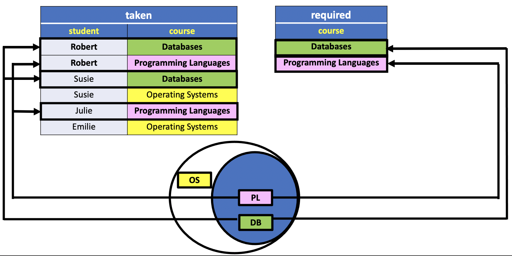
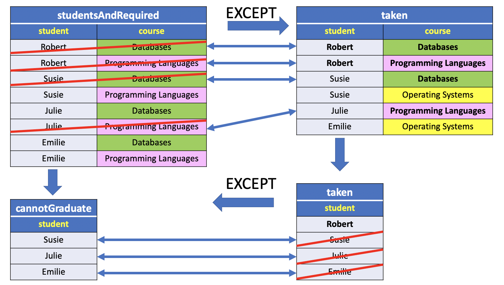

# DIVISION

`Division` is typically required when you want **to find out entities that are interacting with all entities of a set of different type entities**.
The division operator is used when we have to evaluate queries which contain the keyword ‘`all`’.

Some instances where division operator is used are:

- Which person has account in all the banks of a particular city?
- Which students have taken all the courses required to graduate?

In all these queries, the description after the keyword ‘`all`’ defines a set which contains some elements and the final result contains those units who satisfy these requirements.

Important: **Division is not supported by SQL implementations. However, it can be represented using other operations**.

## DIVISION operation: Example

As a motivating example, consider the following two relations: `Taken(Student,Course)` which contains the courses that each student has completed, and `Required(Course)`, which contains the courses that are required to graduate.

```console
uniy=# CREATE TABLE taken (
uniy(#     student VARCHAR,
uniy(#     course VARCHAR,
uniy(#     PRIMARY KEY (student, course)
uniy(# );
CREATE TABLE
uniy=# CREATE TABLE required (
uniy(#    course VARCHAR PRIMARY KEY
uniy(# );
CREATE TABLE
uniy=# INSERT INTO taken
uniy-#        (student, course)
uniy-# VALUES ('Robert','Databases'),
uniy-#        ('Robert','Programming Languages'),
uniy-#        ('Susie','Databases'),
uniy-#        ('Susie','Operating Systems'),
uniy-#        ('Julie','Programming Languages'),
uniy-#        ('Emilie','Operating Systems');
INSERT 0 6
uniy=# INSERT INTO required
uniy-#        (course)
uniy-# VALUES ('Databases'),
uniy-#        ('Programming Languages');
INSERT 0 2
```

The instances for this example are shown below:

Table **taken**:

| student |        course|
|:-------:|:---------------------:|
| Robert  | Databases|
| Robert  | Programming Languages|
| Susie   | Databases|
| Susie   | Operating Systems|
| Julie   | Programming Languages|
| Emilie  | Operating Systems|

Table **required**

|course|
|:---------------------:|
|Databases|
|Programming Languages|

Suppose we are asked the following two queries:

1. Find all students who have taken a required course.
2. Find all students who can graduate (i.e., who have taken all required courses).



Just by looking at the Veen Diagram representation of this small instance (illustrated in the picture above), it is easy to see that the answers we want are:

1. `Robert`,`Susie` and `Julie`.
2. `Robert`.

## Asking About Some

We have already seen how to do Query 1 using the standard `SELECT ... FROM . . . WHERE` clauses. To remove duplicates from our result, we can use the SQL keyword `DISTINCT`.

**SQL1**
```SQL
SELECT DISTINCT student
  FROM taken
 WHERE course IN (
       SELECT *
         FROM required);
```

**SQL2**
```SQL
SELECT DISTINCT student
  FROM taken
NATURAL JOIN required;
```


**Results**

|student|
|:-------:|
|Robert|
|Susie|
|Julie|


**Query**
```console
uniy=# SELECT DISTINCT student
uniy-#   FROM taken
uniy-#  WHERE course IN (
uniy(#        SELECT *
uniy(#          FROM required);
```
**Output**
```console
 student
---------
 Robert
 Susie
 Julie
(3 rows)
```

Informally, we might read this query as “**give me the set of students who have taken a course that appears in the set of required courses**”, or “**the set of students whose courses contain at least one course that is required.**”

## Asking About All

Query 2 is more difficult. Just by looking at this small instance, it is easy to see that the answer we want is:

`Can Graduate` students:

|student|
|:-------:|
|Robert|


There is a relational operator that directly gives us this result. The operator is division, written `R ÷ S`.
Unfortunately,**there is no direct way to express division in SQL**.

We can write this query, but to do so, we will have to express our query through double negation and existential quantifiers. We will produce this query in stages. Our roadmap is as follows:

1. Find all students
2. Find all students and the courses required to graduate
3. Find all students and the required courses that they have not taken
4. Find all students who can not graduate
5. Find all students who can graduate

### 1: ALL STUDENTS

All Students First, we create a set of all student that have taken courses. We can express this positively using a selection and projection:

```SQL
CREATE TABLE all_student AS
       SELECT DISTINCT student
         FROM taken;
```

**all_student**

|student|
|:-------:|
|Robert|
|Emilie|
|Susie|
|Julie|


We created a temporary table for this example.

```console
uniy=# CREATE TABLE all_student AS
uniy-#        SELECT DISTINCT student
uniy-#          FROM taken;
SELECT 4
uniy=# SELECT * FROM all_student;
 student
---------
 Robert
 Emilie
 Susie
 Julie
(4 rows)
```

### 2: All Students and Required Classes

Next, we will create a set of students and the courses they need to graduate. We can express this as a `Cartesian product`, creating the pairs of the form (student,course):

**SQL**
```SQL
CREATE TABLE studentsAndRequired AS
       SELECT all_student.student, required.course
         FROM all_student, required;
```

**studentsAndRequired**

|student |        course|
|:------:|:---------------------:|
|Robert  | Databases|
|Robert  | Programming Languages|
|Emilie  | Databases|
|Emilie  | Programming Languages|
|Susie   | Databases|
|Susie   | Programming Languages|
|Julie   | Databases|
|Julie   | Programming Languages|

**Query**
```console
uniy=# CREATE TABLE studentsAndRequired AS
uniy-#        SELECT all_student.student, required.course
uniy-#          FROM all_student, required;
SELECT 8
uniy=# SELECT * FROM studentsAndRequired;
 student |        course
---------+-----------------------
 Robert  | Databases
 Robert  | Programming Languages
 Emilie  | Databases
 Emilie  | Programming Languages
 Susie   | Databases
 Susie   | Programming Languages
 Julie   | Databases
 Julie   | Programming Languages
(8 rows)
```

### 3: All Students and Required Classes Not Taken


This is where our query starts to get tricky. We want to find the subset of the relation we just produced that **includes the students and the required courses that they have not taken**. We are doing this as a first step towards finding the students who cannot graduate.

The intuition is that we want to find all (student,course) pairs that **are in the relation** `studentsAndRequired`, **but not in the relation Taken**.

This **should give us the set of students who cannot graduate**, `with the courses that they still need to take`:

**SQL**
```SQL
CREATE TABLE studentsAndRequiredNotTaken AS
SELECT *
  FROM studentsAndRequired s
 WHERE NOT EXISTS (
       SELECT *
         FROM taken t
        WHERE s.student = t.student AND s.course = t.course);
```

**Results**

|student |        course|
|:-------:|:---------------------:|
|Emilie  | Databases|
|Emilie  | Programming Languages|
|Susie   | Programming Languages|
|Julie   | Databases|


**Query**
```console
uniy=# CREATE TABLE studentsAndRequiredNotTaken AS
uniy-# SELECT *
uniy-#   FROM studentsAndRequired
uniy-#  WHERE NOT EXISTS (
uniy(#        SELECT *
uniy(#          FROM taken
uniy(#         WHERE studentsAndRequired.student = taken.student AND studentsAndRequired.course = taken.course);
SELECT 4
```

**Output**
```console
uniy=# SELECT * FROM studentsAndRequiredNotTaken;
 student |        course
---------+-----------------------
 Emilie  | Databases
 Emilie  | Programming Languages
 Susie   | Programming Languages
 Julie   | Databases
(4 rows)
```

### 4: Students Who Can Not Graduate

From the previous relation, we can apply a projection to get the set of students who cannot graduate.

**SQL**
```SQL
CREATE TABLE cannotGraduate AS
SELECT DISTINCT student
  FROM studentsAndRequiredNotTaken;
```

**Results**

|student|
|:-------:|
|Emilie|
|Susie|
|Julie|


**Query**
```console
uniy=# SELECT DISTINCT student
uniy-#   FROM studentsAndRequiredNotTaken;
```

**Output**
```console
 student
---------
 Emilie
 Susie
 Julie
(3 rows)
```

### 5: Students Who Can Graduate

This is the second tricky part of our query. We find the subset of students who can graduate by looking at the students in AllStudents who are not in the set of CannotGraduate. Put another way, the set of all students except the students who cannot graduate:

**SQL**
```SQL
CREATE TABLE canGraduate AS
SELECT *
  FROM all_student
 WHERE NOT EXISTS (
       SELECT *
         FROM cannotGraduate
        WHERE cannotGraduate.student = all_student.student);
```

**Table**

|student|
|:-------:|
|Robert|

**Query**
```console
uniy=# CREATE TABLE canGraduate AS
uniy-# SELECT *
uniy-#   FROM all_student
uniy-#  WHERE NOT EXISTS (
uniy(#        SELECT *
uniy(#          FROM cannotGraduate
uniy(#         WHERE cannotGraduate.student = all_student.student);
SELECT 1
uniy=# SELECT * FROM canGraduate;
 student
---------
 Robert
(1 row)
```

## Re-write As a Single Query

We can re-write the above set of queries into a single query that does not use the temporary tables:

**SQL**
```SQL
SELECT DISTINCT x.student
  FROM taken x
 WHERE NOT EXISTS (
       SELECT *
         FROM required y
        WHERE NOT EXISTS (
              SELECT *
                FROM taken z
               WHERE z.student = x.student AND
                     z.course = y.course));
```

**Results**

|student|
|:-------:|
|Robert|


**Query**
```console
uniy=# SELECT DISTINCT x.student
uniy-#   FROM taken x
uniy-#  WHERE NOT EXISTS (
uniy(#        SELECT *
uniy(#          FROM required y
uniy(#         WHERE NOT EXISTS (
uniy(#               SELECT *
uniy(#                 FROM taken z
uniy(#                WHERE z.student = x.student AND
uniy(#                      z.course = y.course));
```
**Output**
```console
 student
---------
 Robert
(1 row)
```

## Re-write Using Except

We can re-write the above to use `EXCEPT` instead of `NOT EXISTS`:



**SQL**
```SQL
WITH studentsAndRequired AS (
     SELECT DISTINCT t.student, r.course
       FROM  taken t, required r
),
studentsAndRequiredNottaken AS (
     SELECT student, course
       FROM studentsAndRequired
     EXCEPT
     SELECT student, course
       FROM taken
)
SELECT student
  FROM taken t
EXCEPT
SELECT student
  FROM studentsAndRequiredNotTaken;
```

**Results**

|student|
|:-------:|
|Robert|


**Query**
```console
uniy=# WITH studentsAndRequired AS (
uniy(#      SELECT DISTINCT t.student, r.course
uniy(#        FROM  taken t, required r
uniy(# ),
uniy-# studentsAndRequiredNottaken AS (
uniy(#      SELECT student, course
uniy(#        FROM studentsAndRequired
uniy(#      EXCEPT
uniy(#      SELECT student, course
uniy(#        FROM taken
uniy(# )
uniy-#
uniy-# SELECT student
uniy-#   FROM taken t
uniy-# EXCEPT
uniy-# SELECT student
uniy-#   FROM studentsAndRequiredNotTaken;
```

**Output**
```console
 student
---------
 Robert
(1 row)
```
