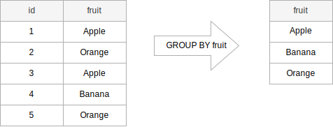
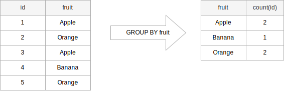

# GROUP BY

The **GROUP BY** clause divides the rows returned from the `SELECT` statement into groups. For each group, you can apply an aggregate function e.g.,  `SUM()` to calculate the sum of items or `COUNT()` to get the number of items in the groups.

The following statement illustrates the basic syntax of the `GROUP BY` clause:

```SQL
SELECT
   column_1,
   column_2,
   ...,
   aggregate_function(column_3)
FROM
   table_name
GROUP BY
   column_1,
   column_2,
   ...;
```
In this syntax:

- First, select the columns that you want to group e.g., `column1` and `column2`, and column that you want to apply an aggregate function (column3).
- Second, list the columns that you want to group in the GROUP BY clause.

The statement clause divides the rows by the values of the columns specified in the `GROUP BY` clause and calculates a value for each group.

It’s possible to use other clauses of the `SELECT` statement with the `GROUP BY` clause.

PostgreSQL evaluates the `GROUP BY` clause after the `FROM` and `WHERE` clauses and before the `HAVING` `SELECT`, `DISTINCT`, `ORDER BY` and `LIMIT` clauses.


The following picture illustrates shows how the `GROUP BY` clause works:




The table on the left side has two columns `id` and `fruit`. When you apply the `GROUP BY` clause to the fruit column, it returns the result set that includes **unique values from the fruit column**:

```SQL
SELECT fruit
  FROM sample_table
 GROUP BY fruit;
```

In practice, you often use the `GROUP BY` clause with an aggregate function such as `MIN`, `MAX`, `AVG`, `SUM`, or `COUNT` to calculate a measure that provides the information for each group.

For example, the following illustrates how the `GROUP BY` clause works with the `COUNT` aggregate function:



In this example, we group the rows by the values of the fruit column and apply the COUNT function to the id column. The result set includes the unique values of the fruit columns and the number of the corresponding rows.

```SQL
SELECT fruit, COUNT(id)
  FROM sample_table
 GROUP BY fruit;
```

The columns that appear in the `GROUP BY` clause are called **grouping columns**. If a grouping column contains `NULL` values, all `NULL` values are **summarized into a single group because** the `GROUP BY` **clause considers all** `NULL` **values equal**.


## PostgreSQL GROUP BY clause examples

We will use the `employees` and `departments` tables in the `hr` sample database to demonstrate how the `GROUP BY` clause works.


The following example uses the `GROUP BY` clause to group the values in `department_id` column of the `employees` table:

**SQL**
```SQL
SELECT department_id
  FROM employees
 GROUP BY department_id
 ORDER BY department_id;
```
**Results**

| department_id|
|:-------------:|
|             1|
|             2|
|             3|
|             4|
|             5|
|             6|
|             7|
|             8|
|             9|
|            10|
|            11|

In this example:

- First, the `SELECT` clause returns all values from the `department_id` column of employees table.
- Second, the `GROUP BY` clause groups all values into groups.

```SQL
SELECT department_id, employee_id
  FROM employees
 ORDER BY department_id
 LIMIT 10;
```

| department_id | employee_id|
|:--------------:|:------------:|
|             1 |         200|
|             2 |         201|
|             2 |         202|
|             3 |         117|
|             3 |         119|
|             3 |         114|
|             3 |         118|
|             3 |         116|
|             3 |         115|
|             4 |         203|


The `department_id` column of the employees table has **40 rows**, including **duplicate** `department_id` values. However, the `GROUP BY` groups these values into groups.

Without an aggregate function, the GROUP BY behaves like the `DISTINCT` keyword:

```SQL
SELECT DISTINCT department_id
  FROM employees
 ORDER BY department_id;
```

The `GROUP BY` clause will be more useful when you use it with an aggregate function.

For example, the following statement uses the `GROUP BY` clause with the `COUNT` function to count the number of employees by department:

```SQL
SELECT department_id,
       COUNT(employee_id) headcount
  FROM employees
 GROUP BY department_id
 ORDER BY department_id;
```

**Results**

| department_id | headcount|
|:-------------:|:--------:|
|             1 |         1|
|             2 |         2|
|             3 |         6|
|             4 |         1|
|             5 |         7|
|             6 |         5|
|             7 |         1|
|             8 |         6|
|             9 |         3|
|            10 |         6|
|            11 |         2|

How it works.

- First, the `GROUP BY` clause groups the rows in the employees table by `department_id`.
- Second, the `COUNT(employee_id)` returns the number of `employee_id` values in each group.

## SQL GROUP BY with INNER JOIN example

The following example returns the number of employees by department. And it uses an `INNER JOIN` clause **to include the department name in the result**:

**SQL**

```SQL
SELECT department_name,
       COUNT(employee_id) headcount
  FROM employees e
 INNER JOIN departments USING(department_id)
 GROUP BY department_name
 ORDER BY department_name;
```

**Results**

| department_name  | headcount|
|:-----------------:|:--------:|
| Accounting       |         2|
| Administration   |         1|
| Executive        |         3|
| Finance          |         6|
| Human Resources  |         1|
| IT               |         5|
| Marketing        |         2|
| Public Relations |         1|
| Purchasing       |         6|
| Sales            |         6|
| Shipping         |         7|

This query will first perform the join, yielding only the selected columns from those records in the two tables employees and departments where the joining condition is met. Next, these chosen records are ordered according to the values in their department_name field, and all records with the same value for the department_name are assigned to a distinct group. Finally, the number of rows with not NULL values in the field employee_id of the records in each group are counted, and the results are printed.

## SQL GROUP BY with ORDER BY example

The following example uses an `ORDER BY` clause to sort the departments by headcount:

**SQL**

```SQL
SELECT department_name,
       COUNT(employee_id) headcount
  FROM employees e
 INNER JOIN departments USING(department_id)
 GROUP BY department_name
 ORDER BY headcount;
```
Note that you can use either the `headcount` alias or the `COUNT(employee_id)` in the `ORDER BY` clause.

**Results**

| department_name  | headcount|
|:----------------:|:--------:|
| Administration   |         1|
| Human Resources  |         1|
| Public Relations |         1|
| Accounting       |         2|
| Marketing        |         2|
| Executive        |         3|
| IT               |         5|
| Finance          |         6|
| Purchasing       |         6|
| Sales            |         6|
| Shipping         |         7|

## SQL GROUP BY with HAVING example

The following example uses the `HAVING` clause to find departments with `headcounts` are greater than 5:

**SQL**

```SQL
SELECT department_name,
       COUNT(employee_id) headcount
  FROM employees
 INNER JOIN departments USING(department_id)
 GROUP BY department_name
 HAVING COUNT(employee_id) > 5
 ORDER BY headcount DESC;
```
Note that you cannot use the `headcount` alias in the `HAVING` clause, you must use the `COUNT(employee_id)`.

**Results**

| department_name | headcount|
|:---------------:|:--------:|
| Shipping        |         7|
| Purchasing      |         6|
| Finance         |         6|
| Sales           |         6|

## SQL GROUP BY with MIN, MAX, and AVG example

The following query returns the minimum, maximum, and average salary of employees in each department.

**SQL**
```SQL
SELECT department_name,
       MIN(salary) min_salary,
       MAX(salary) max_salary,
       ROUND(AVG(salary),2) average_salary
  FROM employees
 INNER JOIN departments USING(department_id)
 GROUP BY department_name;
```

**Results**

| department_name  | min_salary | max_salary | average_salary|
|:----------------:|:----------:|:----------:|:-------------:|
| Accounting       |    8300.00 |   12000.00 |       10150.00|
| Purchasing       |    2500.00 |   11000.00 |        4150.00|
| Marketing        |    6000.00 |   13000.00 |        9500.00|
| Administration   |    4400.00 |    4400.00 |        4400.00|
| Finance          |    6900.00 |   12000.00 |        8600.00|
| Human Resources  |    6500.00 |    6500.00 |        6500.00|
| Public Relations |   10000.00 |   10000.00 |       10000.00|
| Executive        |   17000.00 |   24000.00 |       19333.33|
| Shipping         |    2700.00 |    8200.00 |        5885.71|
| Sales            |    6200.00 |   14000.00 |        9616.67|
| IT               |    4200.00 |    9000.00 |        5760.00|

## SQL GROUP BY with SUM function example

To get the total salary per department, you apply the `SUM` function to the salary column and group employees by the `department_id` column as follows:

**SQL**
```SQL
SELECT department_name,
       SUM(salary) total_salary
  FROM employees
  INNER JOIN departments USING(department_id)
 GROUP BY department_name;
```
**Results**

| department_name  | total_salary|
|:----------------:|:-----------:|
| Accounting       |     20300.00|
| Purchasing       |     24900.00|
| Marketing        |     19000.00|
| Administration   |      4400.00|
| Finance          |     51600.00|
| Human Resources  |      6500.00|
| Public Relations |     10000.00|
| Executive        |     58000.00|
| Shipping         |     41200.00|
| Sales            |     57700.00|
| IT               |     28800.00|

## SQL GROUP BY multiple columns

So far, you have seen that **we have grouped all** `employees` **by one column**. For example, the following clause places all rows with the same values in the department_id column in one group.

```SQL
GROUP BY department_id
```
How about grouping employees by values in both `department_id` and `job_id` columns?

```SQL
GROUP BY department_id, job_id
```

This clause **will group all employees with the same values** in both `department_id` and `job_id` columns in **one group**.

The following statement groups rows with the same values in both `department_id` and `job_id` columns in the same group then **return the rows for each of these groups**.

**SQL**

```SQL
SELECT department_name,
       job_title,
       COUNT(employee_id)
  FROM employees
 INNER JOIN departments USING(department_id)
 INNER JOIN jobs USING(job_id)
 GROUP BY department_name, job_title;
```

**Results**

| department_name  |            job_title            | count|
|:----------------:|:-------------------------------:|:----:|
| Purchasing       | Purchasing Clerk                |     5|
| Public Relations | Public Relations Representative |     1|
| Administration   | Administration Assistant        |     1|
| Marketing        | Marketing Representative        |     1|
| Shipping         | Shipping Clerk                  |     2|
| Shipping         | Stock Clerk                     |     1|
| Purchasing       | Purchasing Manager              |     1|
| IT               | Programmer                      |     5|
| Accounting       | Accounting Manager              |     1|
| Accounting       | Public Accountant               |     1|
| Finance          | Accountant                      |     5|
| Sales            | Sales Manager                   |     2|
| Human Resources  | Human Resources Representative  |     1|
| Sales            | Sales Representative            |     4|
| Executive        | President                       |     1|
| Shipping         | Stock Manager                   |     4|
| Marketing        | Marketing Manager               |     1|
| Finance          | Finance Manager                 |     1|
| Executive        | Administration Vice President   |     2|

## Using PostgreSQL GROUP BY clause with date column

The `payment_date` is a timestamp column in the `payment` table of the `dvdrental` sample database. To group payments by dates, you use the `DATE()` function to convert timestamps to dates first and then group payments by the result date:

**SQL**

```SQL
SELECT DATE(payment_date) paid_date,
       SUM(amount) tot_amount
  FROM payment
 GROUP BY DATE(payment_date)
 ORDER BY DATE(payment_date);
```

**Results**

| paid_date  | tot_amount|
|:----------:|:----------:|
| 2007-02-14 |     116.73|
| 2007-02-15 |    1188.92|
| 2007-02-16 |    1154.18|
| 2007-02-17 |    1188.17|
| 2007-02-18 |    1275.98|
| 2007-02-19 |    1290.90|
| 2007-02-20 |    1219.09|
| 2007-02-21 |     917.87|
| 2007-03-01 |    2808.24|
| 2007-03-02 |    2550.05|
| 2007-03-16 |     299.28|
|...|...|
