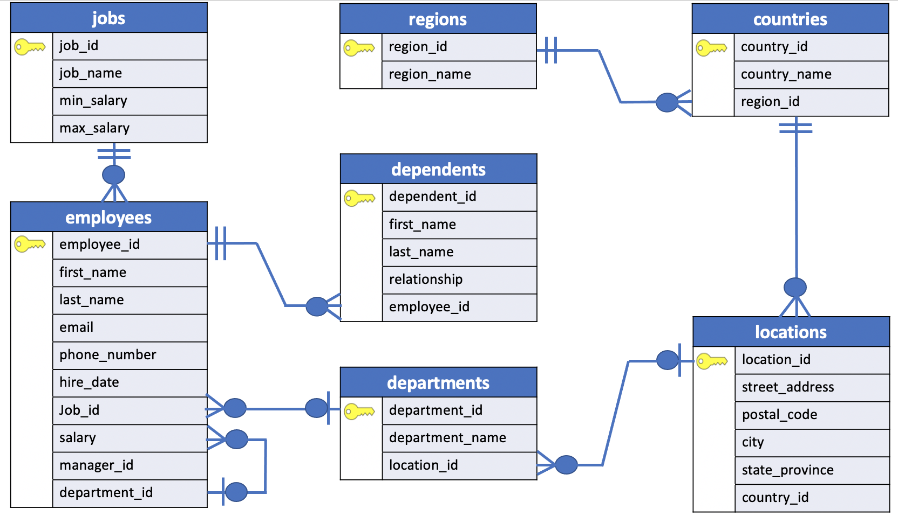

# HAVING

The `HAVING` clause specifies a search condition for a group or an aggregate. The `HAVING` clause is often used with the `GROUP BY` clause to filter groups or aggregates based on a specified condition.

The following statement illustrates the basic syntax of the `HAVING` clause:

```SQL
SELECT column1,
    	 aggregate_function (column2)
  FROM table_name
 GROUP BY column1
 HAVING condition;
```

In this syntax, the `group by` clause **returns rows grouped by the** `column1`. The `HAVING` **clause specifies a condition to filter the groups**.

It’s possible to add other clauses of the `SELECT` statement such as `JOIN`, `LIMIT`, `FETCH` etc.

PostgreSQL evaluates the `HAVING` clause after the `FROM`, `WHERE`, `GROUP BY`, and before the `SELECT`, `DISTINCT`, `ORDER BY` and `LIMIT` clauses.


**NOTE**: Since the `HAVING` clause is evaluated before the `SELECT` clause, you cannot use column aliases in the `HAVING` clause. Because at the time of evaluating the `HAVING` clause, the column aliases specified in the `SELECT` clause are not available.

## HAVING vs. WHERE

The `WHERE` clause allows you to filter rows based on a specified condition. However, the `HAVING` clause allows you to filter groups of rows according to a specified condition.

In other words,
- the `WHERE` clause is applied **to rows** while
- the `HAVING` clause is applied **to groups** of rows.

## SQL HAVING clause examples

We will take the `employees` and `departments` tables in the sample database for the demonstration.



To get the managers and their direct reports, you use the `GROUP BY` clause to group employees by the managers and use the `COUNT` function to count the direct reports.

The following query illustrates the idea:

**SQL**
```SQL
SELECT manager_id,
       COUNT(employee_id) direct_reports,
       COUNT(DISTINCT job_id) jobs_id_count
  FROM employees
 WHERE manager_id IS NOT NULL
 GROUP BY manager_id
 ORDER BY direct_reports DESC;
```

**Results**

| manager_id | direct_reports | jobs_id_count|
|:----------:|:--------------:|:-------------:|
|        100 |             14 |             6|
|        101 |              5 |             5|
|        114 |              5 |             1|
|        108 |              5 |             1|
|        103 |              4 |             1|
|        123 |              2 |             1|
|        205 |              1 |             1|
|        102 |              1 |             1|
|        120 |              1 |             1|
|        201 |              1 |             1|

To find the managers who have at least five direct reports, you add a HAVING clause to the query above as the following:

**SQL**
```SQL
SELECT manager_id,
       COUNT(employee_id) direct_reports,
       COUNT(DISTINCT job_id) jobs_id_count
  FROM employees
 WHERE manager_id IS NOT NULL
 GROUP BY manager_id
 HAVING COUNT(employee_id) >= 5
 ORDER BY direct_reports DESC;
```

**Results**

| manager_id | direct_reports | jobs_id_count|
|:----------:|:--------------:|:-------------:|
|        100 |             14 |             6|
|        101 |              5 |             5|
|        114 |              5 |             1|
|        108 |              5 |             1|
