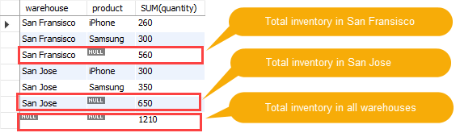

# ROLLUP

The PostgreSQL **ROLLUP** is a `subclause` of the `GROUP BY` clause that offers a **shorthand for defining multiple grouping sets**. A grouping set is a set of columns by which you group. Check out the grouping sets lesson for the detailed information.

Different from the `CUBE` subclause, `ROLLUP` **does not generate all possible grouping sets based on the specified columns**. It just makes a **subset of those**.

The ROLLUP assumes a hierarchy among the input columns and generates all grouping sets that make sense considering the hierarchy. This is the reason why **ROLLUP** is often used to **generate the subtotals and the grand total for reports**.

For example, the **CUBE** `(c1,c2,c3)` makes all eight possible grouping sets:

```SQL
(c1, c2, c3)
(c1, c2)
(c2, c3)
(c1,c3)
(c1)
(c2)
(c3)
()
```

However, the **ROLLUP**`(c1,c2,c3)` generates only **four grouping sets**, assuming the hierarchy `c1 > c2 > c3` as follows:

```SQL
(c1, c2, c3)
(c1, c2)
(c1)
()
```

A common use of  **ROLLUP** is to calculate the **aggregations of data** by `year`, `month`, and `date`, considering the hierarchy `year > month > date`

The following illustrates the syntax of the PostgreSQL **ROLLUP**:

```SQL
SELECT
    c1,
    c2,
    c3,
    aggregate(c4)
FROM
    table_name
GROUP BY
    ROLLUP (c1, c2, c3);
```

It is also possible to do a partial roll up to reduce the number of subtotals generated.

```SQL
SELECT
    c1,
    c2,
    c3,
    aggregate(c4)
FROM
    table_name
GROUP BY
    c1,
    ROLLUP (c2, c3);
```

## PostgreSQL ROLLUP examples

We will use the sales table created in the `GROUPING SETS` lesson for the demonstration.

**sales**

| brand | segment | quantity|
|:-----:|:-------:|:-------:|
| ABC   | Premium |      100|
| ABC   | Basic   |      200|
| XYZ   | Premium |      100|
| XYZ   | Basic   |      300|

The sales table stores the number of products sold by brand and segment.

The following query uses the `ROLLUP` clause to find the **number of products sold by brand** (`subtotal`) and by **all brands and segments** (`total`).


**SQL**

```SQL
SELECT brand,
       segment,
       SUM (quantity)
  FROM sales
 GROUP BY
       ROLLUP (brand, segment)
 ORDER BY brand, segment;
```

**Results**

| brand | segment | sum|
|:-----:|:-------:|:--:|
| ABC   | Basic   | `200`|
| ABC   | Premium | `100`|
| **ABC**   | **NULL**    | **300**|
| XYZ   | Basic   | `300`|
| XYZ   | Premium | `100`|
| **XYZ**   | **NULL**    | **400**|
| NULL  | NULL    | **700**|

As you can see clearly from the output, the
- **third row shows the sales of the ABC brand**, the
- **sixth row displays sales of the the XYZ brand**. The
- **last row shows the grand total for all brands and segments**.

In this example, the hierarchy is `brand > segment`.

If you change the order of brand and segment, the result will be different as follows:

**SQL**

```SQL
SELECT segment,
       brand,
       SUM (quantity)
  FROM sales
 GROUP BY
       ROLLUP (segment, brand)
 ORDER BY
       segment,
       brand;
```

**Results**

| segment | brand | sum|
|:--------:|:----:|:----:|
| Basic   | ABC   | `200`|
| Basic   | XYZ   | `300`|
| **Basic**   | **NULL**  | **500**|
| Premium | ABC   | `100`|
| Premium | XYZ   | `100`|
| **Premium** | **NULL**  | **200**|
| NULL    | NULL  | **700**|

In this case, the hierarchy is the `segment > brand`.

The following statement performs a **partial roll-up**:

**SQL**

```SQL
SELECT segment,
       brand,
       SUM (quantity)
  FROM sales
 GROUP BY segment,
       ROLLUP (brand)
 ORDER BY segment, brand;
```

**Results**

| segment | brand | sum|
|:-------:|:-----:|:----:|
| Basic   | ABC   | 200|
| Basic   | XYZ   | 300|
| Basic   | NULL  | 500|
| Premium | ABC   | 100|
| Premium | XYZ   | 100|
| Premium | NULL  | 200|

See the following `rental` table from the `dvdrental` sample database.

```console
dvdrental=# \d rental
                                             Table "public.rental"
    Column    |            Type             | Collation | Nullable |                  Default
--------------+-----------------------------+-----------+----------+-------------------------------------------
 rental_id    | integer                     |           | not null | nextval('rental_rental_id_seq'::regclass)
 rental_date  | timestamp without time zone |           | not null |
 inventory_id | integer                     |           | not null |
 customer_id  | smallint                    |           | not null |
 return_date  | timestamp without time zone |           |          |
 staff_id     | smallint                    |           | not null |
 last_update  | timestamp without time zone |           | not null | now()
```

The following statement finds the number of rental per `day`, `month`, and `year` by using the `ROLLUP`:

**SQL**

```SQL
SELECT
   EXTRACT (YEAR FROM rental_date) y,
   EXTRACT (MONTH FROM rental_date) M,
   EXTRACT (DAY FROM rental_date) d,
   COUNT (rental_id)
  FROM rental
 GROUP BY
     ROLLUP (
         EXTRACT (YEAR FROM rental_date),
         EXTRACT (MONTH FROM rental_date),
         EXTRACT (DAY FROM rental_date)
     )
 ORDER BY y, M, d;
```

**Results**

|y   |  m   |  d   | count|
|:---:|:----:|:---:|:------:|
|2005 |    5 |   24 |     8|
|2005 |    5 |   25 |   137|
|2005 |    5 |   26 |   174|
|2005 |    5 |   27 |   166|
|2005 |    5 |   28 |   196|
|2005 |    5 |   29 |   154|
|2005 |    5 |   30 |   158|
|2005 |    5 |   31 |   163|
|2005 |    5 | NULL |  1156|
|2005 |    6 |   14 |    16|
|2005 |    6 |   15 |   348|
|2005 |    6 |   16 |   324|
|2005 |    6 |   17 |   325|
|2005 |    6 |   18 |   344|
|2005 |    6 |   19 |   348|
|2005 |    6 |   20 |   331|
|2005 |    6 |   21 |   275|
|2005 |    6 | NULL |  2311|
|2005 |    7 |    5 |    27|
|2005 |    7 |    6 |   504|
|2005 |    7 |    7 |   461|
|2005 |    7 |    8 |   512|
|2005 |    7 |    9 |   513|
|2005 |    7 |   10 |   480|

## SQL ROLLUP examples 2

We will use the `inventory` table that we set up in the `GROUPING SETS` tutorial for the demonstration.

```console
uniy=# CREATE TABLE inventory (
uniy(#    warehouse VARCHAR(255),
uniy(#    product VARCHAR(255) NOT NULL,
uniy(#    model VARCHAR(50) NOT NULL,
uniy(#    quantity INT,
uniy(#    PRIMARY KEY (warehouse, product, model)
uniy(# );
CREATE TABLE
uniy=# INSERT INTO inventory(warehouse, product, model, quantity)
uniy-# VALUES ('San Jose', 'iPhone','6s',100),
uniy-#        ('San Francisco', 'iPhone','6s',50),
uniy-#        ('San Jose','iPhone','7',50),
uniy-#        ('San Francisco','iPhone','7',10),
uniy-#        ('San Jose','iPhone','X',150),
uniy-#        ('San Francisco','iPhone','X',200),
uniy-#        ('San Jose','Samsung','Galaxy S',200),
uniy-#        ('San Francisco','Samsung','Galaxy S',200),
uniy-#        ('San Francisco','Samsung','Note 8',100),
uniy-#        ('San Jose','Samsung','Note 8',150);
INSERT 0 10
```

**inventory** table:

|warehouse   | product |  model   | quantity|
|:----------:|:-------:|:---------:|:-------:|
|San Jose      | iPhone  | 6s       |      100|
|San Francisco | iPhone  | 6s       |       50|
|San Jose      | iPhone  | 7        |       50|
|San Francisco | iPhone  | 7        |       10|
|San Jose      | iPhone  | X        |      150|
|San Francisco | iPhone  | X        |      200|
|San Jose      | Samsung | Galaxy S |      200|
|San Francisco | Samsung | Galaxy S |      200|
|San Francisco | Samsung | Note 8   |      100|
|San Jose      | Samsung | Note 8   |      150|

### SQL ROLLUP with one column example

The following statement uses the `GROUP BY` clause and the `SUM()` function to find the total inventory by warehouse:

**SQL**

```SQL
SELECT warehouse, SUM(quantity)
  FROM inventory
 GROUP BY warehouse;
```

**Results**

|   warehouse   | sum|
|:-------------:|:--:|
| San Francisco | 560|
| San Jose      | 650|

To retrieve the **total products in all warehouses**, you add the `ROLLUP` to the `GROUP BY` clause as follows:

**SQL**

```SQL
SELECT warehouse, SUM(quantity) tot_qty
  FROM inventory
 GROUP BY ROLLUP (warehouse)
 ORDER BY warehouse;
```

**Results**

|warehouse   | tot_qty|
|:----------:|:--------:|
|San Francisco |     560|
|San Jose      |     650|
|**NULL**          |    `1210`|

As you can see in the result, the `NULL` value in the warehouse column specifies the **grand total super-aggregate line**. In this example, the ROLLUP option causes the query to produce another row that shows the total products in all warehouses.

To make the output more readable, you can use the **COALESCE()** function to substitute the `NULL` value by the `All warehouses` as follows:

```SQL
SELECT
    COALESCE(warehouse, 'All warehouses') As warehouse,
    SUM(quantity)
  FROM
    inventory
GROUP BY ROLLUP (warehouse)
ORDER BY warehouse DESC;
```

**Results**

|warehouse    | sum|
|:-----------:|:-----:|
|San Jose       |  650|
|San Francisco  |  560|
|All warehouses | 1210|

### SQL ROLLUP with multiple columns example

The following statement calculates the inventory by warehouse and product:

```SQL
SELECT warehouse, product, SUM(quantity)
  FROM inventory
 GROUP BY warehouse, product;
```

**Results**

|   warehouse   | product | sum|
|:-------------:|:-------:|:----:|
| San Francisco | Samsung | 300|
| San Francisco | iPhone  | 260|
| San Jose      | iPhone  | 300|
| San Jose      | Samsung | 350|

Let’s add the `ROLLUP` to the `GROUP BY` clause:

**SQL**

```SQL
SELECT warehouse, product, SUM(quantity)
  FROM inventory
 GROUP BY ROLLUP (warehouse, product);
```



Note that the output consists of summary information at two levels of analysis, not just one:

- Following each set of product rows for a specified warehouse, an extra summary row appears displaying the total inventory. In these rows, values in the product column set to NULL.
- Following all rows, an extra summary row appears showing the total inventory of all warehouses and products. In these rows, the values in the  warehouse and product columns set to NULL.

## SQL ROLLUP with partial rollup example

You can use ROLLUP to perform a **partial roll-up** that reduces the number of subtotals calculated as shown in the following example:

**SQL**

```SQL
SELECT warehouse, product, SUM(quantity)
  FROM inventory
 GROUP BY warehouse, ROLLUP (product);
```

**Results**

|   warehouse   | product | sum|
|:-------------:|:-------:|:---:|
| San Francisco | Samsung | 300|
| San Francisco | iPhone  | 260|
| San Jose      | iPhone  | 300|
| San Jose      | Samsung | 350|
| San Francisco | NULL    | 560|
| San Jose      | NULL    | 650|

In this example, the **ROLLUP** only makes a **supper-aggregate summary** for the `product` column, not the `warehouse` column.
