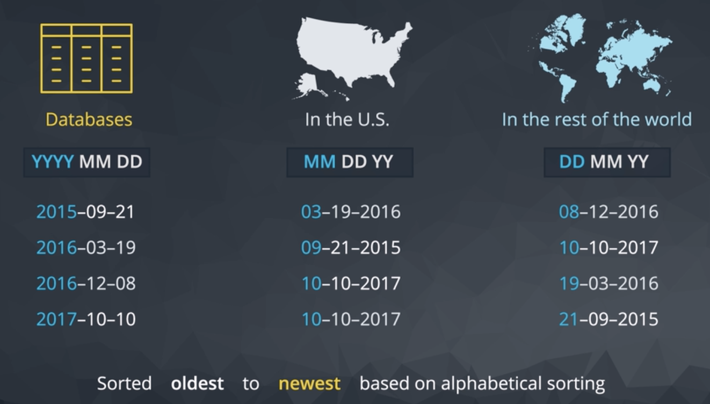

# DATE FUNCTIONS

Aggregate by date field does not work in a practical way. It treats each `TIMESTAMP` as unique. When it would be more practical to round to the nearest day, week or month and aggregate across that period.

Take for example the `orders` table in the `parch_&_posey` sample database. Let's say we want to know the total of standard paper quantity by time period.

```console
parch_posey=# \d orders
                              Table "public.orders"
      Column      |            Type             | Collation | Nullable | Default
------------------+-----------------------------+-----------+----------+---------
 id               | integer                     |           | not null |
 account_id       | integer                     |           |          |
 occurred_at      | timestamp without time zone |           |          |
 standard_qty     | integer                     |           |          |
 gloss_qty        | integer                     |           |          |
 poster_qty       | integer                     |           |          |
 total            | integer                     |           |          |
 standard_amt_usd | numeric(10,2)               |           |          |
 gloss_amt_usd    | numeric(10,2)               |           |          |
 poster_amt_usd   | numeric(10,2)               |           |          |
 total_amt_usd    | numeric(10,2)               |           |          |
```

If we run the following query:

```console
parch_posey=# SELECT COUNT(*)
parch_posey-#   FROM orders;
 count
-------
  6912
```

We clearly see that the total number of rows in this table is `6912`. If we aggregate by `occurred_at` field, how many rows would be?

```console
parch_posey=# WITH paper_qty AS (
parch_posey(#      SELECT occurred_at,
parch_posey(#             SUM(standard_qty) As standard_qty_sum
parch_posey(#        FROM orders
parch_posey(#       GROUP BY occurred_at
parch_posey(# )
parch_posey-#
parch_posey-# SELECT COUNT(*)
parch_posey-#   FROM paper_qty;
 count
-------
  6908
(1 row)
```

You can see in the result here that isn't any more useful than looking at the raw data. This aggregates from 6,912 rows in the raw data down to 6,908. Almost all of the data are unique.

Good news though, there are plenty of special functions to make dates easier to work with. But before we dig into date and time functions let's take a look at how dates are stored.



If you live in the US you're probably used to seeing dates formatted as `MM DD YY`. It's non convention compared to the rest of the word's standards `DD MM YY`. This isn't necessarily better or worse. It's just different.

Databases do it yet another way ordering from least to most granular part of the date. `YYYY MM DD`. There is a very specific utility and basis that dates stored alphabetically are also in chronological order.

In other words, data ordering is the same whether you think of them as dates or as bits of text. With this example here, we can see that the year first way the database stores dates, is ideal for sorting the way we'll want to retrieve this information in the future.


Whether we want the most recent or oldest information, day first and month first date formats sort of funny ways that don't make a ton of sense.


Another benefit is that the date can easily be truncated in order to group them for analysis.

## TIMESTAMP

Timestamps are data types that contain both time and date parts.  Timestamps are long and contain a ton of info on when an event occurred: The `year`, `month`, `day`, `hour`, `minute`, `second`, `millisecond`, and [zulu](https://en.wikipedia.org/wiki/Coordinated_Universal_Time), UTC.


### HOW TO USE DATE_TRUNC()

To remove the unwanted detail of a timestamp, feed it into the **DATE_TRUNC()** function. The `date_trunc` function shortens timestamps so they are easier to read.

The following illustrates the syntax of the `date_trunc` function:

```SQL
date_trunc('datepart', field)
```

The `datepart` argument is the level of **precision used to truncate the field**, which can be one of the following:

- millennium
- century
- decade
- year
- quarter
- month
- week
- day
- hour
- minute
- second
- milliseconds
- microseconds

The field argument is a `TIMESTAMP` or an `INTERVAL` value to truncate. It could be an expression that evaluates to a timestamp or an interval.

The **date_trunc** function returns a `TIMESTAMP` or an `INTERVAL` value.

### PostgreSQL date_trunc examples

The following example truncates a TIMESTAMP value to **year** date part:

```SQL
SELECT DATE_TRUNC('year',TIMESTAMP '2021-12-31 23:59:59');
SELECT DATE_TRUNC('year',TIMESTAMP '2021-12-31 24:00:00');
SELECT DATE_TRUNC('year',TIMESTAMP '2022-01-01 00:00:00');
```

**Results**

|TIMESTAMP| year|
|:--------:|:---:|
|2021-12-31 23:59:59| **2021**-01-01 00:00:00|
|2021-12-31 24:00:00| **2022**-01-01 00:00:00|
|2022-01-01 00:00:00| **2022**-01-01 00:00:00|

The following example truncates a TIMESTAMP value to **quarter** date part:

```SQL
SELECT DATE_TRUNC('quarter',TIMESTAMP '2021-03-31 23:59:59');
SELECT DATE_TRUNC('quarter',TIMESTAMP '2021-06-30 23:59:59');
SELECT DATE_TRUNC('quarter',TIMESTAMP '2021-09-30 23:59:59');
SELECT DATE_TRUNC('quarter',TIMESTAMP '2021-12-31 23:59:59');
```

**Results**

|TIMESTAMP| quarter|
|:--------:|:---:|
|2021-03-31 23:59:59| **2021**-**01**-01 00:00:00|
|2021-06-30 23:59:59| **2021**-**04**-01 00:00:00|
|2021-09-30 23:59:59| **2021**-**07**-01 00:00:00|
|2021-12-31 23:59:59| **2021**-**10**-01 00:00:00|

The following example truncates a TIMESTAMP value to **month** date part:

```SQL
SELECT DATE_TRUNC('month',TIMESTAMP '2021-01-31 23:59:59');
SELECT DATE_TRUNC('month',TIMESTAMP '2021-02-28 23:59:59');
```

**Results**

|TIMESTAMP| month|
|:--------:|:---:|
|2021-01-31 23:59:59| **2021**-**01**-01 00:00:00 |
|2021-02-28 23:59:59| **2021**-**02**-01 00:00:00 |

The following example truncates a TIMESTAMP value to **week** date part:

```SQL
SELECT DATE_TRUNC('week',TIMESTAMP '2021-01-01 23:59:59');
SELECT DATE_TRUNC('week',TIMESTAMP '2021-01-04 23:59:59');
```

**Results**

|TIMESTAMP| week|
|:--------:|:---:|
|2021-01-01 23:59:59| **2020**-**12**-**28** 00:00:00|
|2021-01-04 23:59:59| **2021**-**01**-**04** 00:00:00|

The following example truncates a TIMESTAMP value to **day** date part:

```SQL
SELECT DATE_TRUNC('day',TIMESTAMP '2021-01-01 23:59:59');
SELECT DATE_TRUNC('day',TIMESTAMP '2021-01-04 23:59:59');
```

**Results**

|TIMESTAMP| day|
|:--------:|:---:|
|2021-01-01 23:59:59| **2021**-**01**-**01** 00:00:00|
|2021-01-04 23:59:59| **2021**-**01**-**04** 00:00:00|

## Once truncated, you can pool values by time interval

Using the truncated timestamps as keys and aggregating over rows with the same key, you can pool values by time interval. For example, you can calculate the revenue of each paper type sold by year. Here's the query:

```SQL
SELECT DATE_TRUNC('year', occurred_at) AS year,
       SUM(standard_amt_usd) AS standard_sales,
       SUM(gloss_amt_usd) AS gloss_sales,
       SUM(poster_amt_usd) As poster_sales
  FROM orders
 GROUP BY 1
 ORDER BY 1;
```

**Results**

|        year         | standard_sales | gloss_sales | poster_sales|
|:-------------------:|:--------------:|:-----------:|:-----------:|
| **2013**-01-01 00:00:00 |      132504.46 |   154938.14 |     89888.40|
| **2014**-01-01 00:00:00 |     1766295.33 |  1286999.21 |   1015812.00|
| **2015**-01-01 00:00:00 |     2384167.11 |  1971749.99 |   1396087.84|
| **2016**-01-01 00:00:00 |     5363007.49 |  4148074.35 |   3353836.08|
| **2017**-01-01 00:00:00 |       26372.15 |    31398.08 |     20381.20|


The following query calculates the total revenue of each paper type by year and month.

```SQL
SELECT DATE_TRUNC('month', occurred_at) AS month,
       SUM(standard_amt_usd) AS standard_sales,
       SUM(gloss_amt_usd) AS gloss_sales,
       SUM(poster_amt_usd) As poster_sales
  FROM orders
 WHERE occurred_at BETWEEN '2014-01-01' AND '2016-01-01'
 GROUP BY 1
 ORDER BY 1;
```

**Results**

|        month        | standard_sales | gloss_sales | poster_sales|
|:-------------------:|:--------------:|:-----------:|:------------:|
| `2014`-**01**-01 00:00:00 |      133452.56 |    97512.31 |     55175.40|
| `2014`-**02**-01 00:00:00 |      142010.41 |   118918.73 |     88792.20|
| `2014`-**03**-01 00:00:00 |      135553.35 |   115323.53 |     90635.44|
| `2014`-**04**-01 00:00:00 |      131686.10 |   121914.73 |     91293.16|
| `2014`-**05**-01 00:00:00 |      143572.28 |    96411.28 |     79226.84|
| `2014`-**06**-01 00:00:00 |      140917.60 |    94441.41 |     62296.64|
| `2014`-**07**-01 00:00:00 |      149076.25 |    87677.94 |     52374.00|
| `2014`-**08**-01 00:00:00 |      150408.58 |   132925.03 |     83351.80|
| `2014`-**09**-01 00:00:00 |      142524.38 |    81221.56 |     76222.44|
| `2014`-**10**-01 00:00:00 |      186790.67 |   128887.92 |    179655.00|
| `2014`-**11**-01 00:00:00 |      148677.05 |    97542.27 |     65674.56|
| `2014`-**12**-01 00:00:00 |      161626.10 |   114222.50 |     91114.52|
| `2015`-**01**-01 00:00:00 |      169635.05 |   112657.09 |     65512.16|
| `2015`-**02**-01 00:00:00 |      156112.15 |    88337.06 |     89238.80|
| `2015`-**03**-01 00:00:00 |      161666.02 |   268246.86 |     89490.52|
| `2015`-**04**-01 00:00:00 |      166815.70 |   109196.71 |    175741.16|
| `2015`-**05**-01 00:00:00 |      180408.46 |   127614.62 |     82807.76|
| `2015`-**06**-01 00:00:00 |      179185.91 |   142924.18 |     98796.04|
| `2015`-**07**-01 00:00:00 |      203083.02 |   151230.59 |    107581.88|
| `2015`-**08**-01 00:00:00 |      186855.54 |   177355.71 |     99543.08|
| `2015`-**09**-01 00:00:00 |      213137.87 |   211622.46 |     86088.24|
| `2015`-**10**-01 00:00:00 |      245253.51 |   195444.06 |    113493.24|
| `2015`-**11**-01 00:00:00 |      255313.35 |   190350.86 |    236430.04|
| `2015`-**12**-01 00:00:00 |      266700.53 |   196769.79 |    151364.92|
