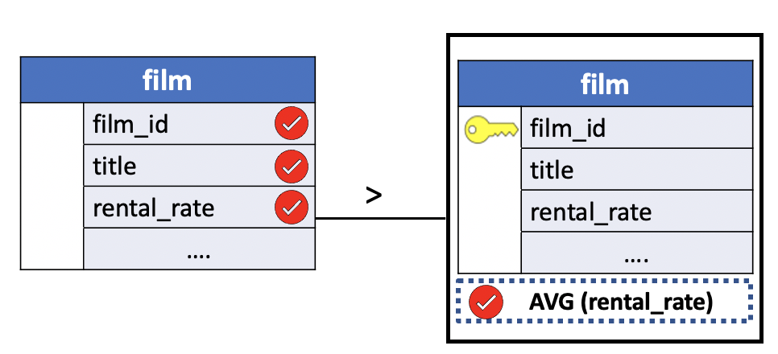
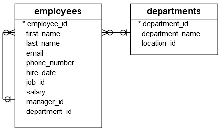
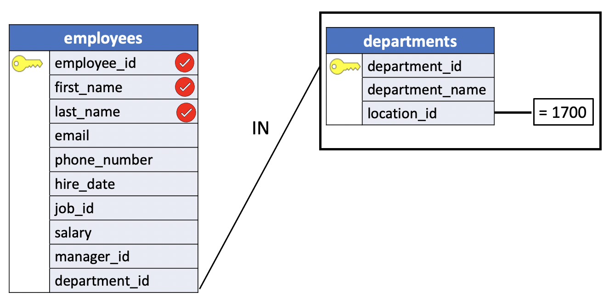

# Queries within Queries: Subqueries

A relational database consists entirely of tables. Every piece of information is stored in some column within one of the database's tables. SQL, since it is a query language for relational database systems, operates on these tables.

But you might already have noticed an interesting fact: *the results* **of a SQL query are also a table**. True, these tables are somewhat ephemeral, sometimes existing only on a terminal screen. But even though a results table does not become part of the stored database, it too can be operated on via SQL queries. Performing this sort of access requires the use of **subqueries**.

## What is a Subquery ?

The result of every SQL query is a table. Sometimes that table is very simple, containing only a single row and column (or even being entirely empty). In other cases, a results table might be much larger then any of the tables actually stored in the database. In either case, **the table that results from executing one query** (`the subquery`) **can be the input for another query**. It is even possible for the results of *that* query to be the input for yet another (and so on). In practice, though, queries are seldom nested than two deep.

Many of the queries that we have already seen can be recast using subqueries. For some questions, including some apparently straightforward ones, using a subquery is the easiest route to the answer. For others, **using a subquery is virtually a requirement**.

You can use a subquery in many places such as:

- With `comparison operators` in the `WHERE` clause
- With the `IN` or `NOT IN` operator
- In the `FROM` clause
- With the `ANY` or `ALL` operator
- With the `EXISTS` or `NOT EXISTS` operator
- In the `SELECT` clause

## Introduction to PostgreSQL subquery in the WHERE clause with the comparison operator


The following syntax illustrates how a subquery is used with a comparison operator:

```SQL
comparison_operator (subquery)
```

where the `comparison operator` is one of these operators:

- Equal (`=`)
- Greater than (`>`)
- Less than (`<`)
- Greater than or equal ( `>=`)
- Less than or equal (`<=`)
- Not equal (`!=`) or (`<>`)

Let’s start with a simple example.

To demonstrate the use of subqueries we'll be using the **film** table in the `dvdrental` sample database.

```console
dvdrental=# \d film
                                              Table "public.film"
      Column      |            Type             | Collation | Nullable |                Default
------------------+-----------------------------+-----------+----------+---------------------------------------
 film_id          | integer                     |           | not null | nextval('film_film_id_seq'::regclass)
 title            | character varying(255)      |           | not null |
 description      | text                        |           |          |
 release_year     | year                        |           |          |
 language_id      | smallint                    |           | not null |
 rental_duration  | smallint                    |           | not null | 3
 rental_rate      | numeric(4,2)                |           | not null | 4.99
 length           | smallint                    |           |          |
 replacement_cost | numeric(5,2)                |           | not null | 19.99
 rating           | mpaa_rating                 |           |          | 'G'::mpaa_rating
 last_update      | timestamp without time zone |           | not null | now()
 special_features | text[]                      |           |          |
 fulltext         | tsvector                    |           | not null |
```

Suppose we want to find the films whose **rental rate is higher than the average rental rate**. We can do it in two steps:

- Find the average rental rate by using the `SELECT` statement and average function ( **AVG**).
- Use the result of the first query in the second `SELECT` statement to find the films that we want.

The following query gets the average rental rate:

```SQL
SELECT ROUND(AVG(rental_rate),2)
  FROM film;
```

**Results**

| round|
|:----:|
|  2.98|

The average rental rate is `2.98`

Now, we can get films whose rental rate is higher than the average rental rate:

```SQL
SELECT film_id,
	     title,
	     rental_rate
  FROM film
 WHERE rental_rate > 2.98
 LIMIT 10;
```

**Results**

|film_id |       title       | rental_rate|
|:------:|:-----------------:|:-----------:|
|    133 | Chamber Italian   |        4.99|
|    384 | Grosse Wonderful  |        4.99|
|      8 | Airport Pollock   |        4.99|
|     98 | Bright Encounters |        4.99|
|      2 | Ace Goldfinger    |        4.99|
|      3 | Adaptation Holes  |        2.99|
|      4 | Affair Prejudice  |        2.99|
|      5 | African Egg       |        2.99|
|      6 | Agent Truman      |        2.99|
|      7 | Airplane Sierra   |        4.99|

The code is not so elegant, which requires two steps. **We want a way to pass the result of the first query to the second query in one query**. The solution is to use a **subquery**.

A `subquery` is **a query nested inside another query** such as `SELECT`, `INSERT`, `DELETE` and `UPDATE`.

To construct a subquery, **we put the second query in brackets and use it in the** `WHERE` clause as an expression:

**Query Diagram**




**Query**

```SQL
SELECT film_id,
	     title,
	     rental_rate
  FROM film
 WHERE rental_rate > (
		      SELECT AVG (rental_rate)
		        FROM film
       )
 LIMIT 10;
```

The query inside the brackets is called a **subquery** or an **inner query**. The query that contains the subquery is known as an **outer query**.

PostgreSQL executes the query that contains a subquery in the following sequence:

- First, executes the subquery.
- Second, gets the result and passes it to the outer query.
- Third, executes the outer query.

**Note that because aggregates like** `AVG` **can't appear in a** `WHERE` clause, **the simplest way to answer this question is with a subquery**. The table resulting from execution of the parenthesized subquery contains only a single value and therefore is fair game to be used immediately following a comparison operator.

It is also possible to use `AND`, `OR` and `NOT` in a `WHERE` clause involving subqueries. In fact, a single subquery can tie together two or more subqueries using these constructs. More commonly, though, a `WHERE` clause will combine a subquery and some more common condition, such as a test for equality, in a single query.

Let's illustrate another example of a subquery in a `WHERE` clause. In this example let's look at the `orders` table in the `parch_posey` sample database.

```console
parch_posey=# \d orders
                              Table "public.orders"
      Column      |            Type             | Collation | Nullable | Default
------------------+-----------------------------+-----------+----------+---------
 id               | integer                     |           | not null |
 account_id       | integer                     |           |          |
 occurred_at      | timestamp without time zone |           |          |
 standard_qty     | integer                     |           |          |
 gloss_qty        | integer                     |           |          |
 poster_qty       | integer                     |           |          |
 total            | integer                     |           |          |
 standard_amt_usd | numeric(10,2)               |           |          |
 gloss_amt_usd    | numeric(10,2)               |           |          |
 poster_amt_usd   | numeric(10,2)               |           |          |
 total_amt_usd    | numeric(10,2)               |           |          |
```
Suppose we might want to return only orders that occurred in the same month as Parch and Posey first order ever. To get the date of the first order, you can write a subquery with a `MIN` function. Let's add a `DATE_TRUNC` function to get the month as follow:

```SQL
SELECT DATE_TRUNC('month', MIN(occurred_at)) As min_month
  FROM orders;
```

**Results**

|      min_month|
|:-------------------:|
| 2013-12-01 00:00:00|

Finally, let's write an outer query that uses this to filter the `orders` table and sorts by the occurred at column.

```SQL
SELECT *
  FROM orders
 WHERE DATE_TRUNC('month', occurred_at) =
       (SELECT DATE_TRUNC('month', MIN(occurred_at)) AS min_month
          FROM orders)
 ORDER BY occurred_at
 LIMIT 2;
```

**Results**

|id |account_id | occurred_at | standard_qty | gloss_qty | poster_qty | total | standard_amt_usd | gloss_amt_usd | poster_amt_usd | total_amt_usd|
|:------:|:-----------:|:---------------------:|:--------------:|:-----------:|:------------:|:-------:|:------------------:|:---------------:|:----------------:|:---------------:|
|5786 | 2861 | **2013**-**12**-04 04:22:44 |  0 | 48 | 33 | 81 | 0.00 | 359.52 |267.96 | 627.48|
|2415 | 2861 | **2013**-**12**-04 04:45:54 |490 | 15 | 11 |516 |2445.10 |112.35 |89.32| 2646.77|

You can see that these orders took place in December 2013, the same month of the first order. This query works because the result of the subquery is only one cell. Most conditional logic will work with subqueries containing one-cell results. But `IN` is the only type of conditional logic that will work when the inner query contains multiple results.


## SQL subquery with the IN or NOT IN operator

Consider the following `employees` and `departments` tables from the `hr` sample database:



Suppose you have to find all employees who locate in the location with the **id** `1700`. You might come up with the following solution.

First, find all departments located at the location whose id is 1700:

```SQL
SELECT *
  FROM departments
 WHERE location_id = 1700;
```

**Results**

| department_id | department_name | location_id|
|:-------------:|:---------------:|:----------:|
|            **1** | Administration  |        `1700`|
|            **3** | Purchasing      |        `1700`|
|            **9** | Executive       |        `1700`|
|            **10** | Finance         |        `1700`|
|            **11** | Accounting      |        `1700`|

Second, find all employees that belong to the location `1700` by using the **department id list** of the previous query:

```SQL
SELECT employee_id, first_name, last_name
  FROM employees
 WHERE department_id IN (1 , 3, 9, 10, 11)
 ORDER BY first_name , last_name;
```

**Results**

|employee_id | first_name  | last_name|
|:----------:|:-----------:|:---------:|
|        115 | Alexander   | Khoo|
|        109 | Daniel      | Faviet|
|        114 | Den         | Raphaely|
|        118 | Guy         | Himuro|
|        111 | Ismael      | Sciarra|
|        200 | Jennifer    | Whalen|
|        110 | John        | Chen|
|        112 | Jose Manuel | Urman|
|        119 | Karen       | Colmenares|
|        102 | Lex         | De Haan|
|        113 | Luis        | Popp|
|        108 | Nancy       | Greenberg|
|        101 | Neena       | Kochhar|
|        205 | Shelley     | Higgins|
|        116 | Shelli      | Baida|
|        117 | Sigal       | Tobias|
|        100 | Steven      | King|
|        206 | William     | Gietz|

This solution has two problems. To start with, you have looked at the departments table to **check which department belongs to the location** `1700`, (i.e: `1`,`3`,`9`,`10`,`11`). However, the original question was not referring to any specific departments; **it referred to the location** `1700`.

Because of the small data volume, you can get a list of department easily. However, in the real system with high volume data, it might be problematic to list all the department id.

Another problem was that you have to revise the queries whenever you want to find employees who locate in a different location.

To overcome these problems, we could also answer this question by using an `INNER JOIN` query such as:

```SQL
SELECT e.employee_id, e.first_name, e.last_name, d.location_id, d.department_id
  FROM employees e
 INNER JOIN departments d USING (department_id)
 WHERE d.location_id = 1700;
```

**Results**

|employee_id | first_name  | last_name  | location_id | department_id|
|:----------:|:-----------:|:----------:|:-----------:|:-------------:|
|        115 | Alexander   | Khoo       |        1700 |             3|
|        109 | Daniel      | Faviet     |        1700 |            10|
|        114 | Den         | Raphaely   |        1700 |             3|
|        118 | Guy         | Himuro     |        1700 |             3|
|        111 | Ismael      | Sciarra    |        1700 |            10|
|        200 | Jennifer    | Whalen     |        1700 |             1|
|        110 | John        | Chen       |        1700 |            10|
|        112 | Jose Manuel | Urman      |        1700 |            10|
|        119 | Karen       | Colmenares |        1700 |             3|
|        102 | Lex         | De Haan    |        1700 |             9|
|        113 | Luis        | Popp       |        1700 |            10|
|        108 | Nancy       | Greenberg  |        1700 |            10|
|        101 | Neena       | Kochhar    |        1700 |             9|
|        205 | Shelley     | Higgins    |        1700 |            11|
|        116 | Shelli      | Baida      |        1700 |             3|
|        117 | Sigal       | Tobias     |        1700 |             3|
|        100 | Steven      | King       |        1700 |             9|
|        206 | William     | Gietz      |        1700 |            11|

This solution has the only drawback of computational efficiency. In fact the `INNER JOIN` is executed first and the filtering condition is evaluated at the end. A much better solution to this problem is to use a subquery.

In this example, you can rewrite combine the two queries above as follows:

**SQL**

```SQL
SELECT employee_id, first_name, last_name
  FROM employees
 WHERE department_id IN (
       SELECT department_id
         FROM departments
        WHERE location_id = 1700)
 ORDER BY first_name , last_name;
```

**Query Diagram**



In the previous example, you have seen how the subquery was used with the IN operator. The following example uses a subquery with the NOT IN operator to find all employees who do not locate at the location 1700:

**SQL**

```SQL
SELECT employee_id, first_name, last_name
  FROM employees
 WHERE department_id NOT IN (
       SELECT department_id
         FROM departments
        WHERE location_id = 1700)
 ORDER BY first_name , last_name;
```

More subquery examples are illustrated in chapter 1 lesson [16_in_not_in](../01_basic_sql/16_in_not_in.md).

## Subquery example in the FROM clause

You can use a subquery in the `FROM` clause of the `SELECT` statement as follows:

```SQL
SELECT *
  FROM (subquery) AS table_name;
```

In this syntax, the table **alias is mandatory** because all tables in the `FROM` clause **must have a name**.

To demonstrate the use of a subquery in the `FROM` clause we'll be using the `web_events` table in the `parch_posey` sample database.

```console
parch_posey=# \d web_events
                         Table "public.web_events"
   Column    |            Type             | Collation | Nullable | Default
-------------+-----------------------------+-----------+----------+---------
 id          | integer                     |           | not null |
 account_id  | integer                     |           |          |
 occurred_at | timestamp without time zone |           |          |
 channel     | bpchar                      |           |          |
```

**We want to find the average number of events for each day for each channel**.

The first table will provide us the number of events for each day and channel, and then we will need to average these values together using a second query.

First, we'll count up all the events in each channel in each day.

```SQL
SELECT DATE_TRUNC('day', occurred_at) AS day,
       channel,
       COUNT(*) AS event_count
  FROM web_events
 GROUP BY 1, 2
 ORDER BY 1
 LIMIT 10;
```

**Results**

|         day         | channel  | event_count|
|:-------------------:|:--------:|:----------:|
| 2013-12-04 00:00:00 | `direct`   |           `2`|
| 2013-12-04 00:00:00 | facebook |           1|
| 2013-12-04 00:00:00 | adwords  |           1|
| 2013-12-05 00:00:00 | `direct`   |           `1`|
| 2013-12-05 00:00:00 | adwords  |           1|
| 2013-12-06 00:00:00 | twitter  |           1|
| 2013-12-06 00:00:00 | facebook |           1|
| 2013-12-06 00:00:00 | `direct`   |           `6`|
| 2013-12-06 00:00:00 | organic  |           1|
| 2013-12-08 00:00:00 | adwords  |           1 |

The last step is that we want to average across the events column we've created.

In order to do that, we'll want to query against the results from this query.

```SQL
(SELECT DATE_TRUNC('day', occurred_at) As day,
       channel,
       COUNT(*) AS event_count
  FROM web_events
 GROUP BY 1, 2
 ORDER BY 1) sub
```

We can do that by **wrapping** the query in parentheses and using it in the `FROM` clause of the next query that we write.

```SQL
SELECT *
  FROM (SELECT DATE_TRUNC('day', occurred_at) AS day,
               channel,
               COUNT(*) As event_count
          FROM web_events
         GROUP BY 1,2
         ORDER BY 1) sub
 LIMIT 10;
```

It's now a query within a query, also known as a **subquery**. Subqueries are **required to have aliases** `when they return a table`, which are added after the parentheses, the same way you would add an alias to a table.

Here, we're just selecting all of the data from the subquery. Let's go the last mile and average events for each channel.

Since the subquery acts like one table in the `FROM` clause, we'll use the aggregate function average and the `GROUP BY` clause after the subquery. Moreover, since we are now reordering based on this new aggregation we no longer need the order by statement in the subquery.

```SQL
SELECT channel,
       AVG (event_count) AS avg_event_count
  FROM (SELECT DATE_TRUNC('day', occurred_at) AS day,
               channel,
               COUNT(*) As event_count
          FROM web_events
         GROUP BY 1,2) sub
 GROUP BY 1
 ORDER BY 2 DESC
 LIMIT 10;
```

**Results**

| channel  |  avg_event_count|
|:--------:|:------------------:|
| direct   | 4.8964879852125693|
| organic  | 1.6672504378283713|
| facebook | 1.5983471074380165|
| adwords  | 1.5701906412478336|
| twitter  | 1.3166666666666667|
| banner   | 1.2899728997289973|

Just to make it superclear. Let's break down how this new query runs.

First, your inner query will run. Your inner query must run on its own as the database will treat it as an independent query. Once you inner query also known as the outer query will run across the result set created by the inner query.

### Expert Tip

Note that **you should not include an alias when you write a subquery in a conditional statement**. This is because the subquery is treated as an individual value (or set of values in the IN case) rather than as a table.

Also, notice the query here compared a single value. If we returned an entire column IN would need to be used to perform a logical argument. If we are returning an entire table, then we must use an ALIAS for the table, and perform additional logic on the entire table.

## SQL Subquery in the SELECT clause

A subquery can be used anywhere an expression can be used in the `SELECT` clause.

To demonstrate the use of a subquery in the `SELECT` clause we'll be using the `employees` table in the `hr` sample database.

```console
hr=# \d employees
                                            Table "public.employees"
    Column     |          Type          | Collation | Nullable |                    Default
---------------+------------------------+-----------+----------+------------------------------------------------
 employee_id   | integer                |           | not null | nextval('employees_employee_id_seq'::regclass)
 first_name    | character varying(20)  |           |          |
 last_name     | character varying(25)  |           | not null |
 email         | character varying(100) |           | not null |
 phone_number  | character varying(20)  |           |          |
 hire_date     | date                   |           | not null |
 job_id        | integer                |           | not null |
 salary        | numeric(8,2)           |           | not null |
 manager_id    | integer                |           |          |
 department_id | integer                |           |          |
Indexes:
    "employees_pkey" PRIMARY KEY, btree (employee_id)
Foreign-key constraints:
    "employees_fkey_department" FOREIGN KEY (department_id) REFERENCES departments(department_id) ON UPDATE CASCADE ON DELETE CASCADE
    "employees_fkey_job" FOREIGN KEY (job_id) REFERENCES jobs(job_id) ON UPDATE CASCADE ON DELETE CASCADE
    "employees_fkey_manager" FOREIGN KEY (manager_id) REFERENCES employees(employee_id) ON UPDATE CASCADE ON DELETE CASCADE
Referenced by:
    TABLE "dependents" CONSTRAINT "dependents_fkey_employee" FOREIGN KEY (employee_id) REFERENCES employees(employee_id) ON UPDATE CASCADE ON DELETE CASCADE
    TABLE "employees" CONSTRAINT "employees_fkey_manager" FOREIGN KEY (manager_id) REFERENCES employees(employee_id) ON UPDATE CASCADE ON DELETE CASCADE
```

The following example finds the salaries of all employees, their average salary, and the `difference between the salary of each employee and the average salary`.

```SQL
SELECT employee_id,
       first_name,
       last_name,
       salary,
       (SELECT ROUND(AVG(salary), 0)
          FROM employees) average_salary,
       salary - (SELECT ROUND(AVG(salary), 0)
                   FROM employees) difference
  FROM employees
 ORDER BY first_name , last_name;
```

**Results**

|employee_id | first_name  |  last_name  |  salary  | average_salary | difference|
|:----------:|:-----------:|:-----------:|:--------:|:--------------:|:---------:|
|        121 | Adam        | Fripp       |  8200.00 |           8060 |     140.00|
|        103 | Alexander   | Hunold      |  9000.00 |           8060 |     940.00|
|        115 | Alexander   | Khoo        |  3100.00 |           8060 |   -4960.00|
|        193 | Britney     | Everett     |  3900.00 |           8060 |   -4160.00|
|        104 | Bruce       | Ernst       |  6000.00 |           8060 |   -2060.00|
|        179 | Charles     | Johnson     |  6200.00 |           8060 |   -1860.00|
|        109 | Daniel      | Faviet      |  9000.00 |           8060 |     940.00|
|        105 | David       | Austin      |  4800.00 |           8060 |   -3260.00|
|        114 | Den         | Raphaely    | 11000.00 |           8060 |    2940.00|
|        107 | Diana       | Lorentz     |  4200.00 |           8060 |   -3860.00|
|        118 | Guy         | Himuro      |  2600.00 |           8060 |   -5460.00|
|        204 | Hermann     | Baer        | 10000.00 |           8060 |    1940.00|
|        126 | Irene       | Mikkilineni |  2700.00 |           8060 |   -5360.00|
|        111 | Ismael      | Sciarra     |  7700.00 |           8060 |    -360.00|
