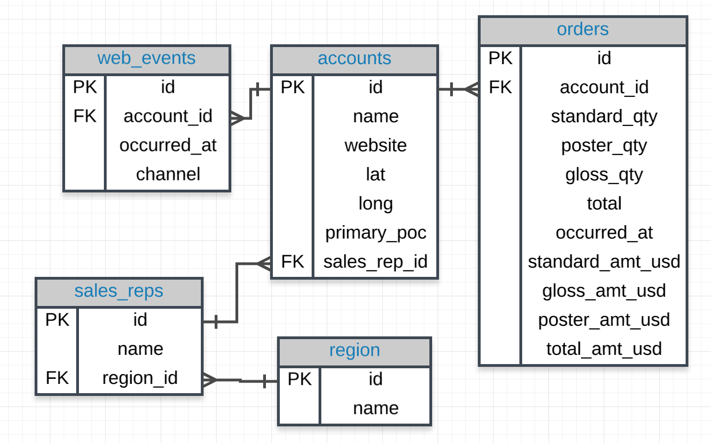

# Subquery and Temporary tables




## Problem 1

1. Provide the `name` of the **sales_rep** in each **region** with the largest amount of **total_amt_usd** sales.

In order to solve this problem, let's first try to pull some of this information together.

We can see that the `name` of the **sales_rep** exists in the **sales_reps** table, the `region` information is in the **region** table and the **total_amt_usd** is in the **orders** table. Therefore, we need to join four tables together in order to pull this information together.

```SQL
FROM sales_reps sr
JOIN region r
  ON sr.region_id = r.id
JOIN accounts a
  ON a.sales_rep_id = sr.id
JOIN orders o
  ON o.account_id = a.id
```

First, I wanted to find the `total_amt_usd` **totals** associated with `each` **sales rep**, and I also wanted the `region` in which they were located. The query below provided this information.


```SQL
SELECT s.name rep_name, r.name region_name, SUM(o.total_amt_usd) total_amt
  FROM sales_reps s
  JOIN accounts a
    ON a.sales_rep_id = s.id
  JOIN orders o
    ON o.account_id = a.id
  JOIN region r
    ON r.id = s.region_id
 GROUP BY 1,2
 ORDER BY 3 DESC;
```

Let's go ahead and run this query

**Results**

|rep_name       | region_name | total_amt|
|:-------------:|:------------:|:-----------:|
|**Earlie Schleusner**   | **Southeast**   | **1098137.72**|
|**Tia Amato**           | **Northeast**   | **1010690.60**|
|Vernita Plump       | Southeast   |  934212.93|
|**Georgianna Chisholm** | **West**        |  **886244.12**|
|Arica Stoltzfus     | West        |  810353.34|
|Dorotha Seawell     | Southeast   |  766935.04|
|Nelle Meaux         | Southeast   |  749076.16|
|Sibyl Lauria        | Northeast   |  722084.27|
|Maren Musto         | Southeast   |  702697.29|
|Brandie Riva        | West        |  675917.64|
|....|....|....|

For this problem we want to provide the name of the `sales_rep` in each region with the largest amount of total sales. For instance, the name of the sales_rep with the largest amount of total sales in the `Southeast` region is **Earlie Schleusner**, however we have other records with region_name equals to `Southeast`, (`Vernita Plump`, ...), we don't want them showing up in our table. Similarly, **Tia Amato** is the sales_rep for the region `Northeast`. So for each region we just want the maximum total sales.

|rep_name       | region_name | total_amt|
|:-------------:|:------------:|:-----------:|
|**Earlie Schleusner**   | **Southeast**   | **1098137.72**|
|Vernita Plump       | Southeast   |  934212.93|
|Dorotha Seawell     | Southeast   |  766935.04|
|....|....|....|
|**Tia Amato**           | **Northeast**   | **1010690.60**|
|Sibyl Lauria        | Northeast   |  722084.27|
|....|....|....|
|**Georgianna Chisholm** | **West**        |  **886244.12**|
|Arica Stoltzfus     | West        |  810353.34|
|....|....|....|

Unfortunately, we can't do this all at once because if we group by the individual again, the individual along with the region is still unique, so we'd end up with all of these table values back. But if we group by just the region and pull the max, we should only get the one rep with the maximum amount of sales.

So, in order to do that we are going to use a subquery. First, we want to be able to pull out the region along with the max total sales for that region. For instance, ( **Southeast** ,**1098137.72**) and (**Northeast**, **1010690.60**).


```SQL
SELECT region_name, MAX(total_amt) total_amt
  FROM (SELECT s.name rep_name, r.name region_name, SUM(o.total_amt_usd) total_amt
          FROM sales_reps s
          JOIN accounts a
            ON a.sales_rep_id = s.id
          JOIN orders o
            ON o.account_id = a.id
          JOIN region r
            ON r.id = s.region_id
      GROUP BY 1, 2) t1
  GROUP BY 1;
```

**Results**

|region_name | total_amt|
|:----------:|:-----------:|
| Midwest     |  675637.19|
| Southeast   | 1098137.72|
| West        |  886244.12|
| Northeast   | 1010690.60|


So, now what we are seeing is the list of four regions with their max sales. And essentially what we want to do is to match that back to the original table that we had before and we are going to call it `t3`.

```SQL
SELECT t3.rep_name, t3.region_name, t3.total_amt
  FROM (SELECT region_name, MAX(total_amt) total_amt
          FROM (SELECT s.name rep_name, r.name region_name, SUM(o.total_amt_usd) total_amt
                  FROM sales_reps s
                  JOIN accounts a
                    ON a.sales_rep_id = s.id
                  JOIN orders o
                    ON o.account_id = a.id
                  JOIN region r
                    ON r.id = s.region_id
                 GROUP BY 1, 2) t1
        GROUP BY 1) t2
  JOIN (SELECT s.name rep_name, r.name region_name, SUM(o.total_amt_usd) total_amt
          FROM sales_reps s
          JOIN accounts a
            ON a.sales_rep_id = s.id
          JOIN orders o
            ON o.account_id = a.id
          JOIN region r
            ON r.id = s.region_id
         GROUP BY 1,2
         ORDER BY 3 DESC) t3
    ON t3.region_name = t2.region_name AND t3.total_amt = t2.total_amt;
```


Essentially, this is a JOIN of these two tables, where the region and amount match.

**Results**

|rep_name       | region_name | total_amt|
|:------------------:|:-----------:|:------------:|
|Earlie Schleusner   | Southeast   | 1098137.72|
|Tia Amato           | Northeast   | 1010690.60|
|Georgianna Chisholm | West        |  886244.12|
|Charles Bidwell     | Midwest     |  675637.19|


## Problem 2

2. For the **region with the largest sales** `total_amt_usd`, how `many total orders` were placed?

The first query I wrote was to pull the total_amt_usd for each region.

```SQL
SELECT r.name region_name, SUM(o.total_amt_usd) total_amt
  FROM sales_reps s
  JOIN accounts a
    ON a.sales_rep_id = s.id
  JOIN orders o
    ON o.account_id = a.id
  JOIN region r
    ON r.id = s.region_id
 GROUP BY r.name;
```

**Results**

|region_name | total_amt|
|:----------:|:-----------:|
| Southeast   | 6458497.00|
| West        | 5925122.96|
| Midwest     | 3013486.51|
| **Northeast**   | **7744405.36**|

Then we just want the region with the max amount from this table. There are two ways I considered getting this amount. One was to pull the max using a subquery. Another way is to order descending and just pull the top value.

```SQL
SELECT MAX(total_amt)
  FROM (SELECT r.name region_name, SUM(o.total_amt_usd) total_amt
               FROM sales_reps s
               JOIN accounts a
                 ON a.sales_rep_id = s.id
               JOIN orders o
                 ON o.account_id = a.id
               JOIN region r
                 ON r.id = s.region_id
              GROUP BY r.name) sub;
```

**Results**

|max|
|:----------:|
|7744405.36|

Finally, we want to pull the total orders for the region with this amount:

```SQL
SELECT r.name, COUNT(o.total) total_orders
  FROM sales_reps s
  JOIN accounts a
    ON a.sales_rep_id = s.id
  JOIN orders o
    ON o.account_id = a.id
  JOIN region r
    ON r.id = s.region_id
 GROUP BY r.name
HAVING SUM(o.total_amt_usd) = (
      SELECT MAX(total_amt)
        FROM (SELECT r.name region_name, SUM(o.total_amt_usd) total_amt
                FROM sales_reps s
                JOIN accounts a
                  ON a.sales_rep_id = s.id
                JOIN orders o
                  ON o.account_id = a.id
                JOIN region r
                  ON r.id = s.region_id
               GROUP BY r.name) sub);
```

**Results**

|name    | total_orders|
|:------:|:-------------:|
|Northeast |         2357|

## Problem 3

3. **How many accounts** had more **total** purchases than the account **name** which has bought the most **standard_qty** paper throughout their lifetime as a customer?

First, we want to find the account that had the most standard_qty paper. The query here pulls that account, as well as the total amount:

```SQL
SELECT a.name account_name, SUM(o.standard_qty) total_std, SUM(o.total) total
  FROM accounts a
  JOIN orders o
    ON o.account_id = a.id
 GROUP BY 1
 ORDER BY 2 DESC
 LIMIT 1;
```

**Results**

|account_name    | total_std | total|
|:--------------:|:---------:|:------:|
|Core-Mark Holding |     41617 | 44750|

Now, I want to use this to pull all the accounts with more total sales:

```SQL
SELECT a.name
  FROM orders o
  JOIN accounts a
    ON a.id = o.account_id
 GROUP BY 1
HAVING SUM(o.total) >
       (SELECT total
          FROM (SELECT a.name act_name, SUM(o.standard_qty) tot_std, SUM(o.total) total
                  FROM accounts a
                  JOIN orders o
                    ON o.account_id = a.id
                 GROUP BY 1
                 ORDER BY 2 DESC
                 LIMIT 1) sub);
```

**Results**

|name|
|:-------------:|
|EOG Resources|
|Mosaic|
|IBM|

This is now a list of all the accounts with more total orders. We can get the count with just another simple subquery.

```SQL
SELECT COUNT(*)
  FROM (SELECT a.name
          FROM orders o
          JOIN accounts a
            ON a.id = o.account_id
         GROUP BY 1
        HAVING SUM(o.total) >
               (SELECT total
                  FROM (SELECT a.name act_name, SUM(o.standard_qty) tot_std, SUM(o.total) total
                          FROM accounts a
                          JOIN orders o
                            ON o.account_id = a.id
                         GROUP BY 1
                         ORDER BY 2 DESC
                         LIMIT 1) inner_tab)
        ) counter_tab;
```

**Results**

|count|
|:-----:|
|    3|

## Problem 4

4. For the customer that spent the most (in total over their lifetime as a customer) **total_amt_usd**, how many **web_events** did they have for each channel?


Here, we first want to pull the customer with the most spent in lifetime value.

```SQL
SELECT a.id, a.name, SUM(o.total_amt_usd) tot_spent
  FROM orders o
  JOIN accounts a
    ON a.id = o.account_id
 GROUP BY a.id, a.name
 ORDER BY 3 DESC
 LIMIT 1;
```

**Results**

|id  |     name      | tot_spent|
|:---:|:------------:|:----------:|
|4211 | EOG Resources | 382873.30|

Now, we want to look at the number of events on each channel this company had, which we can match with just the **id**.

```SQL
SELECT a.name, w.channel, COUNT(*)
  FROM accounts a
  JOIN web_events w
    ON a.id = w.account_id AND
       a.id =  (SELECT id
                  FROM (SELECT a.id, a.name, SUM(o.total_amt_usd) tot_spent
                          FROM orders o
                          JOIN accounts a
                            ON a.id = o.account_id
                         GROUP BY a.id, a.name
                         ORDER BY 3 DESC
                         LIMIT 1) inner_table)
GROUP BY 1, 2
ORDER BY 3 DESC;
```

**Results**

|name      | channel  | count|
|:------------:|:--------:|:------:|
|EOG Resources | direct   |    44|
|EOG Resources | organic  |    13|
|EOG Resources | adwords  |    12|
|EOG Resources | facebook |    11|
|EOG Resources | twitter  |     5|
|EOG Resources | banner   |     4|

I added an ORDER BY for no real reason, and the account name to assure I was only pulling from one account.

## Problem 5

5. What is the lifetime average amount spent in terms of **total_amt_usd** for the top 10 total spending **accounts**?

First, we just want to find the top 10 accounts in terms of highest **total_amt_usd**.

```SQL
SELECT a.id, a.name, SUM(o.total_amt_usd) tot_spent
  FROM orders o
  JOIN accounts a
    ON a.id = o.account_id
 GROUP BY a.id, a.name
 ORDER BY 3 DESC
 LIMIT 10;
```

**Results**

|id  |          name          | tot_spent|
|:---:|:----------------------:|:--------:|
|4211 | EOG Resources          | 382873.30|
|4151 | Mosaic                 | 345618.59|
|1301 | IBM                    | 326819.48|
|1871 | General Dynamics       | 300694.79|
|4111 | Republic Services      | 293861.14|
|3411 | Leucadia National      | 291047.25|
|2181 | Arrow Electronics      | 281018.36|
|1561 | Sysco                  | 278575.64|
|2591 | Supervalu              | 275288.30|
|1401 | Archer Daniels Midland | 272672.84|

Now, we just want the average of these 10 amounts.

```SQL
SELECT AVG(tot_spent)
  FROM (SELECT a.id, a.name, SUM(o.total_amt_usd) tot_spent
          FROM orders o
          JOIN accounts a
            ON a.id = o.account_id
         GROUP BY a.id, a.name
         ORDER BY 3 DESC
         LIMIT 10) temp;
```

**Results**

|avg|
|:-------------------:|
|304846.969000000000|


## Problem 6

6. What is the lifetime average amount spent in terms of **total_amt_usd**, including only the companies that spent more per order, on average, than the average of all orders.

First, we want to pull the average of all accounts in terms of **total_amt_usd**:

```SQL
SELECT AVG(o.total_amt_usd) avg_all
  FROM orders o;
```

**Results**

|avg_all|
|:-------------------:|
|3348.0196513310185185|

Then, we want to only pull the accounts with more than this average amount.

```SQL
SELECT o.account_id, AVG(o.total_amt_usd)
  FROM orders o
 GROUP BY 1
HAVING AVG(o.total_amt_usd) >
       (SELECT AVG(o.total_amt_usd) avg_all
          FROM orders o);
```
Finally, we just want the average of these values.

```SQL
SELECT AVG(avg_amt)
  FROM (SELECT o.account_id, AVG(o.total_amt_usd) avg_amt
          FROM orders o
         GROUP BY 1
        HAVING AVG(o.total_amt_usd) >
               (SELECT AVG(o.total_amt_usd) avg_all
                  FROM orders o)
        ) temp_table;
```

**Results**

|avg|
|:---------------------:|
|4721.1397439971747168|
