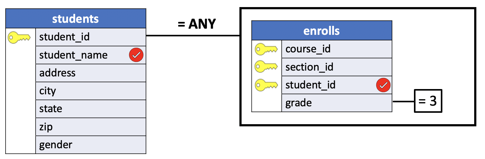
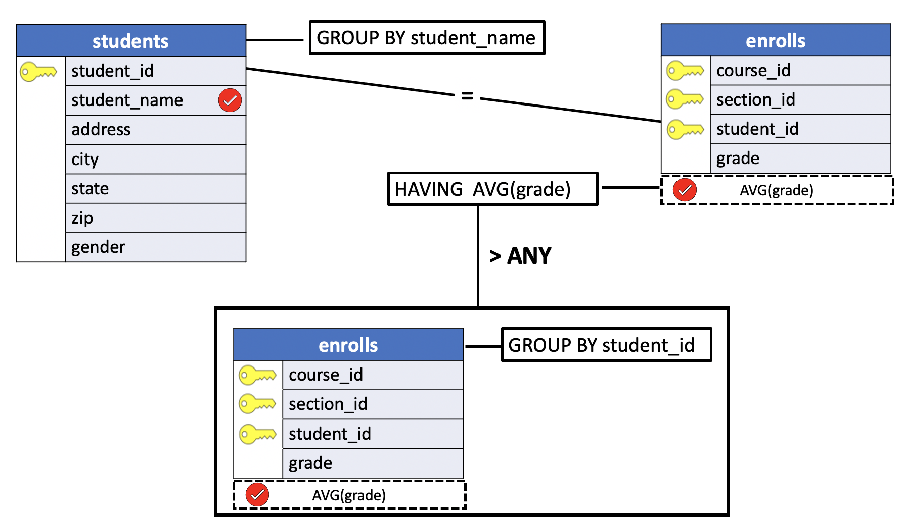

# Using ANY in a Subquery

As we just described, a subquery that immediately follows one of the comparison operators is expected to return only a single value.

**It is possible, however, to use comparison operators with subqueries returning multiple values by following the operator with either of the words** `ANY` or `ALL`.

When `ANY` is used, the `WHERE` or `HAVING` clause containing the subquery **will be true if the specified operator is true for** *any* **of the values returned by the subquery**. In other words, if the expression containing the operator is true for at least one of the values returned by the subquery, the entire `WHERE` or `HAVING` clause will be true.

## Introduction to PostgreSQL ANY operator

The PostgreSQL `ANY` operator **compares a value to a set of values returned by a subquery**. The following illustrates the syntax of  the `ANY` operator:

```SQL
operator ANY ( v1, v2, v3)

operator ANY ( subquery)
```

In this syntax:

- The `ANY` operator must be preceded by a comparison operator such as `=`, `!=`, `>`, `>=`,`<`, `<=`.

- The list or subquery must be **surrounded by the parentheses**.
- The `subquery` must return exactly **one column**.
- The `ANY` operator returns **true if any value of the subquery meets the condition**, otherwise, it returns false.

Note that `SOME` is a synonym for `ANY`, meaning that you can substitute `SOME` for `ANY` in any SQL statement.

When you use the `ANY` operator to compare a value to a list, PostgreSQL expands the initial condition to all elements of the list and uses the `OR` operator to combine them as shown below:

```SQL
SELECT *
  FROM table_name
 WHERE c > ANY (
        v1,
        v2,
        v3
    );
```

PostgreSQL performs a transformation of the above query to the following:

```SQL
SELECT *
  FROM table_name
 WHERE c > v1 OR
       c > v2 OR
       c > v3;
```

For example,

```SQL
x > ANY (subquery)
```

the following condition evaluates to true if x is greater than any value returned by the subquery. So the condition `x > ANY (1,2,3)` evaluates to **true** if `x is greater than 1`.


## PostgreSQL ANY examples

We will use the following `students` and  `enrolls` tables in the `uniy` sample database for the demonstration.

**students**

```console
uniy=# \d students
                    Table "public.students"
    Column    |     Type      | Collation | Nullable | Default
--------------+---------------+-----------+----------+---------
 student_id   | smallint      |           | not null |
 student_name | character(18) |           |          |
 address      | character(20) |           |          |
 city         | character(10) |           |          |
 state        | character(2)  |           |          |
 zip          | character(5)  |           |          |
 gender       | character(1)  |           |          |
Indexes:
    "students_pkey" PRIMARY KEY, btree (student_id)
Referenced by:
    TABLE "enrolls" CONSTRAINT "enrolls_fkey_student" FOREIGN KEY (student_id) REFERENCES students(student_id) ON DELETE CASCADE
```

**enrolls**

```console
uniy=# \d enrolls
                 Table "public.enrolls"
   Column   |   Type   | Collation | Nullable | Default
------------+----------+-----------+----------+---------
 course_id  | smallint |           | not null |
 section_id | smallint |           | not null |
 student_id | smallint |           | not null |
 grade      | smallint |           |          |
Indexes:
    "enrolls_pkey" PRIMARY KEY, btree (course_id, section_id, student_id)
Foreign-key constraints:
    "enrolls_fkey_course" FOREIGN KEY (course_id) REFERENCES courses(course_id) ON DELETE CASCADE
    "enrolls_fkey_section" FOREIGN KEY (course_id, section_id) REFERENCES sections(course_id, section_id) ON DELETE CASCADE
    "enrolls_fkey_student" FOREIGN KEY (student_id) REFERENCES students(student_id) ON DELETE CASCADE
```

**Problem**: list all students who received at least one `B`.

- First we want to return all students who scored `B` (grade = 3) to an exam.


```SQL
SELECT student_id
  FROM enrolls
 WHERE grade = 3;
```

**Results**

| student_id|
|:----------:|
|        148|
|        210|
|        298|
|        298|
|        473|
|        558|

The resulting table returns more than a single value and duplicates (`298`).

- Finally, we could get the names of these students using the `ANY` clause with the `students` table.

```SQL
SELECT student_name
  FROM students
 WHERE student_id = ANY
       (SELECT student_id
          FROM enrolls
         WHERE grade = 3);
```

**Query Diagram**




The result of this query will be the names of all students who received at least one `B`. Because the subquery will return more than one value, we could not use the `=` operator by itself. Following it with `ANY`, however, allows us to compare the `student_id` from `students` with each of the results of the subquery. Although the student_id `298` appears twice in the subquery result, the result of the `ANY` operator returns a single student and not a duplicate. In other words, the `ANY` operator needs only a single `true` condition. The outer query looks at all these values and determines which student's `id`  is equal to the list of student's id values of the subquery, (`148`,`210`,`298`,`473`,`558`).

Note that if the subquery does not return any rows, the entire query returns an empty result set.

**Results**

|student_name|
|:------------------:|
|Susan Powell|
|Bob Dawson|
|Howard Mansfield|
|Carol Dean|
|Val Shipp|


As expected the number of rows is 5. The list of all records in the student's table is:

| student_id |    student_name|
|:----------:|:-------------------:|
|        **148** | **Susan Powell**|
|        **210** | **Bob Dawson**|
|        **298** | **Howard Mansfield**|
|        348 | Susan Pugh|
|        349 | Joe Adams|
|        354 | Janet Ladd|
|        410 | Bill Jones|
|        **473** | **Carol Dean**|
|        548 | Allen Thomas|
|        **558** | **Val Shipp**|
|        649 | John Anderson|
|        654 | Janet Thomas|

## ANY vs. IN

The `= ANY` is equivalent to `IN` operator.

When used to test for equality, using `ANY` is exactly equivalent to using `IN`. Therefore, the query:

```SQL
SELECT student_name
  FROM students
 WHERE student_id IN
       (SELECT student_id
          FROM enrolls
         WHERE grade = 3);
```

will return results identical to the previous example. With the other comparison operators ( `!=`, `>`, `>=`,`<`, `<=`), however, `ANY` **can be a useful addition because it allows comparisons against subqueries that return more than one value**.

For example, to see the names of students whose average grade is higher than that of the student with the lowest average grade (and to provide an example of a `HAVING` clause containing a subquery), we could type:


```SQL
SELECT student_name, AVG(grade)
  FROM students
 INNER JOIN enrolls USING(student_id)
 GROUP BY 1
HAVING AVG(grade) > ANY
       (SELECT AVG(grade)
          FROM enrolls
         GROUP BY student_id);
```

**Query Diagram**



**Results**

|student_name    |        avg|
|:-----------------:|:-----------------:|
|John Anderson      | 4.0000000000000000|
|Susan Powell       | 3.0000000000000000|
|Susan Pugh         | 2.0000000000000000|
|Howard Mansfield   | 3.0000000000000000|
|Joe Adams          | 4.0000000000000000|
|Allen Thomas       | 2.0000000000000000|
|Val Shipp          | 3.0000000000000000|
|Bob Dawson         | 2.0000000000000000|
|Bill Jones         | 2.0000000000000000|
|Janet Thomas       | 4.0000000000000000|

The result of the subquery is a table containing the average grade of every student. The outer query also calculates every student's average grade but relies on the subquery within its `HAVING` clause to determine which of those students' names and average grades appear in its results. Only those students whose average grade is greater than at least one other student's average grade will be selected. In other words, this query will list the names of all students except those with the lowest average grade, (`1.6666666666666667`).

The result of the subquery is

```SQL
SELECT AVG(grade)
          FROM enrolls
         GROUP BY student_id;
```
**Results**

|        avg|
|:-----------------:|
| **1.6666666666666667**|
| 2.0000000000000000|
| 2.0000000000000000|
| 4.0000000000000000|
| 3.0000000000000000|
| 3.0000000000000000|
| 2.0000000000000000|
| 4.0000000000000000|
| 2.0000000000000000|
| 4.0000000000000000|
| 3.0000000000000000|
