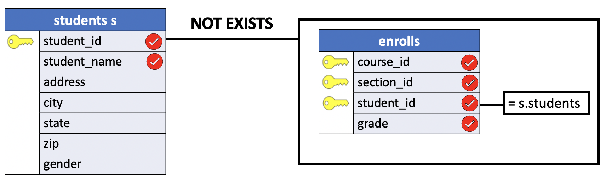
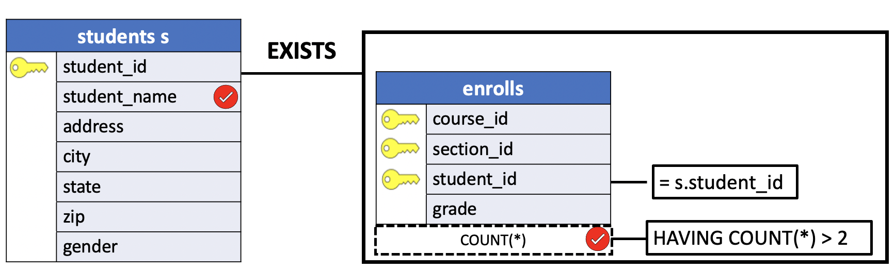

# EXISTS and NOT EXISTS

All subqueries return a table that is then used as input to the enclosing query. So far, we have been concerned with comparing the actual values in this returned table to other values, using operators like `=`, `>` and `<`.

Typically, the records for which the `WHERE` clause was true were selected. SQL also allows us to `test not just the values contained in records returned by a subquery` but the **existence or non-existence of any such records as well**. For this task, the language provides **EXISTS** and **NOT EXISTS**.

Recall that each part of a `WHERE` clause is either true or false for each record in the table. A subquery preceded by the word `EXISTS` will be true if the subquery returns any records at all, regardless of the value of those records (even a record containing all NULL qualifies). Similarly, a subquery preceded by `NOT EXISTS` will be true if the subquery returns no records; that is, an empty table with no rows and no columns.

Existence test, although conceptually simple, can be quite useful. Their most common use, however, is in **correlated subqueries**.

## Introduction to PostgreSQL EXISTS operator

The **EXISTS** operator is a **boolean operator that tests for existence of rows in a subquery**.

The following illustrates syntax of the **EXISTS** operator:

```SQL
EXISTS (subquery)
```

The **EXISTS** accepts an argument which is a subquery.

- If the subquery **returns at least one row**, the `result` of `EXISTS` is **true**.

- In case the subquery **returns no row**, the `result` is of `EXISTS` is **false**.

The **EXISTS** operator is often used with the **correlated subquery**.

The result of **EXISTS** operator **depends on whether any row returned by the subquery, and not on the row contents**. Therefore, columns that appear on the `SELECT` clause of the subquery are not important.

For this reason, the common coding convention is to write **EXISTS** in the following form:

```SQL
SELECT column1
  FROM table_1
 WHERE EXISTS( SELECT 1
                 FROM table_2
                WHERE column_2 = table_1.column_1);
```

The **EXISTS** operator **terminates the query processing immediately once it finds a row**, therefore, you can leverage this feature of the `EXISTS` operator **to improve the query performance**.

## SQL EXISTS operator example

We will use the `students` and `enrolls` tables in the `uniy` sample database for the demonstration.

**students**

```console
uniy=# \d students
                    Table "public.students"
    Column    |     Type      | Collation | Nullable | Default
--------------+---------------+-----------+----------+---------
 student_id   | smallint      |           | not null |
 student_name | character(18) |           |          |
 address      | character(20) |           |          |
 city         | character(10) |           |          |
 state        | character(2)  |           |          |
 zip          | character(5)  |           |          |
 gender       | character(1)  |           |          |
Indexes:
    "students_pkey" PRIMARY KEY, btree (student_id)
Referenced by:
    TABLE "enrolls" CONSTRAINT "enrolls_fkey_student" FOREIGN KEY (student_id) REFERENCES students(student_id) ON DELETE CASCADE
```

**enrolls**

```console
uniy=# \d enrolls
                 Table "public.enrolls"
   Column   |   Type   | Collation | Nullable | Default
------------+----------+-----------+----------+---------
 course_id  | smallint |           | not null |
 section_id | smallint |           | not null |
 student_id | smallint |           | not null |
 grade      | smallint |           |          |
Indexes:
    "enrolls_pkey" PRIMARY KEY, btree (course_id, section_id, student_id)
Foreign-key constraints:
    "enrolls_fkey_course" FOREIGN KEY (course_id) REFERENCES courses(course_id) ON DELETE CASCADE
    "enrolls_fkey_section" FOREIGN KEY (course_id, section_id) REFERENCES sections(course_id, section_id) ON DELETE CASCADE
    "enrolls_fkey_student" FOREIGN KEY (student_id) REFERENCES students(student_id) ON DELETE CASCADE
```

**Problem**: List the names and student numbers of any students who are not currently enrolled in any classes.

One way to express this request in SQL is:

```SQL
SELECT student_id,
       student_name
  FROM students s
 WHERE NOT EXISTS (
           SELECT 1
             FROM enrolls e
            WHERE e.student_id = s.student_id);
```

**Query Diagram**



Unlike the earlier examples, the paranthesized subquery here is not executed just once. Instead, this subquery is executed once for **each** record in the **students** table. For each execution, the value of the `student_id` from **every** record in **enrolls** (via the condition `e.student_id = s.student_id` in the subquery's `WHERE` clause). Whenever the student_id's match, the subquery adds that record from `enrolls` to its result table.

**Results**

|student_id |    student_name|
|:---------:|:---------------:|
|       354 | Janet Ladd|

Recall from the last section how `NOT EXISTS` works: if the table returned by the subquery is not empty (that is, if it contains at least one record), the `NOT EXISTS` condition is false. If, however, the table returned by the subquery is empty (that is, if it contains no records), the `NOT EXISTS` condition is **true**.

In the previous example, the subquery compares the `student_id` field of each record in **students** with every `student_id` filed in the **enrolls** table. If **at least one match is found**, then this student is enrolled in some course, the table resulting from the subquery will not be empty, and the `NOT EXISTS` condition will be **false**. If **no matches** are found, however, then the subquery will return an empty table, the `NOT EXISTS` condition will be **true**, and the `student_name` and `student_id` fields of the **current record in the main query will be selected**.

Note that the alias `s` is defined for the **students** table in the main query, and that **alias is used within the subquery**. Note also that the value of `s.student_id`, which `changes each time the subquery is executed`, is taken from (or correlated with) the current record in the main query. It is from this relationship that the term "**correlated subquery**" is derived. To recognize correlated subqueries, look for the use within the subquery of an `alias` (or, occasionally, of a complete table name) defined only in the main query.

The previous example could also have been written without the alias name for `enrolls` and with only one qualified name, such as

```SQL
SELECT student_id,
       student_name
  FROM students s
 WHERE NOT EXISTS (
           SELECT 1
             FROM enrolls
            WHERE student_id = s.student_id);
```

Again, `s.student_id` takes its value from the current record in `students`. The reference to `student_id` in the subquery's `WHERE` clause till refers to that column in the `enrolls` table; in the absence of a qualified name, the column is assumed to come from the "nearest" table. In this case, that table is `enrolls`. The results of this query are identical to those of the one shown previously.

## SQL EXISTS and NULL

If the subquery returns `NULL`, the **EXISTS** operator still returns the result set. This is because the **EXISTS** operator **only checks for the existence of row returned by the subquery**. It does not matter if the row is NULL or not.

In the following example, the subquery returns `NULL` but the **EXISTS** operator still evaluates to **true**:

```SQL
SELECT student_id,
       student_name
  FROM students
 WHERE EXISTS (SELECT NULL);
```
The query returns all rows in the `students` table.

## PostgreSQL EXISTS vs. IN

The `EXISTS` operator **stops scanning rows once the subquery returns the first row** because it can determine the result whereas the `IN` operator **must scan all rows returned by the subquery to conclude the result**.

The previous query:

```SQL
SELECT student_id,
       student_name
  FROM students s
 WHERE NOT EXISTS (
           SELECT 1
             FROM enrolls
            WHERE student_id = s.student_id);
```

could also be written as:

```SQL
SELECT student_id,
       student_name
  FROM students s
 WHERE s.student_id NOT IN (
       SELECT DISTINCT student_id
         FROM enrolls);
```

Typically, the `EXISTS` operator is **faster** than `IN` operator when the result set of the subquery is **large**. By contrast, the `IN` operator is **faster** than `EXISTS` operator when the result set of the subquery is **small**.

In addition, the `IN` clause can’t compare anything with `NULL` values, but the **EXISTS** clause **can compare everything with** `NULL` values.

## USING HAVING with Correlated Subquery and EXISTS

The `HAVING` clause was discussed in the context of `GROUP BY`. `HAVING` is also useful with correlated subqueries. While a `WHERE` clause specifies restrictions that individual records must meet to be selected, a `HAVING` clause places a restriction on the results of an entire query (or, when used with `GROUP BY`, of a group). When used without `GROUP BY`, a `HAVING` clause can prevent a query from returning anything at all.

To see why this option is useful, suppose we wanted to know which students are taking more than two courses. One way to express this query is:

```SQL
SELECT student_name
  FROM students s
 WHERE EXISTS
       (SELECT COUNT(*)
          FROM enrolls
         WHERE student_id = s.student_id
        HAVING COUNT(*) > 2);
```

**Query Diagram**



**Results**

|student_name|
|:------------------:|
|Carol Dean|

As before, the subquery will be executed once for each record in the `students` table (we know this because of the reference to the alias `s` within the subquery). And, as always, the `student_name` field from the current `students` record will be selected whenever the main query's `WHERE` clause is true.

The question to be answered, then, is when will this `WHERE` clause be true?

Once again, the `EXISTS` operation (and thus the main query's `WHERE` clause) returns true if and only if the subquery returns a non-empty table (that is, a table with at least one row and column). Without the `HAVING` clause, the subquery would return the number of courses in which each student was enrolled. The effect of the `HAVING` clause, however, is to eliminate entirely the results of any subquery executions that return two or fewer records. Once again, because a `HAVING` clause (without `GROUP BY`) places a restriction on the query as a whole, any query that would otherwise return fewer than three records will now return an empty table. The `EXISTS` in the main query, and thus the main query's `WHERE` clause, will therefore be true only for those students who are enrolled in more than two courses.
