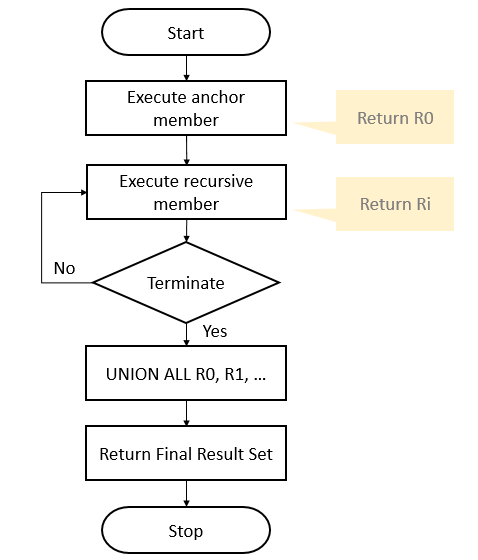

# Intro Recursive Query

A recursive common table expression (**CTE**) is a **CTE** `that references itself`. By doing so, the **CTE** `repeatedly executes, returns subsets of data, until it returns the complete result set`.

A recursive CTE is useful in querying

- hierarchical data such as organization charts where one employee reports to a manager
- or multi-level bill of materials when a product consists of many components, and each component itself also consists of many other components.

## Syntax

The following shows the `syntax` of a **recursive CTE**:

```SQL
WITH expression_name (column_list)
AS
(
    -- Anchor member
    initial_query  
    UNION ALL
    -- Recursive member that references expression_name.
    recursive_query  
)
-- references expression name
SELECT *
FROM   expression_name
```

In general, a recursive CTE has three parts:

1. An **initial query*** that `returns the base result set` of the CTE. The initial query is called an `anchor member`.
2. A **recursive query** that `references the common table expression`, therefore, it is called the recursive member. The `recursive member` is union-ed with the anchor member using the `UNION ALL` operator.
3. A **termination condition** `specified in the recursive member` that **terminates the execution of the recursive member**.


### Execution Order

The **execution order** of a **recursive CTE** is as follows:

1. First, execute the `anchor member` to form the **base result** set (**R0**),
  - use this result for the next iteration.
2. Second, execute the `recursive member` with the `input result set from the previous iteration` (**Ri-1**) and return a `sub-result set` (**Ri**) **until the termination condition is met**.
3. Third, combine all result sets **R0**, **R1**, **… Rn** using `UNION ALL` operator to produce the final result set.

The following flowchart illustrates the execution of a recursive CTE:



Let’s take some examples of using recursive CTEs


## Simple recursive CTE example

This example uses a **recursive CTE** to `returns weekdays from Monday to Saturday`:

```SQL
WITH RECURSIVE cte_numbers(n, weekday, prev_n, prev_weekday)
AS (
    SELECT
        0,
        'MONDAY',
        -1,
        ''
    UNION ALL
    SELECT    
        n + 1, -- UPDATING VARIABLE FOR TERMINAL CONDITION
        CASE WHEN (n + 1)  = 1 THEN 'TUESDAY'
             WHEN (n + 1)  = 2 THEN 'WEDNESDAY'
             WHEN (n + 1)  = 3 THEN 'THURSDAY'
             WHEN (n + 1)  = 4  THEN 'FRIDAY'
             WHEN (n + 1)  = 5 THEN 'SATURDAY'
             WHEN (n + 1)  = 6 THEN 'SUNDAY'
        END,
        n,
        weekday
    FROM    
        cte_numbers
    WHERE n < 6 -- TERMINATION CONDITION
)
SELECT n, weekday, prev_n, prev_weekday
  FROM cte_numbers;
```

|n |  weekday  | prev_n | prev_weekday|
|:--:|:-------:|:------:|:-----------:|
|0 | MONDAY    |     -1 ||
|1 | TUESDAY   |      0 | MONDAY|
|2 | WEDNESDAY |      1 | TUESDAY|
|3 | THURSDAY  |      2 | WEDNESDAY|
|4 | FRIDAY    |      3 | THURSDAY|
|5 | SATURDAY  |      4 | FRIDAY|
|6 | SUNDAY    |      5 | SATURDAY|

**(7 rows)**

In this example:

```SQL
SELECT
    0,
    'MONDAY',
    -1,
    ''
```

The anchor member returns the `MONDAY` and the column `n` is equal to **0**.

### STEP 0

```SQL
SELECT 0 AS n,
       'MONDAY' AS weekday,
       -1 AS prev_n,
       '' AS prev_weeekday;
```

|n | weekday | prev_n | prev_weeekday|
|:-:|:------:|:------:|:-------------:|
|0 | MONDAY  |     -1 ||

It's basically the inizialization of the recursive procedure. It's executed only once.

```SQL
SELECT    
    n + 1, -- UPDATING VARIABLE FOR TERMINAL CONDITION
    CASE WHEN (n + 1)  = 1 THEN 'TUESDAY'
         WHEN (n + 1)  = 2 THEN 'WEDNESDAY'
         WHEN (n + 1)  = 3 THEN 'THURSDAY'
         WHEN (n + 1)  = 4  THEN 'FRIDAY'
         WHEN (n + 1)  = 5 THEN 'SATURDAY'
         WHEN (n + 1)  = 6 THEN 'SUNDAY'
    END,
    n,
    weekday
```

The recursive member returns the next day starting from the Tuesday till Sunday.

Keep in mind that the first execution  of the recursive part `n` is zero.

```SQL
SELECT    
    n + 1, -- UPDATING VARIABLE FOR TERMINAL CONDITION
    CASE WHEN (n + 1)  = 1 THEN 'TUESDAY'
         WHEN (n + 1)  = 2 THEN 'WEDNESDAY'
         WHEN (n + 1)  = 3 THEN 'THURSDAY'
         WHEN (n + 1)  = 4  THEN 'FRIDAY'
         WHEN (n + 1)  = 5 THEN 'SATURDAY'
         WHEN (n + 1)  = 6 THEN 'SUNDAY'
    END,
    n,
    weekday
FROM    
    cte_numbers
WHERE n < 6 -- TERMINATION CONDITION
```

The condition in the `WHERE` clause is the termination condition that stops the execution of the recursive member when `n` is **6**.

### STEP 1

```SQL
WITH cte_numbers_r0(n, weekday, prev_n, prev_weekday) AS (
  SELECT 0,'MONDAY',-1,''
)
SELECT n + 1 AS n, -- UPDATING VARIABLE FOR TERMINAL CONDITION
       CASE WHEN (n + 1)  = 1 THEN 'TUESDAY'
            WHEN (n + 1)  = 2 THEN 'WEDNESDAY'
            WHEN (n + 1)  = 3 THEN 'THURSDAY'
            WHEN (n + 1)  = 4  THEN 'FRIDAY'
            WHEN (n + 1)  = 5 THEN 'SATURDAY'
            WHEN (n + 1)  = 6 THEN 'SUNDAY'
       END AS weekday,
       n AS prev_n,
       prev_weekday
  FROM cte_numbers_r0;
```

|n | weekday | prev_n | prev_weekday|
|:-:|:------:|:------:|:-----------:|
|1 | TUESDAY |      0 ||

### STEP 2: 1 < 6

```SQL
WITH cte_numbers_r1(n, weekday, prev_n, prev_weekday) AS (
  SELECT 1,'TUESDAY',0,''
)
SELECT n + 1 AS n, -- UPDATING VARIABLE FOR TERMINAL CONDITION
       CASE WHEN (n + 1)  = 1 THEN 'TUESDAY'
            WHEN (n + 1)  = 2 THEN 'WEDNESDAY'
            WHEN (n + 1)  = 3 THEN 'THURSDAY'
            WHEN (n + 1)  = 4  THEN 'FRIDAY'
            WHEN (n + 1)  = 5 THEN 'SATURDAY'
            WHEN (n + 1)  = 6 THEN 'SUNDAY'
       END AS weekday,
       n AS prev_n,
       weekday AS prev_weekday
  FROM cte_numbers_r1;
```

|n |  weekday  | prev_n | prev_weekday|
|:-:|:--------:|:------:|:-----------:|
|2 | WEDNESDAY |      1 | TUESDAY|

### STEP 3: 2 < 6

```SQL
WITH cte_numbers_r2(n, weekday, prev_n, prev_weekday) AS (
  SELECT 2,'WEDNESDAY',1,'TUESDAY'
)
SELECT n + 1 AS n, -- UPDATING VARIABLE FOR TERMINAL CONDITION
       CASE WHEN (n + 1)  = 1 THEN 'TUESDAY'
            WHEN (n + 1)  = 2 THEN 'WEDNESDAY'
            WHEN (n + 1)  = 3 THEN 'THURSDAY'
            WHEN (n + 1)  = 4  THEN 'FRIDAY'
            WHEN (n + 1)  = 5 THEN 'SATURDAY'
            WHEN (n + 1)  = 6 THEN 'SUNDAY'
       END AS weekday,
       n AS prev_n,
       weekday AS prev_weekday
  FROM cte_numbers_r2;
```

|n | weekday  | prev_n | prev_weekday|
|:-:|:-------:|:------:|:-----------:|
|3 | THURSDAY |      2 | WEDNESDAY|

### STEP 4: 3 < 6

```SQL
WITH cte_numbers_r3(n, weekday, prev_n, prev_weekday) AS (
  SELECT 3,'THURSDAY',2,'WEDNESDAY'
)
SELECT n + 1 AS n, -- UPDATING VARIABLE FOR TERMINAL CONDITION
       CASE WHEN (n + 1)  = 1 THEN 'TUESDAY'
            WHEN (n + 1)  = 2 THEN 'WEDNESDAY'
            WHEN (n + 1)  = 3 THEN 'THURSDAY'
            WHEN (n + 1)  = 4  THEN 'FRIDAY'
            WHEN (n + 1)  = 5 THEN 'SATURDAY'
            WHEN (n + 1)  = 6 THEN 'SUNDAY'
       END AS weekday,
       n AS prev_n,
       weekday AS prev_weekday
  FROM cte_numbers_r3;
```

|n | weekday | prev_n | prev_weekday|
|:--:|:-----:|:------:|:------------:|
|4 | FRIDAY  |      3 | THURSDAY|

### STEP 5: 4 < 6

```SQL
WITH cte_numbers_r4(n, weekday, prev_n, prev_weekday) AS (
  SELECT 4,'FRIDAY',3,'THURSDAY'
)
SELECT n + 1 AS n, -- UPDATING VARIABLE FOR TERMINAL CONDITION
       CASE WHEN (n + 1)  = 1 THEN 'TUESDAY'
            WHEN (n + 1)  = 2 THEN 'WEDNESDAY'
            WHEN (n + 1)  = 3 THEN 'THURSDAY'
            WHEN (n + 1)  = 4  THEN 'FRIDAY'
            WHEN (n + 1)  = 5 THEN 'SATURDAY'
            WHEN (n + 1)  = 6 THEN 'SUNDAY'
       END AS weekday,
       n AS prev_n,
       weekday AS prev_weekday
  FROM cte_numbers_r4;
```

|n | weekday  | prev_n | prev_weekday|
|:-:|:-------:|:------:|:-----------:|
|5 | SATURDAY |      4 | FRIDAY|

### STEP 6: 5 < 6

```SQL
WITH cte_numbers_r5(n, weekday, prev_n, prev_weekday) AS (
  SELECT 5,'SATURDAY',4,'FRIDAY'
)
SELECT n + 1 AS n, -- UPDATING VARIABLE FOR TERMINAL CONDITION
       CASE WHEN (n + 1)  = 1 THEN 'TUESDAY'
            WHEN (n + 1)  = 2 THEN 'WEDNESDAY'
            WHEN (n + 1)  = 3 THEN 'THURSDAY'
            WHEN (n + 1)  = 4  THEN 'FRIDAY'
            WHEN (n + 1)  = 5 THEN 'SATURDAY'
            WHEN (n + 1)  = 6 THEN 'SUNDAY'
       END AS weekday,
       n AS prev_n,
       weekday AS prev_weekday
  FROM cte_numbers_r5;
```

|n | weekday | prev_n | prev_weekday|
|:--:|:------:|:------:|:-------------:|
|6 | SUNDAY  |      5 | SATURDAY|


### PICTURE ALGORITHM

```console
|n |  weekday  | prev_n | prev_weekday|
|:--:|:-------:|:------:|:-----------:|
|0 | MONDAY    |     -1 |             | <------| R0
|1 | TUESDAY   |      0 | MONDAY      | <------| R1
|2 | WEDNESDAY |      1 | TUESDAY     | <------| R2             STEP 6
|3 | THURSDAY  |      2 | WEDNESDAY   | <------| R3
|4 | FRIDAY    |      3 | THURSDAY    | <------| R4             INPUT
|5 | SATURDAY  |      4 | FRIDAY      | <------| R5 |---------------------+
|6 | SUNDAY    |      5 | SATURDAY    | <------| R6 |<--+ OUTPUT          |
                                                        |                 |
  +-----------------------------------------------------------------+     |
  |SELECT n + 1 AS n, -- UPDATING VARIABLE FOR TERMINAL CONDITION   | <---+
  |        CASE WHEN (n + 1)  = 1 THEN 'TUESDAY'                    |
  |             WHEN (n + 1)  = 2 THEN 'WEDNESDAY'                  |
  |             WHEN (n + 1)  = 3 THEN 'THURSDAY'                   |
  |             WHEN (n + 1)  = 4  THEN 'FRIDAY'                    |
  |             WHEN (n + 1)  = 5 THEN 'SATURDAY'                   |
  |             WHEN (n + 1)  = 6 THEN 'SUNDAY'                     |
  |        END AS weekday,                                          |
  |        n AS prev_n,                                             |
  |        weekday AS prev_weekday                                  |
  +-----------------------------------------------------------------+
```
