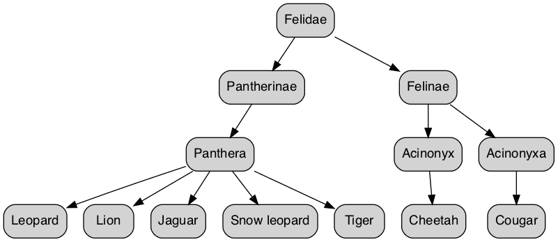

# Recursive Query Hierarchical data

In programming, Recursion is a technique used to solve problems by breaking them into smaller and smaller sub-tasks of the same type. Recursion is typically understood as a function that calls itself until a condition is met.

Recursion works well on certain problems, particularly involving **hierarchical data** (think `tree-style structures`) or where a problem naturally suits being broken into sub-problems.

## Recursive CTEs

PostgreSQL implements Recursion through `Recursive CTEs`, a unique type of `CTE` **that references itself**.

## Structure and layout

A `Recursive CTE` has three components:

- **Anchor Query**: Think of this as the **starting point for the query**. The anchor provides the `initial result set`.
- **Recursive Query**: Following the anchor query, the Recursive query `runs iteratively until a condition is met`. The `result set` from each iteration **serves as input into the next**.
- **Break Condition (optional)**: Also called the `Termination Condition`. The predicate or condition that stops any further iteration.

Recursive CTEs have the following layout:

```SQL
WITH RECURSIVE recursive_cte(list_of_col_names) AS (
    anchor_query
    UNION ALL
    recursive_query
    WHERE break_condition
)
SELECT columns
  FROM recursive_cte;
```

## Writing a Recursive CTE

Now that you know more about Recursion and Recursive CTE requirements let's write a **Recursive CTE** for `hierarchical data`.

## Data

We'll work off the data below, stored in a temp table so you can run it without a physical table.

```SQL
DROP TABLE IF EXISTS cats;
CREATE TABLE cats (
    cat_id INT,
    cat VARCHAR(20),
    ancestor_id INT
);

INSERT INTO cats
       (cat_id, cat, ancestor_id)
VALUES (1,'Felidae', NULL),
       (2,'Pantherinae', 1),
       (3,'Felinae', 1),
       (4,'Panthera', 2),
       (5,'Acinonyx', 3),
       (6,'Acinonyxa', 3),
       (7,'Leopard', 4),
       (8,'Lion', 4),
       (9,'Jaguar', 4),
       (10,'Snow leopard', 4),
       (11,'Tiger', 4),
       (12,'Cheetah', 5),
       (13,'Cougar', 6);
```


|cat_id |     cat      | ancestor_id|
|:-----:|:------------:|:----------:|
|     1 | Felidae      ||
|     2 | Pantherinae  |           1|
|     3 | Felinae      |           1|
|     4 | Panthera     |           2|
|     5 | Acinonyx     |           3|
|     6 | Acinonyxa    |           3|
|     7 | Leopard      |           4|
|     8 | Lion         |           4|
|     9 | Jaguar       |           4|
|    10 | Snow leopard |           4|
|    11 | Tiger        |           4|
|    12 | Cheetah      |           5|
|    13 | Cougar       |           6|

There are a couple of features of this data to pay attention to:

The data represents the relationships between an organism and its common ancestors (known as a `Cladogram`). Each **row** is a `family tree member`, and the rows relate to each other.

The data has a **hierarchy**, so there will be a **row(s)** that `represents the top` of the hierarchy. These **rows** `do not have an ancestor`.


If visualized, the data might look something like this.



We'll be using this picture:

```console
LEVEL
0                                         Felidae
                       +------------------------------------------+
                       |                                          |
1                  Pantherinae                                 Felinae
                       +                                    +-----------+
                       |                                    |           |
2                   Panthera                            Acinonyx    Acinonyxa       
      +--------+-------+----------+-----------+             +           +
      |        |       |          |           |             |           |
3  Leopard   Lion   Jaguar   Snow leopard   Tiger       Cheetah       Cougar
```

Let's create a Recursive CTE to traverse and query this data.

## Anchor Query

```SQL
WITH RECURSIVE recursive_cte(list_of_col_names) AS (
    anchor_query <------|
    UNION ALL
    recursive_query
    WHERE break_condition
)
```

The first step in a Recursive CTE is creating the **Anchor Query**. In the Anchor Query, we select the first level of the hierarchy, i.e., `the rows that don't have an ancestor`.


```SQL
WITH RECURSIVE recursive_cte() AS (
  SELECT c.cat_id,
         c.cat,
         c.ancestor_id,
         CAST(NULL AS VARCHAR(20)) AS ancestor,
         0 AS level,
         c.cat AS lineage
    FROM cats c
   WHERE ancestor_id IS NULL
   UNION ALL
   recursive_query
   WHERE break_condition
)
```


You can think of the Anchor Query as the `starting point` for our `iterative query`.

|cat_id |   cat   | ancestor_id | ancestor | level | lineage|
|:-----:|:-------:|:-----------:|:--------:|:-----:|:------:|
|     1 | Felidae |             |          |     0 | Felidae|


## Recursive query


```SQL
WITH RECURSIVE recursive_cte(list_of_col_names) AS (
    anchor_query
    UNION ALL
    recursive_query <---------|
    WHERE break_condition
)
```

Next comes the `Recursive Query`, where the `CTE` **will reference itself**.

```SQL
WITH RECURSIVE recursive_cte() AS (
  SELECT c.cat_id,
         c.cat,
         c.ancestor_id,
         CAST(NULL AS VARCHAR(20)) AS ancestor,
         0 AS level,
         c.cat::VARCHAR AS lineage
    FROM cats c
   WHERE ancestor_id IS NULL
  UNION ALL
  SELECT c.cat_id,
         c.cat,
         c.ancestor_id,
         recursive_cte.cat,
         recursive_cte.level + 1,
         recursive_cte.lineage || ' > ' || c.cat
    FROM cats c
   INNER JOIN recursive_cte
      ON recursive_cte.cat_id = c.ancestor_id   
)
```
It's important to note the `INNER JOIN`, which references `recursive_cte`.

The **join steps** the query into the `next level` of the hierarchy because the Recursive Query returns only rows that match the `ancestor_id` **from the previous Anchor Query**.


And lastly, as with a regular CTE, we query the CTE with a SELECT.

```SQL
WITH RECURSIVE recursive_cte AS (
  SELECT c.cat_id,
         c.cat,
         c.ancestor_id,
         CAST(NULL AS VARCHAR(20)) AS ancestor,
         0 AS level,
         CAST(c.cat AS VARCHAR(50)) AS lineage
    FROM cats c
   WHERE ancestor_id IS NULL
  UNION ALL
  SELECT c.cat_id,
         c.cat,
         c.ancestor_id,
         recursive_cte.cat,
         recursive_cte.level + 1,
         (recursive_cte.lineage || ' > ' || c.cat)::VARCHAR(50)
    FROM cats c
   INNER JOIN recursive_cte
      ON recursive_cte.cat_id = c.ancestor_id   
)
SELECT cat_id,
       cat,
       ancestor_id,
       ancestor,
       level,
       lineage
  FROM recursive_cte;
```

## What about a Break Condition?


As mentioned above, the `Break Condition` is the `3rd` and `optional` component of a Recursive CTE. The `Break Condition` **tells the query when to stop the Recursive iteration**.

In the case of `hierarchical data`, **we don't need a Break Condition**, as PostgreSQL  **will continue down the hierarchy until it reaches the end**.


## How it Works

There are a couple of key ideas to understanding how PostgreSQL processes the Recursive CTE:

- The `result set` **gets built recursively**, i.e., `step by step`.
- At each recursion, **only the result set of the previous step is available** `to the Recursive Query`, **not the accumulating result set**.

Let's look at how the result set gets built up as the query steps through the data.

## Initial query


```console
LEVEL
0                                         Felidae
                       +------------------------------------------+
```

The query begins with the Anchor, which returns all rows without an ancestor, i.e., the top of the hierarchy.

```SQL
SELECT c.cat_id,
       c.cat,
       c.ancestor_id,
       CAST(NULL AS VARCHAR(20)) AS ancestor,
       0 AS level,
       c.cat AS lineage
  FROM cats c
 WHERE ancestor_id IS NULL
```

At this iteration, the result set of recursive_cte looks like this.

|cat_id |   cat   | ancestor_id | ancestor | level | lineage|
|:-----:|:-------:|:-----------:|:--------:|:-----:|:------:|
|     1 | Felidae |             |          |     0 | Felidae|


### Recursion 1

```console
LEVEL
0                                         Felidae
                       +------------------------------------------+
                       |                                          |
1                  Pantherinae                                 Felinae
                       +                                    +-----------+
```

After this, the Recursion starts, and the query engine repeatedly runs the Recursive Query.

```SQL
SELECT c.cat_id,
       c.cat,
       c.ancestor_id,
       recursive_cte.cat,
       recursive_cte.level + 1,
       (recursive_cte.lineage || ' > ' || c.cat)::VARCHAR(50)
  FROM cats c
 INNER JOIN recursive_cte
    ON recursive_cte.cat_id = c.ancestor_id  
```

```console
recursive_cte: LEVEL 0
------------------------------------------------------------+
|cat_id |   cat   | ancestor_id | ancestor | level | lineage|
|:-----:|:-------:|:-----------:|:--------:|:-----:|:------:|
|     1 | Felidae |             |          |     0 | Felidae|
------------------------------------------------------------+
      |
      |           +-----------------------------------+                   
      |           |cat_id |     cat      | ancestor_id|   cats AS c
      |           |:-----:|:------------:|:----------:|
      |           |     1 | Felidae      |            |
      +--------   |     2 | Pantherinae  | --------->1|-------+
      +--------   |     3 | Felinae      | --------->1|-------+
                  |     4 | Panthera     |           2|       |
                  |     5 | Acinonyx     |           3|       |
                  |     6 | Acinonyxa    |           3|       |
                  |     7 | Leopard      |           4|       |
                  |     8 | Lion         |           4|       |
                  |     9 | Jaguar       |           4|       |
                  |    10 | Snow leopard |           4|       |
                  |    11 | Tiger        |           4|       |
                  |    12 | Cheetah      |           5|       |
                  |    13 | Cougar       |           6|       |
                  +-----------------------------------+       |
                                                              V  
--------------------------------------------------------------------------+
|cat_id |   cat   | ancestor_id | ancestor | level | lineage              |
|:-----:|:-------:|:-----------:|:--------:|:-----:|:--------------------:|
|2 | Pantherinae  |           1 | Felidae  |     1 | Felidae > Pantherinae|
|3 | Felinae      |           1 | Felidae  |     1 | Felidae > Felinae    |
--------------------------------------------------------------------------+           
```


`recursive_cte` is **joined to the original data**. The effect of this is a result set of **descendants of rows from the previous step**.


## Recursion 2

```console
1                  Pantherinae                                 Felinae
                       +                                    +-----------+
                       |                                    |           |
2                   Panthera                            Acinonyx    Acinonyxa   
```

The Recursive Query repeats and the result set of the previous step is joined back to the original data, which takes us into the next level of the hierarchy.


```console
recursive_cte: LEVEL 0
--------------------------------------------------------------------------+
|cat_id |   cat   | ancestor_id | ancestor | level | lineage              |
|:-----:|:-------:|:-----------:|:--------:|:-----:|:--------------------:|
|2 | Pantherinae  |           1 | Felidae  |     1 | Felidae > Pantherinae|
|3 | Felinae      |           1 | Felidae  |     1 | Felidae > Felinae    |
--------------------------------------------------------------------------+  
 |3   | 2
 |    |           +-----------------------------------+                   
 |    |           |cat_id |     cat      | ancestor_id|   cats AS c
 |    |           |:-----:|:------------:|:----------:|
 |    |           |     1 | Felidae      |            |
 |    |           |     2 | Pantherinae  |           1|
 |    |           |     3 | Felinae      |           1|
 |    + --------- |     4 | Panthera     | --------> 2|------------+
 +--------------- |     5 | Acinonyx     | --------> 3| -----+     |
 +--------------- |     6 | Acinonyxa    | --------> 3| -----+     |
                  |     7 | Leopard      |           4|      |     |
                  |     8 | Lion         |           4|      |     |
                  |     9 | Jaguar       |           4|      |     |
                  |    10 | Snow leopard |           4|      |     |
                  |    11 | Tiger        |           4|      |     |
                  |    12 | Cheetah      |           5|      |     |
                  |    13 | Cougar       |           6|      |     |
                  +-----------------------------------+      |     |
                                                             V     V  
--------------------------------------------------------------------------------------+
|cat_id |   cat   | ancestor_id | ancestor    | level | lineage                      |
|:-----:|:-------:|:-----------:|:-----------:|:-----:|:----------------------------:|
|4 | Panthera     |           2 | Pantherinae |  2 | Felidae > Pantherinae >Panthera |
|5 | Acinonyx     |           3 | Felinae     |     2 | Felidae > Felinae > Acinonyx|
|6 | Acinonyxa    |           3 | Felinae     |     2 | Felidae > Felinae >Acinonyxa|
----------------------------------------------------------------------------+           
```

## The last Recursion

The Recursive Query repeats once more, stepping into the last level of the hierarchy.

```console
2                   Panthera                            Acinonyx    Acinonyxa       
      +--------+-------+----------+-----------+             +           +
      |        |       |          |           |             |           |
3  Leopard   Lion   Jaguar   Snow leopard   Tiger       Cheetah       Cougar
```

The result set of recursive_cte now looks like this.


|cat_id |     cat      | ancestor_id |  ancestor   | level |  lineage|
|:-----:|:------------:|------------:|:-----------:|:-----:|:---------:|
|7 | Leopard      |           4 | Panthera    |     3 | Felidae > Pantherinae >Panthera > Leopard|
|8 | Lion         |           4 | Panthera    |     3 | Felidae > Pantherinae >Panthera > Lion|
|9 | Jaguar       |           4 | Panthera    |     3 | Felidae > Pantherinae >Panthera > Jaguar|
|10 | Snow leopard |           4 | Panthera    |     3 | Felidae > Pantherinae >Panthera > Snow leopard
|11 | Tiger|        |           4 | Panthera    |     3 | Felidae > Pantherinae >Panthera > Tiger|
|12 | Cheetah      |           5 | Acinonyx    |     3 | Felidae > Felinae >Acinonyx > Cheetah|
|13 | Cougar       |           6 | Acinonyxa   |     3 | Felidae > Felinae >Acinonyxa > Cougar|

## Termination Condition

The recursive query ends when there is no more matching in the join between the result set of the last recursive call and the original table.


At this point, the query has reached the bottom of the hierarchy, where no more rows exist, and returns the accumulated result set.


|cat_id |     cat      | ancestor_id |  ancestor   | level |  lineage|
|:-----:|:------------:|------------:|:-----------:|:-----:|:---------:|
|1 | Felidae      |             |             |     0 | Felidae|
|2 | Pantherinae  |           1 | Felidae     |     1 | Felidae > Pantherinae|
|3 | Felinae      |           1 | Felidae     |     1 | Felidae > Felinae|
|4 | Panthera     |           2 | Pantherinae |     2 | Felidae > Pantherinae > Panthera|
|5 | Acinonyx     |           3 | Felinae     |     2 | Felidae > Felinae > Acinonyx|
|6 | Acinonyxa    |           3 | Felinae     |     2 | Felidae > Felinae > Acinonyxa|
|7 | Leopard      |           4 | Panthera    |     3 | Felidae > Pantherinae >Panthera > Leopard|
|8 | Lion         |           4 | Panthera    |     3 | Felidae > Pantherinae >Panthera > Lion|
|9 | Jaguar       |           4 | Panthera    |     3 | Felidae > Pantherinae >Panthera > Jaguar|
|10 | Snow leopard |           4 | Panthera    |     3 | Felidae > Pantherinae >Panthera > Snow leopard
|11 | Tiger|        |           4 | Panthera    |     3 | Felidae > Pantherinae >Panthera > Tiger|
|12 | Cheetah      |           5 | Acinonyx    |     3 | Felidae > Felinae >Acinonyx > Cheetah|
|13 | Cougar       |           6 | Acinonyxa   |     3 | Felidae > Felinae >Acinonyxa > Cougar|

A closer look at the level and lineage columns indicates how PostgreSQL traversed the hierarchy.

It began with the root of the hierarchy, then traveled down to the Felidae branch before returning and traveling down Pantherinae.

## Recursion Limit Error

Due to the potential for Recursive CTEs to run indefinitely we can set an artificial column counter to limit the number of recursive calls. In this example, we can use the column level as a counter.

```SQL
WITH RECURSIVE recursive_cte AS (
  SELECT c.cat_id,
         c.cat,
         c.ancestor_id,
         CAST(NULL AS VARCHAR(20)) AS ancestor,
         0 AS level,
         CAST(c.cat AS VARCHAR(50)) AS lineage
    FROM cats c
   WHERE ancestor_id IS NULL
  UNION ALL
  SELECT c.cat_id,
         c.cat,
         c.ancestor_id,
         recursive_cte.cat,
         recursive_cte.level + 1,
         (recursive_cte.lineage || ' > ' || c.cat)::VARCHAR(50)
    FROM cats c
   INNER JOIN recursive_cte
      ON (recursive_cte.cat_id = c.ancestor_id  AND recursive_cte.cat_id = 1)  
)
SELECT cat_id,
       cat,
       ancestor_id,
       ancestor,
       level,
       lineage
  FROM recursive_cte;
```

|cat_id |     cat      | ancestor_id |  ancestor   | level |  lineage|
|:-----:|:------------:|------------:|:-----------:|:-----:|:---------:|
|1 | Felidae      |             |             |     0 | Felidae|
|2 | Pantherinae  |           1 | Felidae     |     1 | Felidae > Pantherinae|
|3 | Felinae      |           1 | Felidae     |     1 | Felidae > Felinae|
