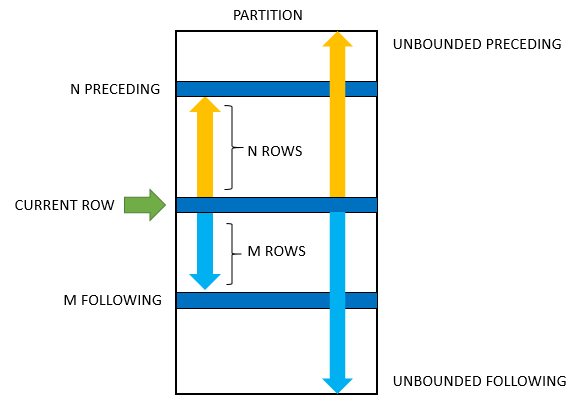

# PostgreSQL WINDOW Functions

PostgreSQL's documentation does an excellent job of introducing the [concept of Window Functions](https://www.postgresql.org/docs/9.1/tutorial-window.html):

A **window function** performs a `calculation across a set of table rows` that are **somehow related to the current row**. This is comparable to the type of calculation that can be done with an aggregate function. But unlike regular aggregate functions, use of a **window function does not cause rows to become grouped into a single output row** — `the rows retain their separate identities`. Behind the scenes, the window function is able to access more than just the current row of the query result.

## Setting up sample tables

First, create two tables named **products** and **product_groups** for the demonstration:


```SQL
CREATE TABLE product_groups (
  group_id serial PRIMARY KEY,
  group_name VARCHAR (255) NOT NULL
);

CREATE TABLE products (
  product_id serial PRIMARY KEY,
  product_name VARCHAR (255) NOT NULL,
  price DECIMAL (11, 2),
  group_id INT NOT NULL,
  FOREIGN KEY (group_id) REFERENCES product_groups (group_id)
);
```

Second, insert some rows into these tables:

```SQL
INSERT INTO product_groups (group_name)
VALUES
  ('Smartphone'),
  ('Laptop'),
  ('Tablet');

INSERT INTO products (product_name, group_id,price)
VALUES
  ('Microsoft Lumia', 1, 200),
  ('HTC One', 1, 400),
  ('Nexus', 1, 500),
  ('iPhone', 1, 900),
  ('HP Elite', 2, 1200),
  ('Lenovo Thinkpad', 2, 700),
  ('Sony VAIO', 2, 700),
  ('Dell Vostro', 2, 800),
  ('iPad', 3, 700),
  ('Kindle Fire', 3, 150),
  ('Samsung Galaxy Tab', 3, 200);
```

**Product_groups** table:

|group_id | group_name|
|:--------:|:-----------:|
|       1 | Smartphone|
|       2 | Laptop|
|       3 | Tablet|

**Products** table:

|product_id |    product_name    |  price  | group_id|
|:---------:|:------------------:|:--------:|:---------:|
|         1 | Microsoft Lumia    |  200.00 |        1|
|         2 | HTC One            |  400.00 |        1|
|         3 | Nexus              |  500.00 |        1|
|         4 | iPhone             |  900.00 |        1|
|         5 | HP Elite           | 1200.00 |        2|
|         6 | Lenovo Thinkpad    |  700.00 |        2|
|         7 | Sony VAIO          |  700.00 |        2|
|         8 | Dell Vostro        |  800.00 |        2|
|         9 | iPad               |  700.00 |        3|
|        10 | Kindle Fire        |  150.00 |        3|
|        11 | Samsung Galaxy Tab |  200.00 |        3|

there are `11` rows in this table.

## Introduction to PostgreSQL window functions

The easiest way to understand the window functions is to start by reviewing the `aggregate functions`. An **aggregate function** `aggregates data from a set of rows into` **a single row**.

The following example uses the `AVG()` aggregate function to calculate the **average price of all products** in the products table.

```SQL
SELECT AVG (price) AS avg_price
  FROM products;
```

**Result**

|avg_price|
|:--------------------:|
|586.3636363636363636|

As shown clearly in the output, all rows from the `products` table are grouped into a single row.

Similar to an aggregate function, a window function calculates on a set of rows. However, a `window function` **does not cause rows to become grouped into a single output row**.

The following query uses the `AVG()` as **a window function**. It returns the average price of all products along with the price of each individual product:

```SQL
SELECT product_name, price,
       AVG (price) OVER() avg_price
  FROM products;
```

**Results**

|product_name    |  price  |      avg_price|
|:-----------------:|:-------:|:-------------------:|
|Microsoft Lumia    |  200.00 | 586.3636363636363636|
|HTC One            |  400.00 | 586.3636363636363636|
|Nexus              |  500.00 | 586.3636363636363636|
|iPhone             |  900.00 | 586.3636363636363636|
|HP Elite           | 1200.00 | 586.3636363636363636|
|Lenovo Thinkpad    |  700.00 | 586.3636363636363636|
|Sony VAIO          |  700.00 | 586.3636363636363636|
|Dell Vostro        |  800.00 | 586.3636363636363636|
|iPad               |  700.00 | 586.3636363636363636|
|Kindle Fire        |  150.00 | 586.3636363636363636|
|Samsung Galaxy Tab |  200.00 | 586.3636363636363636|

In this example, the `OVER()` clause signals that the `AVG()` function is used as a window function. The `OVER()` clause in this example indicates that the `AVG()` function operates to all the values in the `price` column. In other words, the window is the entire table.

The following picture illustrates the main difference between aggregate functions and window functions:


To apply the **aggregate function to subsets of rows**, you use the `GROUP BY` clause. The following example returns `the average price` **for every product group**.

```SQL
SELECT pg.group_name,
       AVG (p.price)
  FROM products p
 INNER JOIN product_groups pg USING (group_id)
 GROUP BY pg.group_name;
```

**Results**

|group_name |         avg|
|:---------:|:-------------------:|
|Smartphone | 500.0000000000000000|
|Tablet     | 350.0000000000000000|
|Laptop     | 850.0000000000000000|

As you see clearly from the output, the `AVG()` function **reduces the number of rows returned by the queries in both examples**.

Similar to an aggregate function, a **window function** operates on a set of rows. However, it **does not reduce the number of rows returned by the query**.

The term `window` **describes the set of rows on which the window function operates**. **A window function returns values from the rows in a window**.

Let's say we want to combine the result of the previous query with the following table records.

```SQL
SELECT product_name, price, group_name
  FROM products
 INNER JOIN product_groups USING (group_id);
```

|product_name    |  price  | group_name|
|:-----------------:|:-------:|:-----------:|
|Microsoft Lumia    |  200.00 | Smartphone|
|HTC One            |  400.00 | Smartphone|
|Nexus              |  500.00 | Smartphone|
|iPhone             |  900.00 | Smartphone|
|HP Elite           | 1200.00 | Laptop|
|Lenovo Thinkpad    |  700.00 | Laptop|
|Sony VAIO          |  700.00 | Laptop|
|Dell Vostro        |  800.00 | Laptop|
|iPad               |  700.00 | Tablet|
|Kindle Fire        |  150.00 | Tablet|
|Samsung Galaxy Tab |  200.00 | Tablet|

For instance, the following query returns the `product name`, `the price`, `product group name`, **along with the average prices of each product group**.

```SQL
SELECT product_name, price, group_name,
       AVG (price) OVER (PARTITION BY group_name) avg_group_name
  FROM products
 INNER JOIN product_groups USING (group_id);
```

**Results**

|product_name    |  price  | group_name |    avg_group_name|
|:-----------------:|:-------:|:----------:|:-------------------:|
|`HP Elite`           | `1200.00` | `Laptop`     | **850.0000000000000000**|
|`Lenovo Thinkpad`    |  `700.00` | `Laptop`     | **850.0000000000000000**|
|`Sony VAIO`          |  `700.00` | `Laptop`     | **850.0000000000000000**|
|`Dell Vostro`        |  `800.00` | `Laptop`     | **850.0000000000000000**|
|Microsoft Lumia    |  200.00 | Smartphone | 500.0000000000000000|
|HTC One            |  400.00 | Smartphone | 500.0000000000000000|
|Nexus              |  500.00 | Smartphone | 500.0000000000000000|
|iPhone             |  900.00 | Smartphone | 500.0000000000000000|
|`iPad`               |  `700.00` | `Tablet`     | **350.0000000000000000**|
|`Kindle Fire`        |  `150.00` | `Tablet`     | **350.0000000000000000**|
|`Samsung Galaxy Tab` |  `200.00` | `Tablet`     | **350.0000000000000000**|

In this query, the `AVG()` function works as a **window function that operates on a set of rows specified by the** `OVER` clause. Each **set of rows is called a window**. The rows retain their separate identities.

In this example, the table is partitioned in three windows based on the `group_name` column. More specifically, the first window labelled `Laptop` includes 4 rows and the `avg_group_name` values is computed across the values of the `price` column of those rows.


The new syntax for this query is the `OVER` clause:

```SQL
AVG(price) OVER (PARTITION BY group_name)
```

In this syntax, the `PARTITION BY` distributes the rows of the result set into groups and the `AVG()` function is applied to each group to return the average price for each.

Note that a window function always performs the calculation on the result set after the `JOIN`, `WHERE`, `GROUP BY` and `HAVING` clause and before the final `ORDER BY` clause in the evaluation order.

## PostgreSQL WINDOW Function Call Syntax

A **window function call** represents the application of an aggregate-like function over some portion of the rows selected by a query. Unlike non-window aggregate calls, this is not tied to grouping of the selected rows into a single output row — **each row remains separate in the query output**.

However the **window function** `has access` **to all the rows that would be part of the current row's group according to the grouping specification** (`PARTITION BY` list) **of the window function call**.

PostgreSQL has a sophisticated syntax for [window function call](https://www.postgresql.org/docs/current/sql-expressions.html#SYNTAX-WINDOW-FUNCTIONS). The following illustrates the simplified version:

```console
window_function(expression) OVER (
   [partition_clause]
   [order_clause]
   [frame_clause]   
```

In this syntax:

### window_function

The `window_function` is the name of the window function (such as `AVG`, `SUM`, ...).

### expression

The target expression or columns on which the window function operates. Some window functions do not accept any argument.

### OVER clause

The OVER clause defines **window partitions to form the groups of rows** specifies the orders of rows in a partition. The OVER clause consists of three clauses: `partition`, `order`, and `frame` clauses.

### Partition clause

The partition clause divides the rows into partitions to which the window function applies. It has the following syntax:

```SQL
PARTITION BY expr1, expr2, ...
```

The `PARTITION BY` clause divides rows into multiple groups or partitions to which the window function is applied. Like the example above, we used the product group to divide the products into groups (or partitions).

The `PARTITION BY` clause is optional. If you skip the `PARTITION BY` clause, the window function will treat `the whole result set as a single partition`.

### ORDER clause

The order clause specifies the orders of rows in a partition on which the window function operates:

```SQL
ORDER BY
    expression [ASC | DESC]  [NULL {FIRST| LAST}]
    ,...
```

The `ORDER BY` clause specifies the order of rows in each partition to which the window function is applied.

The `ORDER BY` clause uses the `NULLS FIRST` or `NULLS LAST` option to specify whether nullable values should be first or last in the result set. The default is `NULLS LAST` option.

### FRAME clause

The `frame_clause` defines **a subset of rows in the current partition to which the window function is applied**. This subset of rows is called a **frame**. To define the frame, you use one of the following syntaxes:

```SQL
{ RANGE | ROWS } frame_start
{ RANGE | ROWS } BETWEEN frame_start AND frame_end  
```

where `frame_start` is one of the following options:

```SQL
N PRECEDING
UNBOUNDED PRECEDING
CURRENT ROW
```

and `frame_end` is one of the following options:

```SQL
CURRENT ROW
UNBOUNDED FOLLOWING
N FOLLOWING
```

Frames are determined with respect to the current row, which enables a frame to move within a partition depending on the location of the current row within its partition.

The following picture illustrates a frame and its options:



- **UNBOUNDED PRECEDING**: the frame starts at the first row of the partition.
- **N PRECEDING**: the frame starts at Nth rows before the current row.
- **CURRENT ROW**: means the current row that is being evaluated.
- **UNBOUNDED FOLLOWING**: the frame ends at the final row in the partition.
- **N FOLLOWING**: the frame ends at the Nh row after the current row.

The **ROWS** or **RANGE** specifies the type of relationship between the current row and frame rows.

 - **ROWS**: the offsets of the current row and frame rows are row numbers.The frame is defined by beginning and ending row positions. Offsets are differences in row numbers from the current row number.
 - **RANGE**: the offset of the current row and frame rows are row values. The frame is defined by rows within a value range. Offsets are differences in row values from the current row value.

### Examples: Defining WINDOW FRAMES WITH ROWS

The window frame is a set of rows that are somehow related to the current row. Their bounds can be defined for each row in the query result with a ROWS subclause, which has the following syntax:

```SQL
ROWS BETWEEN lower_bound AND upper_bound
```

When we specify an `ORDER BY` subclause, the current row is the upper bound of the window frame by default.

Suppose we have the following tables:

**Products** table:

|product_id |    product_name    |  price  | group_id|
|:---------:|:------------------:|:--------:|:---------:|
|         1 | Microsoft Lumia    |  200.00 |        1|
|         2 | HTC One            |  400.00 |        1|
|         3 | Nexus              |  500.00 |        1|
|         4 | iPhone             |  900.00 |        1|
|         5 | HP Elite           | 1200.00 |        2|
|         6 | Lenovo Thinkpad    |  700.00 |        2|
|         7 | Sony VAIO          |  700.00 |        2|
|         8 | Dell Vostro        |  800.00 |        2|
|         9 | iPad               |  700.00 |        3|
|        10 | Kindle Fire        |  150.00 |        3|
|        11 | Samsung Galaxy Tab |  200.00 |        3|
|        12 | Pixie              |  300.00 |        3|
|        13 | Pixie 2            |  400.00 |        3|
|        14 | iPad 2             |  500.00 |        3|

By defining a frame to be all rows from the partition start to the current row, you can compute **running totals for each row**.

A running total is the summation of a sequence of numbers which is updated each time a new number is added to the sequence, by adding the value of the new number to the previous running total.

```SQL
SELECT product_id, price, group_id,
       SUM (price) OVER (PARTITION BY group_id
                         ORDER BY product_id
                         ROWS UNBOUNDED PRECEDING) AS running_total_price,
       SUM (price) OVER (PARTITION BY group_id) AS group_total_price
  FROM products;
```

```SQL
SELECT product_id, price, group_id,
       SUM (price) OVER (PARTITION BY group_id
                         ORDER BY product_id
                         ROWS BETWEEN UNBOUNDED PRECEDING AND CURRENT ROW) AS running_total_price,
       SUM (price) OVER (PARTITION BY group_id) AS group_total_price
  FROM products;
```

**Results**

|product_id |  price  | group_id | running_total_price | group_total_price|
|:----------:|:------:|:---------:|:------------------:|:----------------:|
|         1 |  200.00 |        1 |              `200.00` |           2000.00|
|         2 |  400.00 |        1 |              `600.00` |           2000.00|
|         3 |  500.00 |        1 |             `1100.00` |           2000.00|
|         4 |  900.00 |        1 |             **2000.00** |           **2000.00**|
|         5 | 1200.00 |        2 |             `1200.00` |           3400.00|
|         6 |  700.00 |        2 |             `1900.00` |           3400.00|
|         7 |  700.00 |        2 |             `2600.00` |           3400.00|
|         8 |  800.00 |        2 |             **3400.00** |           **3400.00**|
|         9 |  700.00 |        3 |              `700.00` |           2250.00|
|        10 |  150.00 |        3 |              `850.00` |           2250.00|
|        11 |  200.00 |        3 |             `1050.00` |           2250.00|
|        12 |  300.00 |        3 |             `1350.00` |           2250.00|
|        13 |  400.00 |        3 |             `1750.00` |           2250.00|
|        14 |  500.00 |        3 |             **2250.00** |           **2250.00**|

The table is partitioned according to the `group_id` column. Therefore, there are three windows:

- the first window includes product_id values (`1-4`)
- the second window includes product_id values (`5-8`)
- the last window includes product_id values (`6-13`)

The third column `running_total_price` shows the partial sum of the `price` column values starting from the first row of each group and ending to the current row.

For instance, the running total of the second record is `600`. This number is given by the following sum (`running_total_price` of the previous row `200` + the current row `price` value `400`). The `running_total_price` of the last row must match with the `group_total_price`.

Let’s see an example where we need to specify the bounds of a window frame. Suppose we want to sum and average the values in the `price` column of the rows between the row before the current row and the row after the current row.

```SQL
SELECT product_id, price, group_id,
       SUM (price) OVER (PARTITION BY group_id
                         ORDER BY product_id
                         ROWS BETWEEN 1 PRECEDING AND 1 FOLLOWING) AS partial_sum_price,
       ROUND(AVG (price) OVER (PARTITION BY group_id
                         ORDER BY product_id
                         ROWS BETWEEN 1 PRECEDING AND 1 FOLLOWING),2) AS rolling_avg_price                         
  FROM products;
```

**Results**

|product_id |  price  | group_id | partial_sum_price | rolling_avg_price|
|:----------:|:------:|:--------:|:-----------------:|:----------------:|
|         1 |  200.00 |        1 |            600.00 |            300.00|
|         2 |  `400.00` |        1 |           1100.00 |            366.67|
|         3 |  `500.00` |        1 |           `1800.00` |            **600.00**|
|         4 |  `900.00` |        1 |           1400.00 |            700.00|
|         5 | 1200.00 |        2 |           1900.00 |            950.00|
|         6 |  700.00 |        2 |           2600.00 |            866.67|
|         7 |  700.00 |        2 |           2200.00 |            733.33|
|         8 |  800.00 |        2 |           1500.00 |            750.00|
|         9 |  700.00 |        3 |            850.00 |            425.00|
|        10 |  150.00 |        3 |           1050.00 |            350.00|
|        11 |  200.00 |        3 |            650.00 |            216.67|
|        12 |  300.00 |        3 |            900.00 |            300.00|
|        13 |  400.00 |        3 |           1200.00 |            400.00|
|        14 |  500.00 |        3 |            900.00 |            450.00|

By defining a frame as extending 1 row on either side of the current row, you can compute rolling averages. For instance, the `rolling_avg_price` of `product_id` **3** is `600.00`. This number is the result of `1800/3`.

### Examples: Defining WINDOW FRAMES WITH RANGE

In the previous section, we defined the bounds of a window frame in terms of ROWS. In this section, we will explain how to use the subclause `RANGE` to specify the bounds of a window frame in ranges of rows. The syntax of the `RANGE` subclause is the following:

```SQL
RANGE BETWEEN lower_bound AND upper_bound
```

```SQL
SELECT product_id, price, group_id, product_id - 1 AS p_id_lb, product_id + 2 AS p_id_ub,
       SUM (price) OVER (PARTITION BY group_id
                         ORDER BY product_id
                         RANGE BETWEEN 1 PRECEDING AND 2 FOLLOWING) AS partial_sum_price                   
  FROM products;
```

**Results**

|product_id |  price  | group_id | p_id_lb | p_id_ub | partial_sum_price|
|:----------:|:------:|:---------:|:------:|:-------:|:-----------------:|
|         1 |  200.00 |        1 |       0 |       3 |           1100.00|
|         2 |  400.00 |        1 |       1 |       4 |           2000.00|
|         3 |  500.00 |        1 |       2 |       5 |           1800.00|
|         4 |  900.00 |        1 |       3 |       6 |           1400.00|
|         5 | 1200.00 |        2 |       4 |       7 |           2600.00|
|         6 |  700.00 |        2 |       5 |       8 |           3400.00|
|         7 |  700.00 |        2 |       6 |       9 |           2200.00|
|         8 |  800.00 |        2 |       7 |      10 |           1500.00|
|         9 |  700.00 |        3 |       8 |      11 |           1050.00|
|        10 |  150.00 |        3 |       9 |      12 |           1350.00|
|        11 |  200.00 |        3 |      10 |      13 |           1050.00|
|        12 |  300.00 |        3 |      11 |      14 |           1400.00|
|        13 |  400.00 |        3 |      12 |      15 |           1200.00|
|        14 |  500.00 |        3 |      13 |      16 |            900.00|

```SQL
SELECT product_id, price, group_id, price - 200 AS price_lb, price + 200 AS price_ub,
       SUM (price) OVER (PARTITION BY group_id
                         ORDER BY price
                         RANGE BETWEEN 200 PRECEDING AND 200 FOLLOWING) AS partial_sum_price                   
  FROM products;
```

**Results**

|product_id |  price  | group_id | price_lb | price_ub | partial_sum_price|
|:----------:|:-------:|:--------:|:--------:|:--------:|:----------------:|
|          1 |  200.00 |        1 |     0.00 |   400.00 |            600.00|
|          2 |  400.00 |        1 |   200.00 |   600.00 |           1100.00|
|          3 |  500.00 |        1 |   300.00 |   700.00 |            900.00|
|          4 |  900.00 |        1 |   700.00 |  1100.00 |            900.00|
|          7 |  700.00 |        2 |   500.00 |   900.00 |           2200.00|
|          6 |  700.00 |        2 |   500.00 |   900.00 |           2200.00|
|          8 |  800.00 |        2 |   600.00 |  1000.00 |           2200.00|
|          5 | 1200.00 |        2 |  1000.00 |  1400.00 |           1200.00|
|         10 |  150.00 |        3 |   -50.00 |   350.00 |            650.00|
|         11 |  200.00 |        3 |     0.00 |   400.00 |           1050.00|
|         12 |  300.00 |        3 |   100.00 |   500.00 |           1550.00|
|         13 |  400.00 |        3 |   200.00 |   600.00 |           1400.00|
|         14 |  500.00 |        3 |   300.00 |   700.00 |           1900.00|
|          9 |  700.00 |        3 |   500.00 |   900.00 |           1200.00|

### Shorter syntax

If you use multiple window functions in a query:

```SQL
SELECT
    wf1() OVER(PARTITION BY c1 ORDER BY c2),
    wf2() OVER(PARTITION BY c1 ORDER BY c2)
FROM table_name;
```
you can use the `WINDOW` clause to shorten the query as shown in the following query:

```SQL
SELECT
   wf1() OVER w,
   wf2() OVER w,
FROM table_name
WINDOW w AS (PARTITION BY c1 ORDER BY c2);
```

It is also possible to use the `WINDOW` clause even though you call one window function in a query:

```SQL
SELECT wf1() OVER w
FROM table_name
WINDOW w AS (PARTITION BY c1 ORDER BY c2);
```

## SQL window function types

The window functions are divided into three types **value** window functions, **aggregation** window functions, and **ranking** window functions:

## Value window functions

- `FIRST_VALUE()`
- `LAG()`
- `LAST_VALUE()`
- `LEAD()`

## Ranking window functions

- `CUME_DIST()`
- `DENSE_RANK()`
- `NTILE()`
- `PERCENT_RANK()`
- `RANK()`
- `ROW_NUMBER()`

## Aggregate window functions

- AVG()
- COUNT()
- MAX()
- MIN()
- SUM()
