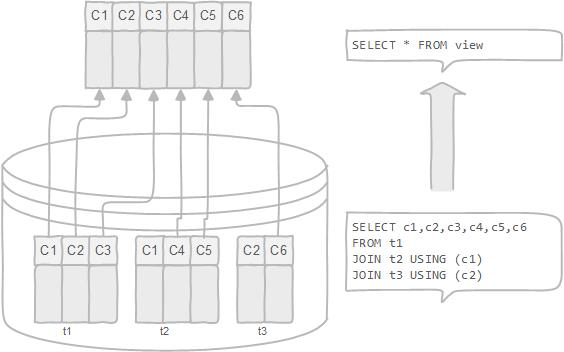

# Managing Views

A view is a table created from all or part of one or more existing tables. Because of their lack of physical existence, views are sometimes called **virtual tables** while the tables that physically exist in the database are called **real** (or, more commonly, **base tables**).

A view is a `database object` that is of a **stored query**. A view can be accessed as a `virtual table` in PostgreSQL. In other words, a PostgreSQL view is a **logical table** that represents data of one or more underlying tables through a `SELECT` statement.

Notice that **a view does not store data physically** `except` for a **materialized view**.




## Why do you need to use the views

A view can be very useful in some cases such as:

- A view helps **simplify the complexity of a query because you can query a view**, which is based on a complex query, **using a simple** `SELECT` **statement**.
- Like a table, you can `grant permission to users through a view` that contains specific data that the users are authorized to see.
- A view provides a `consistent layer even the columns of underlying table changes`.

Views allow you to store complex queries in the database. For example, instead of issuing a complex SQL query each time you want to see the data, you just need to issue a simple query as follows:

```SQL
SELECT column_list
FROM view_name;
```

Views help you pack the data for a specific group of users. For example, you can create a view of salary data for the employees for Finance department.

Views help maintain database security. Rather than give the users access to database tables, you create a view to revealing only necessary data and grant the users to access to the view.
