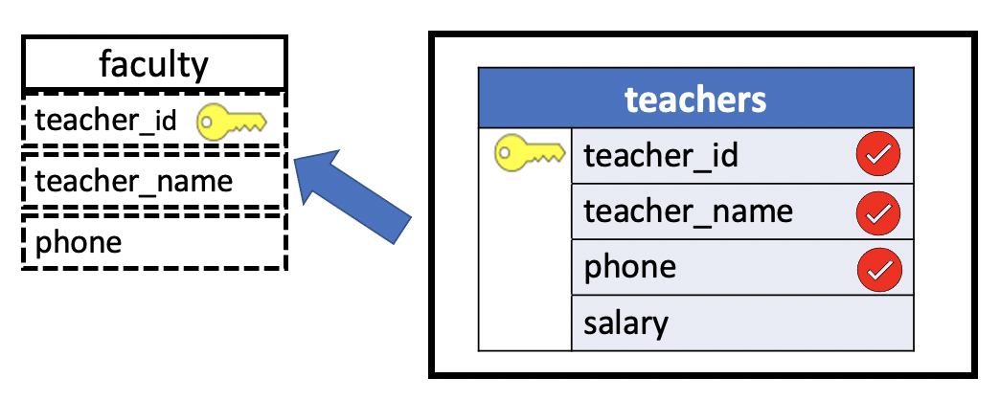

# CREATE VIEWS

Like tables, views are created with the `CREATE` statement. Unlike tables, the rows and columns comprising a view must already exist in one or more tables (or views) in the database.

To create a view, we use  `CREATE VIEW` statement. The simplest syntax of the `CREATE VIEW` statement is as follows:

```SQL
CREATE VIEW view_name AS
            SELECT-statement;
```

- First, specify the name of the view after the `CREATE VIEW` clause.

- Second, construct a `SELECT statement` to query data from multiple tables.

The `SELECT statement` can be as complex as necessary. It might perform a join with two or more tables, include a subquery, or even use `GROUP BY`. In any case, the table that results from the `SELECT` is the view.

## CREATING Views Based on One Table

The simplest views draw their records from only a single base table. In fact, one common reason to use views is to limit access to information stored in a table.

To demonstrate the use of the `CREATE VIEW` we'll use the `uniy` sample database.

```console
uniy=# \dv
Did not find any relations.
```

As we can see, there are no views in the `uniy` sample database.

Suppose, for example, that we wished to allow students access to the example database but did not want them to be able to see teacher's salaries. To allow this, we could create a view called **faculty** that includes everything from **teachers** table except the salary column. This view could be created with:

```SQL
CREATE VIEW faculty AS
       SELECT teacher_id, teacher_name, phone
         FROM teachers;
```

Views are represented in this chapter's query diagrams by using dashed lines.

**Query Diagram**



```console
uniy=# CREATE VIEW faculty AS
uniy-#        SELECT teacher_id, teacher_name, phone
uniy-#          FROM teachers;
CREATE VIEW
```

Now the execution of the `display view command` should return the faculty ` virtual table`:

```console
uniy=# \dv
             List of relations
 Schema |  Name   | Type |      Owner
--------+---------+------+-----------------
 public | faculty | view | ludovicopinzari
(1 row)
```

To show the actual definition of a view, use the `\sv` command.

```console
uniy=# \sv faculty
CREATE OR REPLACE VIEW public.faculty AS
 SELECT teachers.teacher_id,
    teachers.teacher_name,
    teachers.phone
   FROM teachers
```

Because no new column names were specified, the column names of the view **faculty** are identical to the selected columns in **teachers**: `teacher_id`,`teacher_name` and `phone`. In general, this view functions just as if it were a base table: A user could, for instance, use a `SELECT` statement referencing this view to learn a particular teacher's phone number. But because it does not include the column called `salary` from **teachers**, accessors of this view could not retrieve that information. `Students`, therefore, **could be allowed to access this view to retrieve information about their instructors**, but access to the actual **teachers** table, and thus to salary information, would be restricted only to university administrators. (SQL's tools for granting and revoking access to tables).

From now on, whenever you need to get a complete customer data, you just query it from the view by executing the following simple `SELECT` statement:

```SQL
SELECT *
  FROM faculty;
```

**Results**

|teacher_id |    teacher_name    |   phone|
|:---------:|:------------------:|:--------:|
|       303 | Dr. Horn           | 257-3049|
|       290 | Dr. Lowe           | 257-2390|
|       430 | Dr. Engle          | 256-4621|
|       180 | Dr. Cooke          | 257-8088|
|       560 | Dr. Olsen          | 257-8086|
|       784 | Dr. Scango         | 257-3046|
|       213 | Dr. Wright         | 257-3393|


Another simple example: We might `frequently` wish to access the names and student numbers of students from Pennsylvania. To facilitate easy access to this information, we could define a view called `pa_only` with:

```SQL
CREATE VIEW pa_only (name, number, state) AS
       SELECT student_name, student_id, state
         FROM students
        WHERE state = 'PA';
```

In this example, we have changed the name and order of the columns in the view from those found in the base table **students**. For instance, The `student_name` column is renamed `name` in the **pa_only** view table. This view will contain only the specified columns from those records in **students** that satisfy the `WHERE` clause given (that is, the names, student numbers and states of all students from Pennsylvania).

It is even possible to create views that include columns not present in any base table but that are instead derived from base table information. Naturally enough, such columns are sometimes called *derived columns*. If, for instance, we were frequently interested in seeing the teacher's monthly salaries, we might define a view like:

```SQL
CREATE VIEW monthly (teacher_name, teacher_id, m_salary) AS
       SELECT teacher_name, teacher_id, salary / 12
         FROM teachers;
```

The resulting view contains a derived column of monthly salary values, information not directly found in any base table. For use with later `SELECTs`, however, the view **monthly** can be used just like any other table.

## CREATING Views Based on Two tables

Views need not draw their records from just one table. Since a view can be defined that consists of the records resulting from any `SELECT` statement, the view can draw its values from two or more tables. Although slightly more complex to create, such views can be very useful.

Suppose, for example, that we often wished to refer to a summary of course information that included each course's name, its course number, and the number of students in each section. To make our lives easier, we could define a view that contained exactly this information. Because this information is stored in different tables, however, the view must be based on a `join`, such as:

```SQL
CREATE VIEW summary AS
       SELECT course_name,
              c.course_id,
              section_id,
              num_students
         FROM courses c
        INNER JOIN sections s
           ON s.course_id = c.course_id;
```

Once again, the column names of the view are inherited from those in the base tables **sections** and **courses**. The contents of the view are those records that result from this `CREATE VIEW's` join. (As usual, the aliases `s` and `c` are simply a convenience; they aren't required part of view definitions.)

Note that the query statement uses the `INNER JOIN` syntax. Many databases still support the older `WHERE` syntax for creating views, but most databases that support updatable views require the new syntax in order for the view to be updateable.

For example, the following statement creates the `employee` contacts view based on the data of the `employees` and `departments` tables in the `hr` sample database.

```console
hr=# \d employees
                                            Table "public.employees"
    Column     |          Type          | Collation | Nullable |                    Default
---------------+------------------------+-----------+----------+------------------------------------------------
 employee_id   | integer                |           | not null | nextval('employees_employee_id_seq'::regclass)
 first_name    | character varying(20)  |           |          |
 last_name     | character varying(25)  |           | not null |
 email         | character varying(100) |           | not null |
 phone_number  | character varying(20)  |           |          |
 hire_date     | date                   |           | not null |
 job_id        | integer                |           | not null |
 salary        | numeric(8,2)           |           | not null |
 manager_id    | integer                |           |          |
 department_id | integer                |           |          |
Indexes:
    "employees_pkey" PRIMARY KEY, btree (employee_id)
Foreign-key constraints:
    "employees_fkey_department" FOREIGN KEY (department_id) REFERENCES departments(department_id) ON UPDATE CASCADE ON DELETE CASCADE
    "employees_fkey_job" FOREIGN KEY (job_id) REFERENCES jobs(job_id) ON UPDATE CASCADE ON DELETE CASCADE
    "employees_fkey_manager" FOREIGN KEY (manager_id) REFERENCES employees(employee_id) ON UPDATE CASCADE ON DELETE CASCADE
Referenced by:
    TABLE "dependents" CONSTRAINT "dependents_fkey_employee" FOREIGN KEY (employee_id) REFERENCES employees(employee_id) ON UPDATE CASCADE ON DELETE CASCADE
    TABLE "employees" CONSTRAINT "employees_fkey_manager" FOREIGN KEY (manager_id) REFERENCES employees(employee_id) ON UPDATE CASCADE ON DELETE CASCADE
```

**departments**

```console
hr=# \d departments
                                             Table "public.departments"
     Column      |         Type          | Collation | Nullable |                      Default
-----------------+-----------------------+-----------+----------+----------------------------------------------------
 department_id   | integer               |           | not null | nextval('departments_department_id_seq'::regclass)
 department_name | character varying(30) |           | not null |
 location_id     | integer               |           |          |
Indexes:
    "departments_pkey" PRIMARY KEY, btree (department_id)
Foreign-key constraints:
    "departments_fkey_location" FOREIGN KEY (location_id) REFERENCES locations(location_id) ON UPDATE CASCADE ON DELETE CASCADE
Referenced by:
    TABLE "employees" CONSTRAINT "employees_fkey_department" FOREIGN KEY (department_id) REFERENCES departments(department_id) ON UPDATE CASCADE ON DELETE CASCADE
```

```SQL
CREATE VIEW employee_contacts AS
       SELECT first_name,
              last_name,
              email,
              phone_number,
              department_name
         FROM employees e
        INNER JOIN departments d
           ON d.department_id = e.department_id
        ORDER BY first_name;
```

**By default**, the names of columns of the view are the same as column specified in the `SELECT` statement. If you want to **rename the columns in the view**, you include the new column names after the `CREATE VIEW` clause as follows:

```SQL
CREATE VIEW view_name(new_column_list) AS
       SELECT-statement;
```

For example, the following statement creates a view whose column names are not the same as the column names of the base tables.

```SQL
CREATE VIEW payroll (first_name , last_name , job, compensation) AS
       SELECT first_name, last_name, job_title, salary
         FROM employees e
        INNER JOIN jobs j
           ON j.job_id= e.job_id
     ORDER BY first_name;
```

## CREATING Views Based on More Than One Table

Views can be based on as many tables as desired. For instance, to create a roster for all courses, listing for each its teacher, course name and the names and grades of all its students, one could use:

```SQL
CREATE VIEW roster AS
       SELECT teacher_name,
              course_name,
              student_name,
              grade
         FROM teachers
        INNER JOIN sections USING(teacher_id)
        INNER JOIN enrolls USING(section_id,course_id)
        INNER JOIN courses USING(course_id)
        INNER JOIN students USING(student_id);
```

From now on, whenever you need to get a complete customer data, you just query it from the view by executing the following simple `SELECT` statement:

```SQL
SELECT *
  FROM roster;
```

|    teacher_name    |     course_name      |    student_name    | grade|
|:------------------:|:--------------------:|:------------------:|:-----:|
| Dr. Lowe           | Calculus IV          | Susan Powell       |     3|
| Dr. Olsen          | Western Civilization | Bob Dawson         |     3|
| Dr. Lowe           | Calculus IV          | Bob Dawson         |     1|
| Dr. Engle          | English Composition  | Howard Mansfield   |     3|
| Dr. Scango         | Compiler Writing     | Howard Mansfield   |     3|
| Dr. Lowe           | Calculus IV          | Susan Pugh         |     2|
| Dr. Engle          | English Composition  | Joe Adams          |     4|
| Dr. Cooke          | Compiler Writing     | Bill Jones         |     2|
| Dr. Horn           | Western Civilization | Carol Dean         |     2|
| Dr. Lowe           | Calculus IV          | Carol Dean         |     3|
| Dr. Scango         | Compiler Writing     | Carol Dean         |     0|
| Dr. Engle          | English Composition  | Allen Thomas       |     2|
| Dr. Lowe           | Calculus IV          | Val Shipp          |     3|
| Dr. Lowe           | Calculus IV          | John Anderson      |     4|
| Dr. Cooke          | Compiler Writing     | John Anderson      |     4|
| Dr. Horn           | Western Civilization | Janet Thomas       |     4|
| Dr. Olsen          | Western Civilization | Allen Thomas       |  NULL|


```console
uniy=# \dv
             List of relations
 Schema |  Name   | Type |      Owner
--------+---------+------+-----------------
 public | faculty | view | ludovicopinzari
 public | roster  | view | ludovicopinzari
(2 rows)
```

Both this view and the previously defined view can be used like any other table in `SELECT` statements.

For example, in our `dvdrental` sample database, we have four tables:

1. `customer` – stores all customer data
2. `address` – stores address of customers
3. `city` – stores city data
4. `country` – stores country data

If you want to get a complete customers data, you normally construct a join statement as follows:

```SQL
SELECT cu.customer_id AS id,
       cu.first_name || ' ' || cu.last_name AS name,
       a.address,
       a.postal_code AS "zip code",
       a.phone,
       city.city,
       country.country,
       CASE
           WHEN cu.activebool THEN 'active'
           ELSE ''
       END AS notes,
       cu.store_id AS sid
  FROM customer cu
 INNER JOIN address a USING (address_id)
 INNER JOIN city USING (city_id)
 INNER JOIN country USING (country_id);
```

This query is quite complex. However, you can create a view named `customer_master` as follows:

```SQL
CREATE VIEW customer_master AS
       SELECT cu.customer_id AS id,
              cu.first_name || ' ' || cu.last_name AS name,
              a.address,
              a.postal_code AS "zip code",
              a.phone,
              city.city,
              country.country,
              CASE
                   WHEN cu.activebool THEN 'active'
                   ELSE ''
              END AS notes,
              cu.store_id AS sid
        FROM customer cu
       INNER JOIN address a USING (address_id)
       INNER JOIN city USING (city_id)
       INNER JOIN country USING (country_id);
```

From now on, whenever you need to get a complete customer data, you just query it from the view by executing the following simple `SELECT` statement:

```SQL
SELECT *
  FROM customer_master;
```
