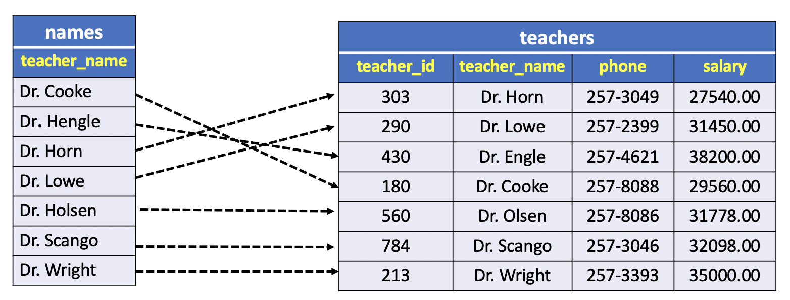

# CREATE INDEX

In this lesson, you will learn about indexes and how to use the PostgreSQL `CREATE INDEX` statement to define a new index for a table.

## Phonebook analogy and index

Assuming that you need to look up for John Doe’s phone number on a phone book. With the understanding that names on the phone book are in alphabetically order, you first look for the page where the last name is Doe, then look for first name John, and finally get his phone number.

Suppose the names on the phone book were not ordered alphabetically, you would have to go through all pages, check every name until you find John Doe’s phone number. This is called sequential scan which you go over all entries until you find the one that you are looking for.

Similar to a phonebook, the data stored in the table should be organized in a particular order to speed up various searches. This is why indexes come into play.

An index is a separated data structure e.g., B-Tree that speeds up the data retrieval on a table at the cost of additional writes and storage to maintain it.

## Overview

Each index applies to a single table and must also specify one or more columns in that table whose values should be indexed. To create an index, one uses SQL's `CREATE INDEX` statement. Although the SQL standard defines no common way to create indexes, the general form of `CREATE INDEX` in most implementations is:

```SQL
CREATE INDEX <name>
ON <table> (<columns>);
```

where `<name>` is a name for the new index, `<table>` identifies which table is to be indexed, and `<columns>` names the column(s) on which the index is to be based. For example, to create an index called `names` on the `teacher_name` column of the **teachers** table, one would type:

```SQL
CREATE INDEX names
    ON teachers (teachr_name);
```

A new table now exists, called `names`, containing an index of the `teacher_names` in **teachers**.

To get an idea of what this index table actually looks like, refer to the following image:



As figure shows, an index can be thought of as simply an ordered list of the values in the indexed column. Instead of the random record order of **teachers**, the **names** index table orders the values of its indexed column in a specific way such as in `alphabetical` order. Stored with each record in the index is an indication of where the record containing that value actually occurs in the table being indexed.

For example, the first entry in the index table **names** contains the value `Dr. Cooke`, along with a *pointer* to where Dr. Cooke's record occurs in **teachers** table. The second index entry contains `Dr. Engle` and a *pointer* to dr. Engle's record and so on.

Now, each time a query is executed against **teachers** that requires SQL to find a specific teacher's name, the index **names** can be automatically consulted. Rather than exhaustively searching the unordered records in **teachers**, a much faster search is made of the alphabetically ordered teacher names in the index **names**. (it's much easier to locate a specific element in an ordered list than in a list with no order - compare the difficulty, for instance, of looking up someone's phone number in a normal telephone directory with randomly listed names.)

Once the correct record in **names** is located, it's simple top follow that record's pointer to the desired record in **teachers**. And to keep the index up to date, any new records added to **teachers** are automatically added to **names** as well. (Note that with some systems, an additional command is required after the creation of the index to allow its automatic use during execution of a query.)

It is also possible to create indexes in which the values in the indexed columns are guaranteed to be unique. This is done by specifying the `UNIQUE` option when the index is created, such as:

```SQL
CREATE UNIQUE INDEX unames
    ON teachers(teacher_name);
```

As before, an index table is created containing unique ordered values of `teacher_names` and pointers back to the original records in **teachers**. This time, however, all teacher names are required to be **unique**.

Furthermore, if an attempt is made to add a new record to **teachers** with a teacher name identical to one already found in the table, the addition will be rejected. (Note that if the `UNIQUE` option was specified for this column when the table was created, addition of a record with a duplicate value for that column will be rejected regardless of whether any index exists.s)

A note about implementation: The exact structure of index tables varies from one SQL implementation to another. Some might order indexed columns alphabetically while others might use more complex techniques. Similarly, the index's pointers back to the main table can be implemented in a variety of ways. None of this is visible to a SQL user, however, because the index is automatically used.

## PostgreSQL CREATE INDEX overview

A simple version of `CREATE INDEX` statement is as follows:

```SQL
CREATE INDEX index_name ON table_name [USING method]
(
    column_name [ASC | DESC] [NULLS {FIRST | LAST }],
    ...
);
```

In this syntax:

- First, specify the index name after the `CREATE INDEX` clause. The index name should be meaningful and easy to remember.
- Second, specify the `name` of the table to which the index belongs.
- Third, specify the index method such as `btree`, `hash`, `gist`, `spgist`, `gin`, and `brin`. PostgreSQL uses `btree` by default.
- Fourth, list one or more columns that to be stored in the index. The `ASC` and `DESC` specify the sort order. `ASC` is the default. `NULLS FIRST` or `NULLS LAST` specifies nulls sort before or after non-nulls. The `NULLS FIRST` is the default when `DESC` is specified and `NULLS LAST` is the default when `DESC` is not specified.

To check if a query uses an index or not, you use the `EXPLAIN` statement.

## PostgreSQL CREATE INDEX example

We will use the `address` table from the `dvdrental` sample database for the demonstration.

```console
dvdrental=# \d address
                                             Table "public.address"
   Column    |            Type             | Collation | Nullable |                   Default
-------------+-----------------------------+-----------+----------+---------------------------------------------
 address_id  | integer                     |           | not null | nextval('address_address_id_seq'::regclass)
 address     | character varying(50)       |           | not null |
 address2    | character varying(50)       |           |          |
 district    | character varying(20)       |           | not null |
 city_id     | smallint                    |           | not null |
 postal_code | character varying(10)       |           |          |
 phone       | character varying(20)       |           | not null |
 last_update | timestamp without time zone |           | not null | now()
Indexes:
    "address_pkey" PRIMARY KEY, btree (address_id)
    "idx_fk_city_id" btree (city_id)
Foreign-key constraints:
    "fk_address_city" FOREIGN KEY (city_id) REFERENCES city(city_id)
Referenced by:
    TABLE "customer" CONSTRAINT "customer_address_id_fkey" FOREIGN KEY (address_id) REFERENCES address(address_id) ON UPDATE CASCADE ON DELETE RESTRICT
    TABLE "staff" CONSTRAINT "staff_address_id_fkey" FOREIGN KEY (address_id) REFERENCES address(address_id) ON UPDATE CASCADE ON DELETE RESTRICT
    TABLE "store" CONSTRAINT "store_address_id_fkey" FOREIGN KEY (address_id) REFERENCES address(address_id) ON UPDATE CASCADE ON DELETE RESTRICT
Triggers:
    last_updated BEFORE UPDATE ON address FOR EACH ROW EXECUTE PROCEDURE last_updated()
```

The following query finds the address whose phone number is `223664661973`:

```SQL
SELECT *
  FROM address
 WHERE phone = '223664661973';
```

It is obvious that the database engine had to scan the whole address table to look for the address because there is no index available for the phone column.

To show the query plan, you use the `EXPLAIN` statement as follows:

```SQL
EXPLAIN ANALYZE SELECT *
        FROM address
        WHERE phone = '223664661973';
```

**Results**

```console
QUERY PLAN
---------------------------------------------------------------------------------------------------
Seq Scan on address  (cost=0.00..15.54 rows=1 width=61) (actual time=0.067..0.303 rows=1 loops=1)
Filter: ((phone)::text = '223664661973'::text)
Rows Removed by Filter: 602
Planning Time: 0.108 ms
Execution Time: 0.328 ms
```


As you can see the query executes a **sequential scan** (`Seq Scan on address`).

|address_id |      address       | address2 | district  | city_id | postal_code |    phone     |     last_update|
|:------------:|:--------------------:|:----------:|:-----------:|:---------:|:-------------:|:--------------:|:---------------------:|
|85 | 320 Baiyin Parkway |          | Mahajanga |     319 | 37307       | 223664661973 | 2006-02-15 09:45:30|


To create an index for the values in the `phone` column of the address table, you use the following statement:

```SQL
CREATE INDEX idx_address_phone
       ON address(phone);
```

Now, if you execute the query again, you will find that the database engine uses the index for lookup:

```SQL
EXPLAIN ANALYZE SELECT *
        FROM address
        WHERE phone = '223664661973';
```

```console
QUERY PLAN
----------------------------------------------------------------------------------------------------------------------------
Index Scan using idx_address_phone on address  (cost=0.28..8.29 rows=1 width=61) (actual time=0.055..0.056 rows=1 loops=1)
Index Cond: ((phone)::text = '223664661973'::text)
Planning Time: 0.347 ms
Execution Time: 0.081 ms
(4 rows)
```
