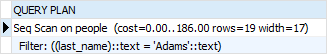
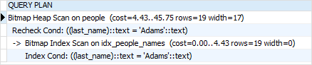
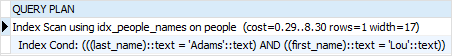
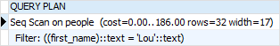

# MULTICOLUMN INDEXES

You can create an **index** on `more than one column of a table`. This index is called a **multicolumn index**, a `composite index`, a `combined index`, or a `concatenated index`.

A **multicolumn index** can have `maximum 32 columns` of a table. The limit can be changed by modifying the `pg_config_manual.h` when building PostgreSQL.

In addition, only `B-tree`, `GIST`, `GIN`, and `BRIN` index types **support multicolumn indexes**.

The following syntax shows how to create a **multicolumn index**:

```SQL
CREATE INDEX index_name
ON table_name(a,b,c,...);
```

When defining a multicolumn index, you should place
- the **columns which are often used** in the `WHERE` clause at the beginning of the column list and
- the **columns that are less frequently** used in the condition after.

In the above syntax, the PostgreSQL optimizer will consider using the index in the following cases:

```SQL
WHERE a = v1 and b = v2 and c = v3;
```

Or

```SQL
WHERE a = v1 and b = v2;
```

Or

```SQL
WHERE a = v1;
```

However, it will not consider using the index in the following cases:

```SQL
WHERE  c = v3;
```

Or

```SQL
WHERE b = v2 and c = v3;    
```

## PostgreSQL Multicolumn Index example

To demonstrate multicolumn indexes, we will create a new table named `people` with three columns: `id`, `first name`, and `last name`:

```SQL
CREATE TABLE people(
    id INT GENERATED BY DEFAULT AS IDENTITY,
    first_name VARCHAR(50) NOT NULL,
    last_name VARCHAR(50) NOT NULL
);
```

You can use the following script to load 10,000 rows into the people table:

[Script](https://www.postgresqltutorial.com/wp-content/uploads/2019/01/Script-to-load-10000-names.txt) to load 10,00 rows.

The following statement finds people whose last name is `Adams`:

```SQL
SELECT *
  FROM people
 WHERE last_name = 'Adams';
```

Here is the output:



As shown clearly in the output, PostgreSQL performed the sequential scan on the people table to find the corresponding rows because there was no index defined for the `last_name` column.

Let’s define a `B-tree` index on both `last_name` and `first_name` columns. Assuming that searching for people by the last name is more often than by the first name, we define the index with the following column order:

```SQL
CREATE INDEX idx_people_names
ON people (last_name, first_name);
```

Now, if you search for people whose last name is Adams, the PostgreSQL optimizer will use the index as shown in the output of the following statement:

```SQL
EXPLAIN SELECT
    *
FROM
    people
WHERE
    last_name = 'Adams';
```



The following statement finds the person whose last name is Adams and the first name is `Lou`.

```SQL
SELECT
    *
FROM
    people
WHERE
    last_name = 'Adams'
AND first_name = 'Lou';
```



The PostgreSQL Optimizer used the index for this statement because both columns in the `WHERE` clause are all in the index:

```SQL
EXPLAIN SELECT
    *
FROM
    people
WHERE
    last_name = 'Adams'
AND first_name = 'Lou';
```

However, if you search for people whose first name is `Lou`, PostgreSQL will perform sequential scan the table instead of using the index as shown in the output of the following statement:

```SQL
EXPLAIN SELECT
    *
FROM
    people
WHERE
    first_name = 'Lou';
```



Even though the `first_name` column is a part of the index, PostgreSQL could not leverage it.

A key point to take away is that when you define a multicolumn index, you should always consider the business context to find which columns are often used for lookup and place these columns at the beginning of the column list while defining the index.
