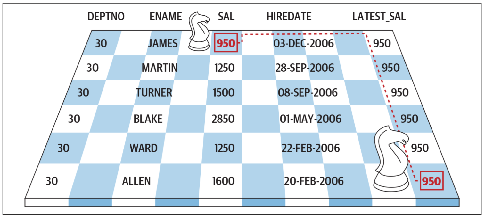

# Finding Knight Values

You want return a result set that contains each employee’s
- `name`,
- the `department` they work in,
- their `salary`,
- the date they were `hired`,
- and the `salary of the last employee hired`, in **each department**.

You want to return the following result set:

The values in `LATEST_SAL` are the “**knight values**” because the path to find them is analogous to a `knight’s path` in the **game of chess**.


> A knight value comes from "up and over"

You determine the result the way a knight determines a new location: by jumping to a row and then turning and jumping to a different column (See figure).

To find the correct values for `LATEST_SAL`, you must first locate (jump to) the row with the latest `HIREDATE` in each `DEPTNO`, and then you select (jump to) the `SAL` column of that row.

|deptno | ename  | sal  |  hiredate  | latest_sal|
|:-----:|:------:|:----:|:----------:|:---------:|
|    10 | CLARK  | 2450 | 2006-06-09 |       1300|
|    10 | KING   | 5000 | 2006-11-17 |       1300|
|    10 | MILLER | 1300 | 2007-01-23 |       1300|
|    20 | JONES  | 2975 | 2006-04-02 |        800|
|    20 | FORD   | 3000 | 2006-12-03 |        800|
|    20 | SCOTT  | 3000 | 2007-12-09 |        800|
|    20 | ADAMS  | 1100 | 2008-01-12 |        800|
|    20 | SMITH  |  800 | 2015-12-17 |        800|
|    30 | ALLEN  | 1600 | 2006-01-20 |        950|
|    30 | WARD   | 1250 | 2006-02-22 |        950|
|    30 | BLAKE  | 2850 | 2006-05-01 |        950|
|    30 | TURNER | 1500 | 2006-09-08 |        950|
|    30 | MARTIN | 1250 | 2006-09-28 |        950|
|    30 | JAMES  |  950 | 2006-12-03 |        950|

## Solution


Use a `CASE` expression in a subquery to return the `SAL` of the last employee hired in each `DEPTNO`; for all other salaries, return `0`. Use the window function `MAX OVER` in the outer query to return the nonzero `SAL` for each employee’s department:

```SQL
WITH t AS (
  SELECT deptno,
         ename,
         sal,
         hiredate,
         CASE WHEN hiredate = MAX(hiredate) OVER (PARTITION BY deptno)
               THEN sal ELSE 0
         END last_sal
    FROM emp
)
SELECT deptno, ename, sal, hiredate,
       MAX(last_sal) OVER(PARTITION BY deptno) As latest_sal
  FROM t
 ORDER BY deptno, hiredate;
```


## Discussion

The first step is to use the window function `MAX OVER` in a `CASE` expression to find the **employee hired last**, or most recently, **in each** `DEPTNO`.

```SQL
SELECT deptno,
       ename,
       sal,
       hiredate,
       CASE WHEN hiredate = MAX(hiredate) OVER (PARTITION BY deptno)
             THEN sal ELSE 0
       END last_sal
  FROM emp
 ORDER BY deptno, hiredate desc;
```

If an employee’s HIREDATE matches the value returned by `MAX OVER`, then use a `CASE` expression to return that **employee’s SAL**; otherwise, **return zero**.

The results of this are shown here:

|deptno | ename  | sal  |  hiredate  | last_sal|
|;-----:|:-------:|:----:|:---------:|:-------:|
|    10 | MILLER | 1300 | 2007-01-23 |     1300|
|    10 | KING   | 5000 | 2006-11-17 |        0|
|    10 | CLARK  | 2450 | 2006-06-09 |        0|
|    20 | SMITH  |  800 | 2015-12-17 |      800|
|    20 | ADAMS  | 1100 | 2008-01-12 |        0|
|    20 | SCOTT  | 3000 | 2007-12-09 |        0|
|    20 | FORD   | 3000 | 2006-12-03 |        0|
|    20 | JONES  | 2975 | 2006-04-02 |        0|
|    30 | JAMES  |  950 | 2006-12-03 |      950|
|    30 | MARTIN | 1250 | 2006-09-28 |        0|
|    30 | TURNER | 1500 | 2006-09-08 |        0|
|    30 | BLAKE  | 2850 | 2006-05-01 |        0|
|    30 | WARD   | 1250 | 2006-02-22 |        0|
|    30 | ALLEN  | 1600 | 2006-01-20 |        0|

Because the value for `LATEST_SAL` will be either zero or the SAL of the employee(s) hired most recently, you can wrap the previous query in an CTE and use `MAX OVER` again, but this time to return **the greatest nonzero** `LATEST_SAL` **for each** `DEPTNO`:

```SQL
WITH t AS (
  SELECT deptno,
         ename,
         sal,
         hiredate,
         CASE WHEN hiredate = MAX(hiredate) OVER (PARTITION BY deptno)
               THEN sal ELSE 0
         END last_sal
    FROM emp
)
SELECT deptno, ename, sal, hiredate,
       MAX(last_sal) OVER(PARTITION BY deptno) As latest_sal
  FROM t
 ORDER BY deptno, hiredate;
```

|deptno | ename  | sal  |  hiredate  | latest_sal|
|:-----:|:------:|:----:|:----------:|:---------:|
|    10 | CLARK  | 2450 | 2006-06-09 |       1300|
|    10 | KING   | 5000 | 2006-11-17 |       1300|
|    10 | MILLER | 1300 | 2007-01-23 |       1300|
|    20 | JONES  | 2975 | 2006-04-02 |        800|
|    20 | FORD   | 3000 | 2006-12-03 |        800|
|    20 | SCOTT  | 3000 | 2007-12-09 |        800|
|    20 | ADAMS  | 1100 | 2008-01-12 |        800|
|    20 | SMITH  |  800 | 2015-12-17 |        800|
|    30 | ALLEN  | 1600 | 2006-01-20 |        950|
|    30 | WARD   | 1250 | 2006-02-22 |        950|
|    30 | BLAKE  | 2850 | 2006-05-01 |        950|
|    30 | TURNER | 1500 | 2006-09-08 |        950|
|    30 | MARTIN | 1250 | 2006-09-28 |        950|
|    30 | JAMES  |  950 | 2006-12-03 |        950|
