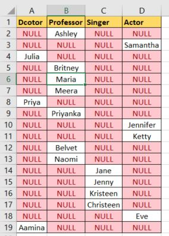
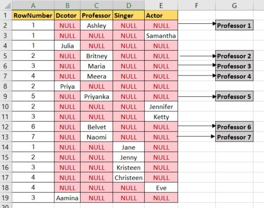

# Occupations

[Pivot](https://en.wikipedia.org/wiki/Pivot_table) the `Occupation` column in **OCCUPATIONS** so that each `Name` is sorted alphabetically and displayed underneath its corresponding Occupation. The output column headers should be `Doctor`, `Professor`, `Singer`, and `Actor`, respectively.

Note: Print `NULL` when there are no more names corresponding to an occupation.

## Input Format

The **OCCUPATIONS** table is described as follows:

|Column|Type|
|:----:|:---:|
|Name|String|
|Occupation|String|

Occupation will contain only one of the following values: `Doctor`, `Professor`, `Singer` or `Actor`.

## Sample Input

An **OCCUPATIONS** table that contains the following records:

|Name|Occupation|
|:---:|:------:|
|Samantha|Doctor|
|Julia|Actor|
|Maria|Actor|
|Meera|Singer|
|Ashely|Professor|
|Ketty|Professor|
|Christeen|Professor|
|Jane|Actor|
|Jenny|Doctor|
|Priya|Singer|


## Sample Output


```console
Jenny    Ashley     Meera  Jane
Samantha Christeen  Priya  Julia
NULL     Ketty      NULL   Maria
```

Explanation

- The first column is an alphabetically ordered list of `Doctor` names.
- The second column is an alphabetically ordered list of `Professor` names.
- The third column is an alphabetically ordered list of `Singer` names.
- The fourth column is an alphabetically ordered list of `Actor` names.
- The empty cell data for columns with less than the maximum number of names per occupation (in this case, the Professor and Actor columns) are filled with NULL values.


Let me break it down in steps (answer in MySQL)

## Step 1:

Create a virtual table in your head of the data given to us. It look like this



```SQL
SELECT
    CASE WHEN occupation = 'Doctor' THEN name ELSE NULL
              END AS Doctor,
    CASE WHEN occupation = 'Professor' THEN name ELSE NULL
              END AS Professor,
    CASE WHEN occupation = 'Singer' THEN name ELSE NULL
              END AS Singer,
    CASE WHEN occupation = 'Actor' THEN name ELSE NULL
              END AS Actor
FROM occupations;
```

```console
|Doctor|Professor|Singer|Actor|
|:---:|:----:|:---:|:---:|
|NULL |Ashley| NULL| NULL|
|NULL |NULL| NULL| Samantha|
|Julia| NULL| NULL| NULL|
|NULL |Britney| NULL| NULL|
|NULL |Maria| NULL| NULL|
|NULL |Meera| NULL| NULL|
|Priya| NULL| NULL| NULL|
|NULL |Priyanka| NULL| NULL|
|NULL |NULL| NULL| Jennifer|
|NULL |NULL| NULL| Ketty|
|NULL |Belvet| NULL| NULL|
|NULL |Naomi| NULL| NULL|
|NULL |NULL| Jane| NULL|
|NULL |NULL| Jenny| NULL|
|NULL |NULL| Kristeen| NULL|
|NULL |NULL| Christeen| NULL|
|NULL |NULL| NULL| Eve|
|Aamina|NULL| NULL| NULL|
```

## Step 2:

Create an index column with respect to occupation as "RowNumber".



Notice from the image, under `professor` column, the first Name `Ashely` is indexed as **1**, the next name `Birtney` as **2**, the next name `Maria` as **3** and so on. That is what I mean by **index w.r.t occupation**. The same reasoning is applied to the other columns.

The below code will only give the "rowNumber" column,

```SQL
set @r1 = 0, @r2 = 0, @r3 = 0, @r4 = 0;

SELECT CASE
	       WHEN occupation = 'Doctor' THEN (@r1 := @r1 + 1)
         WHEN occupation = 'Professor' THEN (@r2 := @r2 + 1)
         WHEN occupation = 'Singer' THEN (@r3 := @r3 + 1)
         WHEN occupation = 'Actor' THEN (@r4 := @r4 + 1)
       END AS rowNumber
 FROM occupations;
```

```console
1
1
1
2
3
4
2
5
2
3
6
7
1
2
3
4
4
3
```

To get the result like in image proceed to step 3.

## Step 3:

Combine the result from step 1 and step 2:

```SQL
SET @r1 = 0, @r2 = 0, @r3 = 0, @r4 = 0;

SELECT
    CASE WHEN occupation = 'Doctor' THEN (@r1 := @r1 + 1)
         WHEN occupation = 'Professor' THEN (@r2 := @r2 + 1)
         WHEN occupation = 'Singer' THEN (@r3 := @r3 + 1)
         WHEN occupation = 'Actor' THEN (@r4 := @r4 + 1)
         END AS rowNumber,
    CASE WHEN occupation = 'Doctor' THEN name ELSE NULL
         END AS Doctor,
    CASE WHEN occupation = 'Professor' THEN name ELSE NULL
         END AS Professor,
    CASE WHEN occupation = 'Singer' THEN name ELSE NULL
         END AS Singer,
    CASE WHEN occupation = 'Actor' THEN name ELSE NULL
         END AS Actor
FROM occupations;
```
|rowNumber|Doctor|Professor|Singer|Actor|
|:--:|:---:|:----:|:---:|:---:|
|**1** |NULL |**Ashley**   |NULL| NULL|
|**1** |NULL |NULL     |NULL| **Samantha**|
|**1** |**Julia**| NULL    |NULL| NULL|
|**2** |NULL |**Britney**  |NULL| NULL|
|**3** |NULL |**Maria**    |NULL| NULL|
|**4** |NULL |**Meera**    |NULL| NULL|
|**2** |**Priya**| NULL    |NULL| NULL|
|**5** |NULL |**Priyanka** |NULL| NULL|
|2 |NULL |NULL     |NULL| Jennifer|
|3 |NULL |NULL     |NULL| Ketty|
|6 |NULL |Belvet   |NULL| NULL|
|7 |NULL |Naomi    |NULL| NULL|
|1 |NULL |NULL     |Jane| NULL|
|2 |NULL |NULL     |Jenny| NULL|
|3 |NULL |NULL     |Kristeen| NULL|
|4 |NULL |NULL     |Christeen| NULL|
|4 |NULL |NULL     |NULL| Eve|
|3 |Aamina| NULL   |NULL| NULL|


If you order by occupation you get the following result:

```console
1 NULL NULL NULL Samantha
2 NULL NULL NULL Eve
3 NULL NULL NULL Ketty
4 NULL NULL NULL Jennifer
--------------------------
1 Priya NULL NULL NULL
2 Julia NULL NULL NULL
3 Aamina NULL NULL NULL
--------------------------
1 NULL Maria NULL NULL
2 NULL Meera NULL NULL
3 NULL Priyanka NULL NULL
4 NULL Britney NULL NULL
5 NULL Belvet NULL NULL
6 NULL Naomi NULL NULL
7 NULL Ashley NULL NULL
----------------------------
1 NULL NULL Jane NULL
2 NULL NULL Jenny NULL
3 NULL NULL Kristeen NULL
4 NULL NULL Christeen NULL
```

The resulting table shows that the number of
- Actor: **4**
- Doctor: **3**
- Professor: **7**
- Singer: **4**

Next, we want to list the names in alphabetical order and they should be one below the other. In other words, we do not want to show NULL values between.

## Step 4:

Now, `Order_by` name.

```SQL
SET @r1 = 0, @r2 = 0, @r3 = 0, @r4 = 0;

SELECT
    CASE WHEN occupation = 'Doctor' THEN (@r1 := @r1 + 1)
         WHEN occupation = 'Professor' THEN (@r2 := @r2 + 1)
         WHEN occupation = 'Singer' THEN (@r3 := @r3 + 1)
         WHEN occupation = 'Actor' THEN (@r4 := @r4 + 1)
         END AS rowNumber,
    CASE WHEN occupation = 'Doctor' THEN name ELSE NULL
         END AS Doctor,
    CASE WHEN occupation = 'Professor' THEN name ELSE NULL
         END AS Professor,
    CASE WHEN occupation = 'Singer' THEN name ELSE NULL
         END AS Singer,
    CASE WHEN occupation = 'Actor' THEN name ELSE NULL
         END AS Actor
 FROM occupations
ORDER BY name;
```
|rowNumber|Doctor|Professor|Singer|Actor|
|:--:|:---:|:----:|:---:|:---:|
|**1** |**Aamina**| NULL| NULL| NULL|
|**1** |NULL| **Ashley**| NULL| NULL|
|2 |NULL| Belvet| NULL| NULL|
|3 |NULL| Britney| NULL| NULL|
|**1** |NULL| NULL| **Christeen**| NULL|
|**1** |NULL| NULL| NULL| **Eve**|
|2 |NULL| NULL| Jane| NULL|
|2 |NULL| NULL| NULL| Jennifer|
|3 |NULL| NULL| Jenny| NULL|
|2 |Julia| NULL| NULL| NULL|
|3 |NULL| NULL| NULL| Ketty|
|4 |NULL| NULL| Kristeen| NULL|
|4 |NULL| Maria| NULL| NULL|
|5 |NULL| Meera| NULL| NULL|
|6 |NULL| Naomi| NULL| NULL|
|3 |Priya| NULL| NULL| NULL|
|7 |NULL| Priyanka| NULL| NULL|
|4 |NULL| NULL| NULL| Samantha|

The resulting table shows that

## Step 5

Using Min/Max, if there is a name, it will return it, if not, return NULL.

```SQL
SET @r1 = 0, @r2 = 0, @r3 = 0, @r4 = 0;

WITH temp AS ( SELECT
             CASE WHEN occupation = 'Doctor' THEN (@r1 := @r1 + 1)
                  WHEN occupation = 'Professor' THEN (@r2 := @r2 + 1)
                  WHEN occupation = 'Singer' THEN (@r3 := @r3 + 1)
                  WHEN occupation = 'Actor' THEN (@r4 := @r4 + 1)
                  END AS rowNumber,
             CASE WHEN occupation = 'Doctor' THEN name ELSE NULL
                  END AS Doctor,
             CASE WHEN occupation = 'Professor' THEN name ELSE NULL
                  END AS Professor,
             CASE WHEN occupation = 'Singer' THEN name ELSE NULL
                  END AS Singer,
             CASE WHEN occupation = 'Actor' THEN name ELSE NULL
                  END AS Actor
          FROM occupations
         ORDER BY name)

SELECT MIN(Doctor),
       MIN(Professor),
       MIN(Singer),
       MIN(Actor)
  FROM temp
 GROUP BY rowNumber;
```

Since the `rowNumber` is unique for each occupation column We could have used the `MAX` function as well.

|Doctor|Professor|Singer|Actor|
|:-----:|:------:|:----:|:---:|
|**Aamina**| **Ashley**| **Christeen**| **Eve**|
|**Julia**| **Belvet**| **Jane**| **Jennifer**|
|**Priya**| **Britney**| **Jenny**| **Ketty**|
|`NULL`| **Maria**| **Kristeen**| **Samantha**|
|`NULL`| **Meera**| `NULL`| `NULL`|
|`NULL`| **Naomi**| `NULL`| `NULL`|
|`NULL`| **Priyanka**| `NULL`| `NULL`|
