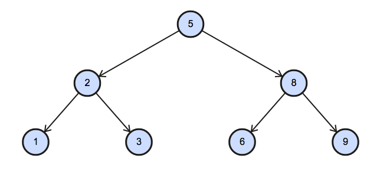

# Binary Tree Node

[problem](https://www.hackerrank.com/challenges/binary-search-tree-1/problem?isFullScreen=true)

You are given a table, `BST`, containing two columns: `N` and `P`, where `N` represents the **value of a node** in Binary Tree, and `P` is **the parent** of `N`.

|Column|Type|
|:----:|:--:|
|N|Integer|
|P|Integer|

Write a query to find the node type of Binary Tree ordered by the value of the node. Output one of the following for each node:

- `Root`: If node is **root node**.
- `Leaf`: If node is **leaf node**.
- `Inner`: If node is **neither root nor leaf node**.

## Sample Input

|N|P|
|:-:|:-:|
|1|2|
|3|2|
|6|8|
|9|8|
|2|5|
|8|5|
|5|NULL|

## Sample Output

```console
1 Leaf
2 Inner
3 Leaf
5 Root
6 Leaf
8 Inner
9 Leaf
```

## Explanation

The Binary Tree below illustrates the sample:



- The `Root` node does not have predecessor. `P IS NULL`
- An `INNER` node must be the predecessor of a Node (i.e it should appear `exists` in column `P`). In other words all nodes in column `P` are inner nodes.
- The rest of nodes are leaves.


```SQL
SELECT BT.N,
  CASE WHEN BT.P IS NULL THEN 'Root'
       WHEN EXISTS (SELECT B.P
                     FROM BST B
                    WHERE B.P = BT.N) THEN 'Inner'        
       ELSE 'Leaf'
   END AS node
  FROM BST AS BT
 ORDER BY BT.N;
```
