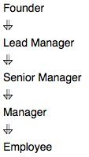

# New Companies

Amber's conglomerate corporation just acquired some new companies. Each of the companies follows this hierarchy:



Given the table schemas below, write a query to print the

- `company_code`,
- `founder name`,
- `total number` of **lead managers**,
- `total number` of **senior managers**,
- `total number` of **managers**, and
- `total number` of **employees**.

Order your output **by ascending** `company_code`.

**Note**:

- The tables may contain duplicate records.
- The `company_code` is string, so the sorting should not be numeric. For example, if the company_codes are `C_1`, `C_2`, and `C_10`, then the ascending `company_codes` will be `C_1`, `C_10`, and `C_2`.

## Input Format

The following tables contain **company** data:

- **Company**: The `company_code` is the code of the company and `founder` is the founder of the company.

|Column|Type|
|:-----:|:--:|
|company_code|String|
|founder|String|

- **Lead_Manager**: The `lead_manager_code` is the code of the lead manager, and the `company_code` is the code of the working company.

|Column|Type|
|:-----:|:--:|
|lead_manager_code|String|
|company_code|String|

- **Senior_Manager**: The `senior_manager_code` is the code of the senior manager, the `lead_manager_code` is the code of its lead manager, and the `company_code` is the code of the working company.

|Column|Type|
|:-----:|:--:|
|senior_manager_code|String|
|lead_manager_code|String|
|company_code|String|

- **Manager**: The `manager_code` is the code of the manager, the `senior_manager_code` is the code of its senior manager, the `lead_manager_code` is the code of its lead manager, and the `company_code` is the code of the working company.

|Column|Type|
|:-----:|:--:|
|manager_code|String|
|senior_manager_code|String|
|lead_manager_code|String|
|company_code|String|

- **Employee**: The `employee_code` is the code of the employee, the `manager_code` is the code of its manager, the `senior_manager_code` is the code of its senior manager, the `lead_manager_code` is the code of its lead manager, and the `company_code` is the code of the working company.

|Column|Type|
|:-----:|:--:|
|employee_code|String|
|manager_code|String|
|senior_manager_code|String|
|lead_manager_code|String|
|company_code|String|

## Sample Input

**Company** Table:

|company_code|founder|
|:----------:|:-----:|
|C1|Monika|
|C2|Samantha|


**Lead_Manager** Table:

|lead_Manager_code|company_code|
|:----------------:|:----------:|
|LM1|C1|
|LM2|C2|

**Senior_Manager** Table:

|senior_manager_code|lead_Manager_code|company_code|
|:-----------------:|:----------------:|:----------:|
|SM1|LM1|C1|
|SM2|LM1|C1|
|SM3|LM2|C2|

**Manager** Table:

|manager_code|senior_manager_code|lead_Manager_code|company_code|
|:-----:|:-----------------:|:----------------:|:----------:|
|M1|SM1|LM1|C1|
|M2|SM3|LM2|C2|
|M3|SM3|LM2|C2|


**Employee** Table:

|employee_code|manager_code|senior_manager_code|lead_Manager_code|company_code|
|:----:|:-----:|:-----------------:|:----------------:|:----------:|
|E1|M1|SM1|LM1|C1|
|E2|M1|SM1|LM1|C1|
|E3|M2|SM3|LM2|C2|
|E4|M3|SM3|LM2|C2|

## Sample Output

```console
C1 Monika 1 2 1 2
C2 Samantha 1 1 2 2
```

## Explanation

In company **C1**,
- the only lead manager is `LM1`.
- There are two senior managers, `SM1` and `SM2`, under LM1.
- There is one manager, `M1`, under senior manager SM1.
- There are two employees, `E1` and `E2`, under manager M1.

In company **C2**,
- the only lead manager is `LM2`.
- There is one senior manager, `SM3`, under LM2.
- There are two managers, `M2` and `M3`, under senior manager SM3.
- There is one employee, `E3`, under manager M2, and another employee, `E4`, under manager, M3.
