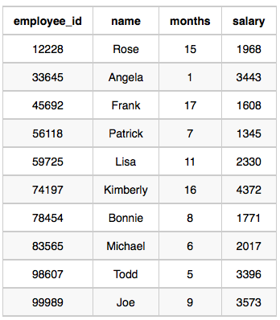

# Top Earners

We define an employee's `total earnings` to be their monthly **salary x month** worked, and the `maximum total earnings` to be the maximum total earnings for any employee in the **Employee** table. Write a query to find the `maximum total earnings` for all employees as well as the `total number of employees` who have maximum total earnings. Then print these values as `2` space-separated integers.

## Input Format

The **Employee** table containing employee data for a company is described as follows:

|Column|type|
|:-----:|:--:|
|employee_id| Integer|
|name| String|
|months| Integer|
|salary| Integer|

where
- `employee_id` is an employee's ID number,
- `name` is their name,
- `months` is the total number of months they've been working for the company, and
- `salary` is the their monthly salary.

## Sample Input




## Sample Output

```console
69952 1
```

## Explanation

The table and earnings data is depicted in the following diagram:

he maximum earnings value is `69952`. The only employee with earnings  is Kimberly, so we print the maximum earnings value (`69952`) and a count of the number of employees who have earned `60052` (which is `1`) as two space-separated values.


## Solution

Step 1:

```SQL
SELECT employee_id,
       (months * salary) AS earnings
  FROM employee
 ORDER BY earnings DESC
 LIMIT 10;
```
|employee_id|earnings|
|:---------:|:------:|
|98497| **108064** |
|99491| **108064** |
|98493| **108064** |
|50664| **108064** |
|99493| **108064** |
|98499| **108064** |
|98495| **108064** |
|82828| 101154 |
|38272| 91241|

The resulting table shows that the maximum earning is `108064` and the number of employees earning that amount are `7`. Therefore, the solution is `108064 7`. We need to count the the number of employees with the following query:

```SQL
SELECT (months * salary) AS earnings,
       COUNT(*)
  FROM employee
 GROUP BY earnings
 ORDER BY earnings DESC
 LIMIT 1; 
```
