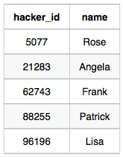
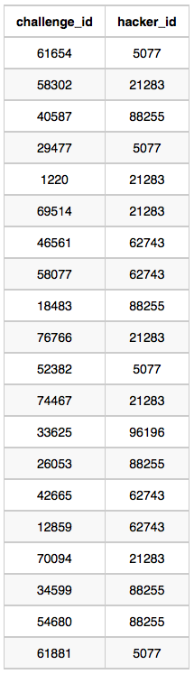
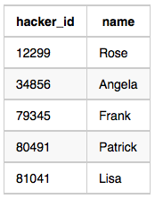
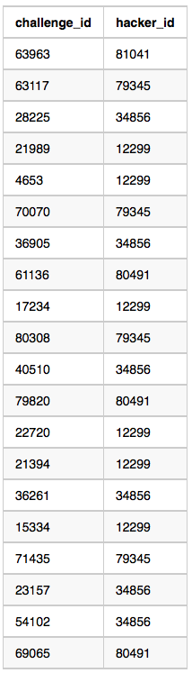
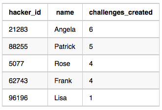
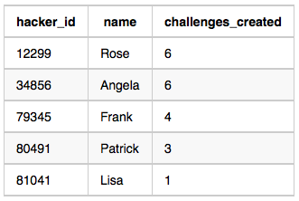

# Challenges

Julia asked her students to create some coding challenges.

Write a query to print the `hacker_id`, `name`, and the `total number of challenges` created by each student.

**Sort your results by** `the total number of challenges in descending order`.

If `more than one student` created the **same number of challenges**, then sort the result by `hacker_id`.

If more than one student created the same number of challenges and the **count is less than the maximum number of challenges created**, then `exclude those students from the result`.

## Input Format

The following tables contain challenge data:

- **Hackers**: The `hacker_id` is the `id` of the hacker, and `name` is the name of the hacker.

|Column|Type|
|:----:|:--:|
|hacker_id|Integer|
|name|String|

- **Challenges**: The `challenge_id` is the `id` of the challenge, and `hacker_id` is the id of the student who created the challenge.

|Column|Type|
|:----:|:--:|
|challenge_id|Integer|
|hacker_id|Integer|


## Sample Input 0

- **Hackers** Table:



- **Challenges** Table:



## Sample Output 0

```console
21283 Angela 6
88255 Patrick 5
96196 Lisa 1
```

## Sample Input 1

- **Hackers** Table:



- **Challenges** Table:




## Sample Output 1

```console
12299 Rose 6
34856 Angela 6
79345 Frank 4
80491 Patrick 3
81041 Lisa 1
```

## Explanation

For Sample Case 0, we can get the following details:



Students `5077` and `62743` both created `4` challenges, but the maximum number of challenges created is `6` so these students are excluded from the result.

For Sample Case 1, we can get the following details:



Students `12299` and `34856` both created `6` challenges. Because `6` is the maximum number of challenges created, these students are included in the result.


```SQL
SELECT c.hacker_id, h.name,
       COUNT(c.hacker_id) AS total_count
  FROM hackers h
 INNER JOIN challenges c  USING(hacker_id)
 GROUP BY c.hacker_id, h.name
HAVING total_count = (SELECT COUNT(t1.challenge_id) AS max_count
                        FROM challenges t1
                       GROUP BY t1.hacker_id
                       ORDER BY max_count DESC
                       LIMIT 1 ) OR
       total_count IN (SELECT DISTINCT other_counts
                         FROM (SELECT h2.hacker_id, h2.name,
                                      COUNT(c2.challenge_id) AS other_counts
                                 FROM hackers h2
                                INNER JOIN challenges c2 USING(hacker_id)
                                GROUP BY h2.hacker_id, h2.name) temp2
                        GROUP BY other_counts
                        HAVING COUNT(other_counts) = 1)
  ORDER BY total_count DESC,
           h.hacker_id;
```
