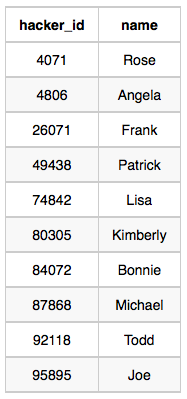
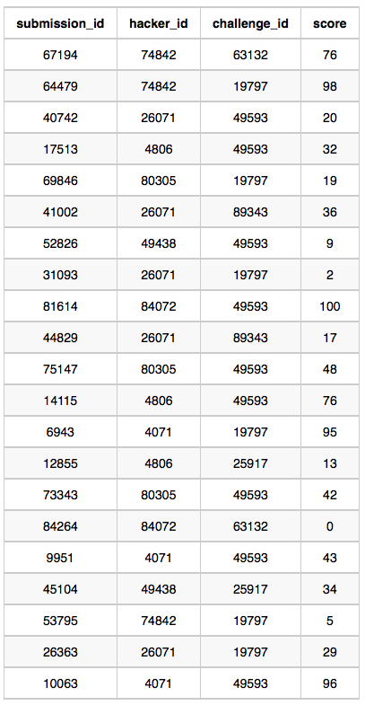

# Contest Leader Board

You did such a great job helping Julia with her last coding contest challenge that she wants you to work on this one, too!

The total score of a hacker is the `sum of their maximum scores` **for all of the challenges**.

Write a query to print the `hacker_id`, `name`, and `total score` of the hackers **ordered by the descending score**.

If `more than one hacker` achieved the `same total score`, then **sort the result by** `ascending hacker_id`. Exclude all hackers with a total score of `0` from your result.

## Input Format

The following tables contain contest data:

- **Hackers**: The `hacker_id` is the id of the hacker, and `name` is the name of the hacker.

|Column|Type|
|:----:|:--:|
|hacker_id|Integer|
|name|String|


- **Submissions**: The `submission_id` is the id of the submission, `hacker_id` is the id of the hacker who made the submission, `challenge_id` is the id of the challenge for which the submission belongs to, and `score` is the score of the submission.

|Column|Type|
|:----:|:--:|
|submission_id|Integer|
|hacker_id| Integer|
|challenge_id|Integer|
|score|Integer|


## Sample Input

**Hackers**



**Submissions** Table:



## Sample Output

```console
4071 Rose 191
74842 Lisa 174
84072 Bonnie 100
4806 Angela 89
26071 Frank 85
80305 Kimberly 67
49438 Patrick 43
```

## Explanation

Hacker 4071 submitted solutions for challenges `19797`(95) and `49593`(43,96), so the
- total score = **95** + **max(43,96)**= **191**.

Hacker 74842 submitted solutions for challenges `19797`(98,5) and `63132`(76), so the -
- total score = **max(98,5)** + **76** = **174**.

Hacker 84072 submitted solutions for challenges `49593`(100) and `63132`(0), so the
- total score = **100** + **0** = **100** .

The total scores for hackers `4806`, `26071`, `80305`, and `49438` can be similarly calculated.

## Solution

```SQL
SELECT h.hacker_id, h.name, SUM(MAX_SCORE.t1) as total_score
  FROM hackers h
 INNER JOIN (SELECT s.hacker_id, MAX(s.score) AS t1  
               FROM Submissions s
              GROUP BY s.challenge_id, s.hacker_id
             HAVING t1 > 0) AS MAX_SCORE
   ON h.hacker_id = MAX_SCORE.hacker_id
GROUP BY h.hacker_id, h.name
ORDER BY total_score DESC, hacker_id ASC;
```
