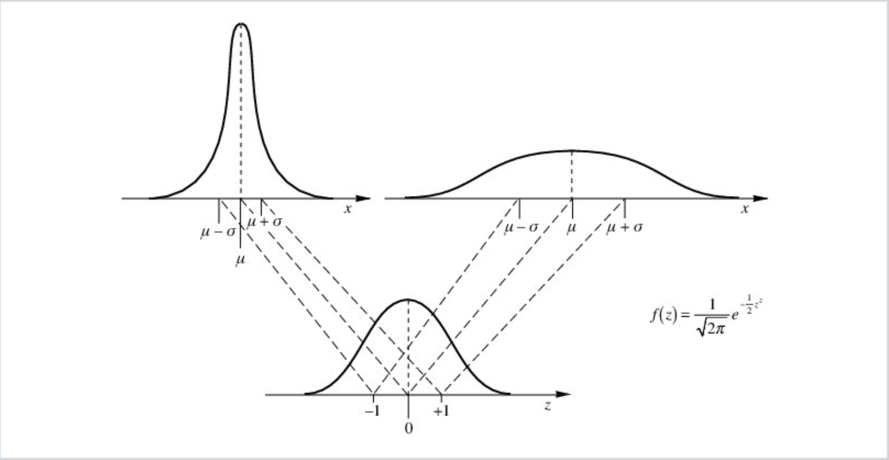

# Normal standard Numerical Example

Let X be a normal random variable with mean `mu` and standard deviation `sigma`:

```console    
                                +-              -+
                                |  (x - mu)^(2)  |
                              - | -------------- |
                  1             |  2 * sigma^(2) |
                                +-              -+
f(x) = ------------------- * e
        sigma * SQRT(2*pi)


N(mu,sigma)     mu = Mean,   sigma = standard deviation         
```


Thanks to the linear transformation

```console
      x - mu
z =  --------
      sigma
```

It's possible to calculate the probaility P(a <= X <= b) for any normal distribution with a mean `mu` and standard deviation `sigma`.

```console    
                                +-              -+
                                |  (z)^(2)       |
                              - | -------------- |
                  1             |  2             |
                                +-              -+
f(z) = ------------------- * e
            SQRT(2*pi)

```



For instance, the probability  P(X <= x<sub>i</sub>) is equivalent to:

- P(X <= x<sub>i</sub>) = P(Z <= z<sub>i</sub>)

Where:

```console
       xi - mu
zi = -------------
        sigma
```

Similarly, the probability P(x<sub>1</sub> <= X <= x<sub>2</sub>) is equivalent to:

- P(x<sub>1</sub> <= X <= x<sub>2</sub>) = P(z<sub>1</sub> <= Z <= z<sub>2</sub>)

Where

```console
       x1 - mu                 x2 - mu
z1 = -------------     z2 = -------------
        sigma                    sigma
```

## Problem 1

Let X be a normal random variable such that:

```console
mean   | sample_std
-------+------------
115.50 |       9.97
```

The graph of `N(mu,sigma) = N(115.50,9.97)` is illustrated in the picture below (Keep in mind the graph is an approximation of a continuous curve!, we only know that the curve is a gaussian distribution with a given mean and standard deviation):

```console
X   |                 freq_plot
----+------+------------------------------------------
86  | *
87  | *
88  | *
89  | *
90  | **
91  | **
92  | ***
93  | ***
94  | ****
95  | *****
     -------------------------------------------- mu - 2*sigma = 95.56
96  | ******
97  | *******
98  | *********
99  | **********
100 | ************
101 | **************
102 | ****************
103 | ******************
104 | *********************
105 | ***********************
     -------------------------------------------- mu - sigma = 105.53
106 | *************************                   ^                     ^
107 | ****************************                |                     |
108 | ******************************              |                     |
109 | ********************************            |                     |
110 | **********************************          |                     |
111 | ************************************        |   0.3143 = 31.43 %  |
112 | **************************************      |                     |
113 | ***************************************     |                     |
114 | ***************************************     |                     |
115 | ****************************************    V                     |
     --------------------------------------------- Mean : mu = 115.5    + 0.6826 = 68.26%
116 | ****************************************    ^                     |
117 | ***************************************     |                     |
118 | ***************************************     |                     |
119 | **************************************      |                     |
120 | ************************************        |   0.3413 = 34.13 %  |
121 | **********************************          |                     |
122 | ********************************            |                     |
123 | ******************************              |                     |
124 | ****************************                |                     |
125 | *************************                   V                     V
     -------------------------------------------- mu + sigma = 125.47
126 | ***********************                     ^
127 | *********************                       |
128 | ******************                          |
129 | ****************                            |
130 | **************                              |  0.1359 = 13.59 %
131 | ************                                |
132 | **********                                  |
133 | *********                                   |
134 | *******                                     |
135 | ******                                      V
     -------------------------------------------- mu + 2*sigma = 135.44
136 | *****                                       ^
137 | ****                                        |
138 | ***                                         |
139 | ***                                         |
140 | **                                          |  0.0228 = 2.28 %
141 | **                                          |
142 | *                                           |
143 | *                                           |
144 | *                                           |
145 | *                                           V
```

Compute:

1. `P(X <= 125.47)` = 0.8413
2. `P(X >= 135.44)` = 0.0228
3. `P(105.53 <= X <= 125.47)` = 0.6826
4. `P(125.47 <= X <= 135.44)` = 0.1359


- **Ex 1**: `P(X <= 125.47)`

```SQL
WITH normal_random_x AS (
  SELECT 115.50 AS mu
       , 9.97 AS sigma
),
standardz1 AS (
  SELECT  125.47 AS x
        , (125.47 - mu)/sigma AS zscore
    FROM normal_random_x
)
SELECT x
     , ROUND(zscore::NUMERIC,4) AS z
     , ROUND(pnorm(zscore)::NUMERIC,4) AS p_le_125_47
  FROM standardz1;
```

```console
x      |   z    | p_le_125_47
-------+--------+-------------
125.47 | 1.0000 |      0.8413
```

- **Ex 2**: `P(X >= 135.44)`

```SQL
WITH normal_random_x AS (
  SELECT 115.50 AS mu
       , 9.97 AS sigma
),
standardz2 AS (
  SELECT  135.44 AS x
        , (135.44 - mu)/sigma AS zscore
    FROM normal_random_x
)
SELECT x
     , ROUND(zscore::NUMERIC,4) AS z
     , ROUND(1 - pnorm(zscore)::NUMERIC,4) AS p_ge_135_44
  FROM standardz2;
```

```console
x      |   z    | p_ge_135_44
-------+--------+-------------
135.44 | 2.0000 |      0.0228
```

- **Ex 3**: `P(105.53 <= X <= 125.47)`

```SQL
WITH normal_random_x AS (
  SELECT 115.50 AS mu
       , 9.97 AS sigma
),
standardz3 AS (
  SELECT  105.53 AS x1
        , 125.47 AS x2
        , (105.53 - mu)/sigma AS zscore1
        , (125.47 - mu)/sigma AS zscore2
    FROM normal_random_x
)
SELECT x1
     , x2
     , ROUND(zscore1::NUMERIC,4) AS z1
     , ROUND(zscore2::NUMERIC,4) AS z2
     , ROUND((pnorm(zscore2)::NUMERIC - pnorm(zscore1)::NUMERIC),4) AS p_105_53_and_125_47
  FROM standardz3;
```

```console
x1     |   x2   |   z1    |   z2   | p_105_53_and_125_47
-------+--------+---------+--------+---------------------
105.53 | 125.47 | -1.0000 | 1.0000 |              0.6826
```

- **Ex 4**: `P(125.47 <= X <= 135.44)`

```SQL
WITH normal_random_x AS (
  SELECT 115.50 AS mu
       , 9.97 AS sigma
),
standardz4 AS (
  SELECT  125.47 AS x1
        , 135.44 AS x2
        , (125.47 - mu)/sigma AS zscore1
        , (135.44 - mu)/sigma AS zscore2
    FROM normal_random_x
)
SELECT x1
     , x2
     , ROUND(zscore1::NUMERIC,4) AS z1
     , ROUND(zscore2::NUMERIC,4) AS z2
     , ROUND((pnorm(zscore2)::NUMERIC - pnorm(zscore1)::NUMERIC),4) AS p_125_47_and_135_44
  FROM standardz4;
```

```console
x1     |   x2   |   z1   |   z2   | p_125_47_and_135_44
-------+--------+--------+--------+---------------------
125.47 | 135.44 | 1.0000 | 2.0000 |              0.1359
```

## Problem 2

Let X be a normal random variable such that:

```console
mean   | sample_std
-------+------------
115.50 |       3.99
```

The graph of `N(mu,sigma) = N(115.50,3.99)` is illustrated in the picture below (Keep in mind the graph is an approximation of a continuous curve!, we only know that the curve is a gaussian distribution with a given mean and standard deviation):

```console
x   |                                              freq_plot
----+------+----------------------------------------------------------------------------
103 | *
104 | **
105 | ***
106 | ******
107 | **********
108 | *****************
109 | ***************************
110 | ***************************************
111 | *****************************************************
112 | ********************************************************************
113 | **********************************************************************************
114 | *********************************************************************************************
115 | ***************************************************************************************************
116 | ***************************************************************************************************
117 | *********************************************************************************************
118 | **********************************************************************************
119 | ********************************************************************
      -----------------------------------------------------------------------------------------------  mu + sigma = 119.49
120 | *****************************************************
121 | ***************************************
122 | ***************************
123 | *****************
      -----------------------------------------------------------------------------------------------  mu + 2*sigma = 123.48
124 | **********
125 | ******
126 | ***
127 | **
128 | *
(26 rows)
```

Compute:

1. `P(X <= 119.49)` = 0.8413
2. `P(X >= 123.48)` = 0.0228

- **Ex 1**: `P(X <= 119.49)`

```SQL
WITH normal_random_x AS (
  SELECT 115.50 AS mu
       , 3.99 AS sigma
),
standardz1 AS (
  SELECT  119.49 AS x
        , (119.49 - mu)/sigma AS zscore
    FROM normal_random_x
)
SELECT x
     , ROUND(zscore::NUMERIC,4) AS z
     , ROUND(pnorm(zscore)::NUMERIC,4) AS p_le_119_49
  FROM standardz1;
```

```console
x      |   z    | p_le_119_49
-------+--------+-------------
119.49 | 1.0000 |      0.8413
```

- **Ex 2**: `P(X >= 123.48)`

```SQL
WITH normal_random_x AS (
  SELECT 115.50 AS mu
       , 3.99 AS sigma
),
standardz2 AS (
  SELECT  123.48 AS x
        , (123.48 - mu)/sigma AS zscore
    FROM normal_random_x
)
SELECT x
     , ROUND(zscore::NUMERIC,4) AS z
     , ROUND(1 - pnorm(zscore)::NUMERIC,4) AS p_ge_123_48
  FROM standardz2;
```

```console
x      |   z    | p_ge_123_48
-------+--------+-------------
123.48 | 2.0000 |      0.0228
```
