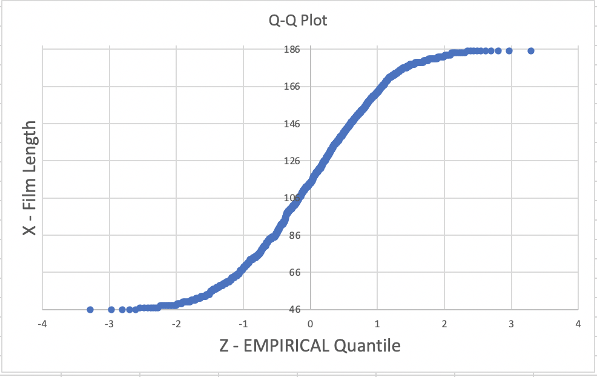
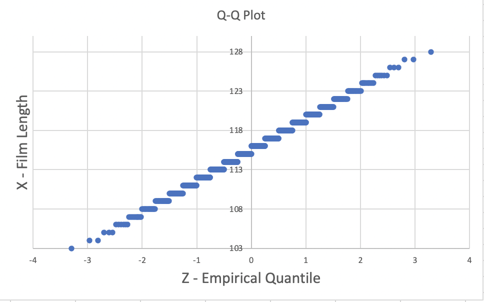
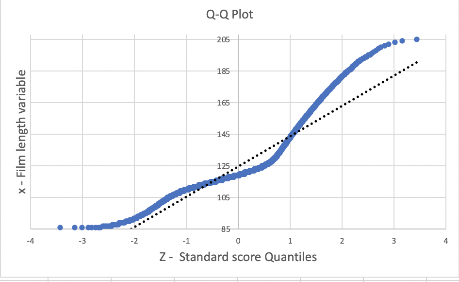

# Z-score and QQ-Plot

Say we have a `film` table, (`dvdrental` sample database):

```console
dvdrental=# \d film
                                              Table "public.film"
      Column      |            Type             | Collation | Nullable |                Default
------------------+-----------------------------+-----------+----------+---------------------------------------
 film_id          | integer                     |           | not null | nextval('film_film_id_seq'::regclass)
 title            | character varying(255)      |           | not null |
 description      | text                        |           |          |
 release_year     | year                        |           |          |
 language_id      | smallint                    |           | not null |
 rental_duration  | smallint                    |           | not null | 3
 rental_rate      | numeric(4,2)                |           | not null | 4.99
 length           | smallint                    |           |          |
 replacement_cost | numeric(5,2)                |           | not null | 19.99
 rating           | mpaa_rating                 |           |          | 'G'::mpaa_rating
 last_update      | timestamp without time zone |           | not null | now()
 special_features | text[]                      |           |          |
 fulltext         | tsvector                    |           | not null |
Indexes:
    "film_pkey" PRIMARY KEY, btree (film_id)
    "film_fulltext_idx" gist (fulltext)
    "idx_fk_language_id" btree (language_id)
    "idx_title" btree (title)
Foreign-key constraints:
    "film_language_id_fkey" FOREIGN KEY (language_id) REFERENCES language(language_id) ON UPDATE CASCADE ON DELETE RESTRICT
Referenced by:
    TABLE "film_actor" CONSTRAINT "film_actor_film_id_fkey" FOREIGN KEY (film_id) REFERENCES film(film_id) ON UPDATE CASCADE ON DELETE RESTRICT
    TABLE "film_category" CONSTRAINT "film_category_film_id_fkey" FOREIGN KEY (film_id) REFERENCES film(film_id) ON UPDATE CASCADE ON DELETE RESTRICT
    TABLE "inventory" CONSTRAINT "inventory_film_id_fkey" FOREIGN KEY (film_id) REFERENCES film(film_id) ON UPDATE CASCADE ON DELETE RESTRICT
Triggers:
    film_fulltext_trigger BEFORE INSERT OR UPDATE ON film FOR EACH ROW EXECUTE PROCEDURE tsvector_update_trigger('fulltext', 'pg_catalog.english', 'title', 'description')
    last_updated BEFORE UPDATE ON film FOR EACH ROW EXECUTE PROCEDURE last_updated()
```

where each row is a film with length in minutes:

```SQL
SELECT  film_id
      , title
      , length
  FROM film
 ORDER BY length DESC, film_id;
```

```console
film_id |            title            | length
--------+-----------------------------+--------
    141 | Chicago North               |    185
    182 | Control Anthem              |    185
    212 | Darn Forrester              |    185
    349 | Gangs Pride                 |    185
    426 | Home Pity                   |    185
    609 | Muscle Bright               |    185
    690 | Pond Seattle                |    185
    817 | Soldiers Evolution          |    185
    872 | Sweet Brotherhood           |    185
    991 | Worst Banger                |    185
    180 | Conspiracy Spirit           |    184
    198 | Crystal Breaking            |    184
    499 | King Evolution              |    184
    597 | Moonwalker Fool             |    184
    813 | Smoochy Control             |    184
    820 | Sons Interview              |    184
    821 | Sorority Queen              |    184
    886 | Theory Mermaid              |    184
    128 | Catch Amistad               |    183
    340 | Frontier Cabin              |    183
    767 | Scalawag Duck               |    183
    973 | Wife Turn                   |    183
    996 | Young Language              |    183
     50 | Baked Cleopatra             |    182
    591 | Monsoon Cause               |    182
    719 | Records Zorro               |    182
    721 | Reds Pocus                  |    182
    765 | Saturn Name                 |    182
    774 | Searchers Wait              |    182
     24 | Analyze Hoosiers            |    181
    406 | Haunting Pianist            |    181
    435 | Hotel Happiness             |    181
    467 | Intrigue Worst              |    181
    473 | Jacket Frisco               |    181
    510 | Lawless Vision              |    181
    535 | Love Suicides               |    181
    751 | Runaway Tenenbaums          |    181
    841 | Star Operation              |    181
    974 | Wild Apollo                 |    181
     16 | Alley Evolution             |    180
    174 | Confidential Interview      |    180
    454 | Impact Aladdin              |    180
    584 | Mixed Doors                 |    180
    612 | Mussolini Spoilers          |    180
    615 | Nash Chocolat               |    180
    818 | Something Duck              |    180
     27 | Anonymous Human             |    179
     88 | Born Spinal                 |    179
    126 | Casualties Encino           |    179
    ... | ....                        |    ...
```

In lesson [desc_stats](./00_desc_stats.md), we summarized the main descriptive statics to analyse the duration of movies in the `film` table of the `dvdrental` sample database.

```console
median |  mean  | sample_std | sample_skeweness | sample_kurt
-------+--------+------------+------------------+-------------
   114 | 115.27 |      40.43 |             0.03 |       -1.17
```

The findings of the median, mean and skeweness describe an approximately symmetric distribution, (the mean is closed to the median and the sample skeweness indicates a distribution a bit skewed to the right but almost symmetric). The excess of kurtosis indicates an almost flat distribution compared to the normal distribution.

## Problem

Calculate and plot the z-score of the length variable.

```console
zscore | cont | freq | sum  |                 freq_plot
--------+------+------+------+-------------------------------------------
  -1.7 |   23 |   23 |   23 | ***********************
  -1.6 |   28 |   28 |   51 | ****************************
  -1.5 |   22 |   22 |   73 | **********************
  -1.4 |   31 |   31 |  104 | *******************************
  -1.3 |   34 |   34 |  138 | **********************************
  -1.2 |   22 |   22 |  160 | **********************
  -1.1 |   24 |   24 |  184 | ************************
  -1.0 |   41 |   41 |  225 | *****************************************
  -0.9 |   28 |   28 |  253 | ****************************
  -0.8 |   29 |   29 |  282 | *****************************
  -0.7 |   32 |   32 |  314 | ********************************
  -0.6 |   36 |   36 |  350 | ************************************
  -0.5 |   12 |   12 |  362 | ************
  -0.4 |   35 |   35 |  397 | ***********************************
  -0.3 |   32 |   32 |  429 | ********************************
  -0.2 |   28 |   28 |  457 | ****************************
  -0.1 |   37 |   37 |  494 | *************************************
   0.0 |   26 |   26 |  520 | **************************
   0.1 |   31 |   31 |  551 | *******************************
   0.2 |   29 |   29 |  580 | *****************************
   0.3 |   28 |   28 |  608 | ****************************
   0.4 |   24 |   24 |  632 | ************************
   0.5 |   33 |   33 |  665 | *********************************
   0.6 |   29 |   29 |  694 | *****************************
   0.7 |   29 |   29 |  723 | *****************************
   0.8 |   27 |   27 |  750 | ***************************
   0.9 |   33 |   33 |  783 | *********************************
   1.0 |   23 |   23 |  806 | ***********************
   1.1 |   27 |   27 |  833 | ***************************
   1.2 |   21 |   21 |  854 | *********************
   1.3 |   22 |   22 |  876 | **********************
   1.4 |   27 |   27 |  903 | ***************************
   1.5 |   28 |   28 |  931 | ****************************
   1.6 |   40 |   40 |  971 | ****************************************
   1.7 |   29 |   29 | 1000 | *****************************
(35 rows)
```
Non-normal distributions can be transformed into sets of Z-scores. In this case the standard normal table cannot be consulted, since the shape of the distribution of Z-scores is the same as that for the original non-normal distribution.

Histogram of a sample from a uniform distribution – it looks multimodal and supposedly roughly symmetric.


## Problem 2

```SQL
WITH film_count AS (
  SELECT  length AS x
        , COUNT(1) AS freq
    FROM film
   GROUP BY 1
)
SELECT  *
      , LPAD('*',freq::INTEGER,'*') AS freq_plot
  FROM film_count
 ORDER BY x;
```

```console
x  | freq |     freq_plot
---+------ +-------------------
46 |    5  | *****
47 |    7  | *******
48 |   11  | ***********
49 |    5  | *****
50 |    9  | *********
51 |    7  | *******
52 |    7  | *******
53 |    9  | *********
54 |    6  | ******
55 |    2  | **
56 |    5  | *****
57 |    7  | *******
58 |    7  | *******
59 |    9  | *********
60 |    8  | ********
61 |   10  | **********
62 |    6  | ******
63 |    9  | *********
64 |    9  | *********
65 |    7  | *******
66 |    2  | **
67 |    8  | ********
68 |    5  | *****
69 |    6  | ******
70 |    7  | *******
71 |    7  | *******
72 |    4  | ****
73 |   12  | ************
74 |   12  | ************
75 |   10  | **********
76 |    7  | *******
77 |    6  | ******
78 |    6  | ******
79 |    6  | ******
80 |   10  | **********
81 |    3  | ***
82 |    7  | *******
83 |    6  | ******
84 |   13  | *************
85 |   17  | *****************
86 |    5  | *****
87 |    6  | ******
88 |    4  | ****
89 |    6  | ******
90 |    5  | *****
91 |    6  | ******
92 |   11  | ***********
93 |    8  | ********
94 |    4  | ****
95 |    2  | **
96 |    2  | **
97 |    4  | ****
98 |    8  | ********
99 |    8  | ********
100 |   12 | ************
101 |    7 | *******
102 |   11 | ***********
103 |    9 | *********
104 |    6 | ******
105 |    6 | ******
106 |    6 | ******
107 |   10 | **********
108 |    5 | *****
109 |    7 | *******
110 |    9 | *********
111 |    7 | *******
112 |   13 | *************
113 |    8 | ********
114 |   10 | **********
115 |    7 | *******
116 |    4 | ****
117 |    5 | *****
118 |    8 | ********
119 |    6 | ******
120 |    9 | *********
121 |    8 | ********
122 |   11 | ***********
123 |    7 | *******
124 |    4 | ****
125 |    7 | *******
126 |    9 | *********
127 |    5 | *****
128 |    7 | *******
129 |    7 | *******
130 |    6 | ******
131 |    5 | *****
132 |    8 | ********
133 |    5 | *****
134 |    5 | *****
135 |   10 | **********
136 |    9 | *********
137 |    9 | *********
138 |    6 | ******
139 |   11 | ***********
140 |    5 | *****
141 |    7 | *******
142 |    7 | *******
143 |    7 | *******
144 |    8 | ********
145 |    7 | *******
146 |    5 | *****
147 |    9 | *********
148 |    7 | *******
149 |    6 | ******
150 |    8 | ********
151 |    7 | *******
152 |    9 | *********
153 |    9 | *********
154 |    7 | *******
155 |    6 | ******
156 |    4 | ****
157 |    6 | ******
158 |    6 | ******
159 |    6 | ******
160 |    6 | ******
161 |    9 | *********
162 |    5 | *****
163 |    7 | *******
164 |    4 | ****
165 |    5 | *****
166 |    5 | *****
167 |    7 | *******
168 |    4 | ****
169 |    6 | ******
170 |    4 | ****
171 |    8 | ********
172 |    8 | ********
173 |    7 | *******
174 |    6 | ******
175 |    6 | ******
176 |   10 | **********
177 |    6 | ******
178 |   10 | **********
179 |   13 | *************
180 |    7 | *******
181 |   10 | **********
182 |    6 | ******
183 |    5 | *****
184 |    8 | ********
185 |   10 | **********
```


We want to generate a table to plot the normal probability plot or `Q-Q Plot`.

The normal probability plot is a plot used to assess the normal distribution of any numerical data.

If the data follow a normal distribution then a normal probability plot of the theoretical percentiles of the normal distribution on the x-axis versus the observed sample percentiles on the y-axis should be approximately linear.

The theoretical p% percentile of a normal distribution is the value such that p% of the values are lower than that value.

The sample p% percentile of any numerical data is the value such that p% of the measurements fall below that value.

For example, the 50% percentile or the median is the value so that 50% or half of your measurements fall below that value.

We want to generate the following table:

```console
x  |   q    |   z
---+--------+--------
46 | 0.0005 | -3.291
46 | 0.0015 | -2.968
46 | 0.0025 | -2.807
46 | 0.0035 | -2.697
46 | 0.0045 | -2.612
47 | 0.0055 | -2.543
47 | 0.0065 | -2.484
47 | 0.0075 | -2.432
47 | 0.0085 | -2.387
47 | 0.0095 | -2.346
47 | 0.0105 | -2.308
47 | 0.0115 | -2.273
48 | 0.0125 | -2.241
48 | 0.0135 | -2.212
48 | 0.0145 | -2.183
48 | 0.0155 | -2.157
48 | 0.0165 | -2.132
```

Where the first column `x` is the sample data, and the second column is the  quantile  of the x sample value, and the third column is the normal z-score value corresponding to the `q` value. In other words is the inverse function of the `pnorm` function. It's usually referred to `qnorm` function. The `qnorm` function takes as input the `CDF` value of the normal standard, usually referred as `quantile` or `q` and returns the corresponding `z-score` value. For example, the z-score value of `0.5` is `z=0`.

Plot the normal probability plot :




Normal probability plot of a sample from a uniform distribution – it has an S shape.

## Problem 3

We want to generate a table to plot the normal probability plot or `Q-Q Plot` of the following distribution:

```SQL
SELECT  x, freq
      , LPAD('*',freq::INTEGER,'*') AS freq_plot
  FROM v3;
```

```console
x   | freq |                                              freq_plot
----+------+-----------------------------------------------------------------------------------------------------
103 |    1 | *
104 |    2 | **
105 |    3 | ***
106 |    6 | ******
107 |   10 | **********
108 |   17 | *****************
109 |   27 | ***************************
110 |   39 | ***************************************
111 |   53 | *****************************************************
112 |   68 | ********************************************************************
113 |   82 | **********************************************************************************
114 |   93 | *********************************************************************************************
115 |   99 | ***************************************************************************************************
116 |   99 | ***************************************************************************************************
117 |   93 | *********************************************************************************************
118 |   82 | **********************************************************************************
119 |   68 | ********************************************************************
120 |   53 | *****************************************************
121 |   39 | ***************************************
122 |   27 | ***************************
123 |   17 | *****************
124 |   10 | **********
125 |    6 | ******
126 |    3 | ***
127 |    2 | **
128 |    1 | *
(26 rows)
```



The linearity of the points suggests that the data are normally distributed. On a Q-Q plot normally distributed data appears as roughly a straight line (although the ends of the Q-Q plot often start to deviate from the straight line).

## Problem 4

We want to generate a table to plot the normal probability plot or `Q-Q Plot` of the following distribution:

```console
x   | freq | f_cdf  |                                     freq_plot
----+------+--------+-----------------------------------------------------------------------------------
86 |    8 |   0.43 | ********
87 |    6 |   0.75 | ******
88 |    6 |   1.07 | ******
89 |    7 |   1.45 | *******
90 |    7 |   1.83 | *******
91 |    7 |   2.20 | *******
92 |    7 |   2.58 | *******
93 |    7 |   2.95 | *******
94 |    8 |   3.38 | ********
95 |    8 |   3.81 | ********
96 |    8 |   4.24 | ********
97 |    8 |   4.67 | ********
98 |    8 |   5.10 | ********
99 |    9 |   5.59 | *********
100 |   10 |   6.12 | **********
101 |   10 |   6.66 | **********
102 |   11 |   7.25 | ***********
103 |   11 |   7.84 | ***********
104 |   13 |   8.54 | *************
105 |   16 |   9.40 | ****************
106 |   19 |  10.42 | *******************
107 |   23 |  11.65 | ***********************
108 |   27 |  13.10 | ***************************
109 |   33 |  14.88 | *********************************
110 |   40 |  17.02 | ****************************************
111 |   47 |  19.55 | ***********************************************
112 |   56 |  22.56 | ********************************************************
113 |   63 |  25.94 | ***************************************************************
114 |   69 |  29.65 | *********************************************************************
115 |   75 |  33.67 | ***************************************************************************
116 |   79 |  37.92 | *******************************************************************************
117 |   81 |  42.27 | *********************************************************************************
118 |   81 |  46.62 | *********************************************************************************
119 |   79 |  50.86 | ******************************************************************************* <--- Median
120 |   75 |  54.89 | ***************************************************************************
121 |   70 |  58.65 | **********************************************************************
122 |   63 |  62.03 | ***************************************************************
123 |   56 |  65.04 | ********************************************************
124 |   48 |  67.62 | ************************************************ <--- Mean
125 |   41 |  69.82 | *****************************************
126 |   34 |  71.64 | **********************************
127 |   28 |  73.15 | ****************************
128 |   23 |  74.38 | ***********************
129 |   20 |  75.46 | ********************
130 |   17 |  76.37 | *****************
131 |   15 |  77.18 | ***************
132 |   13 |  77.87 | *************
133 |   12 |  78.52 | ************
134 |   12 |  79.16 | ************
135 |   12 |  79.81 | ************
136 |   11 |  80.40 | ***********
137 |   11 |  80.99 | ***********
138 |   11 |  81.58 | ***********
139 |   11 |  82.17 | ***********
140 |   10 |  82.71 | **********
141 |   10 |  83.24 | **********
142 |   10 |  83.78 | **********
143 |   10 |  84.32 | **********
144 |   10 |  84.85 | **********
145 |   10 |  85.39 | **********
146 |   10 |  85.93 | **********
147 |    9 |  86.41 | *********
148 |    9 |  86.90 | *********
149 |    9 |  87.38 | *********
150 |    9 |  87.86 | *********
151 |    9 |  88.35 | *********
152 |    9 |  88.83 | *********
153 |    8 |  89.26 | ********
154 |    8 |  89.69 | ********
155 |    8 |  90.12 | ********
156 |    8 |  90.55 | ********
157 |    8 |  90.98 | ********
158 |    7 |  91.35 | *******
159 |    7 |  91.73 | *******
160 |    7 |  92.11 | *******
161 |    7 |  92.48 | *******
162 |    7 |  92.86 | *******
163 |    6 |  93.18 | ******
164 |    6 |  93.50 | ******
165 |    6 |  93.82 | ******
166 |    6 |  94.15 | ******
167 |    6 |  94.47 | ******
168 |    5 |  94.74 | *****
169 |    5 |  95.01 | *****
170 |    5 |  95.27 | *****
171 |    5 |  95.54 | *****
172 |    5 |  95.81 | *****
173 |    5 |  96.08 | *****
174 |    4 |  96.29 | ****
175 |    4 |  96.51 | ****
176 |    4 |  96.72 | ****
177 |    4 |  96.94 | ****
178 |    4 |  97.15 | ****
179 |    4 |  97.37 | ****
180 |    3 |  97.53 | ***
181 |    3 |  97.69 | ***
182 |    3 |  97.85 | ***
183 |    3 |  98.01 | ***
184 |    3 |  98.17 | ***
185 |    3 |  98.34 | ***
186 |    3 |  98.50 | ***
187 |    2 |  98.60 | **
188 |    2 |  98.71 | **
189 |    2 |  98.82 | **
190 |    2 |  98.93 | **
191 |    2 |  99.03 | **
192 |    2 |  99.14 | **
193 |    2 |  99.25 | **
194 |    2 |  99.36 | **
195 |    2 |  99.46 | **
196 |    1 |  99.52 | *
197 |    1 |  99.57 | *
198 |    1 |  99.62 | *
199 |    1 |  99.68 | *
200 |    1 |  99.73 | *
201 |    1 |  99.79 | *
202 |    1 |  99.84 | *
203 |    1 |  99.89 | *
204 |    1 |  99.95 | *
205 |    1 | 100.00 | *
(120 rows)
```



## Solution

Here’s the SQL for calculating z-scores for the length variable in the film table.

```SQL
WITH mean_std AS (
  SELECT ROUND(AVG(length),2) AS mu
       , ROUND(STDDEV(length),2) AS sigma
    FROM film
),
standardz AS (
  SELECT  length AS x
        , (length - mu)/sigma AS zscore
    FROM film f, mean_std m
),
freq AS (
  SELECT  ROUND(zscore::NUMERIC,1) AS zscore
        , COUNT(1) AS cont
    FROM standardz
   GROUP BY 1
),
histogram AS (
  SELECT  *
        , ROUND(1000.0*cont/SUM(cont) OVER(),1)::INTEGER AS freq
    FROM freq
)
SELECT  *
      , SUM(freq) OVER(ORDER BY zscore)
      , LPAD('*',freq::INTEGER,'*') AS freq_plot
  FROM histogram
 ORDER BY 1;
```


## Plot the Q-Q Plot

Compute the the q values of the normal probability plot in the `film` table for the length variable.


```SQL
WITH ranking AS (
  SELECT  length AS x
        , ROW_NUMBER() OVER (ORDER BY length) AS rnk
        , COUNT(length) OVER() AS n
    FROM film
),
plot_val AS (
  SELECT  x
        , ROUND((rnk - 0.5)/n,4) AS q_plot
    FROM ranking
)
SELECT  x
      , q_plot
  FROM plot_val
 ORDER BY x DESC;
```

1. Assign a rank to each value of your data.

- `ROW_NUMBER() OVER (ORDER BY length) AS rnk`

2. Calculate the cumulative probability (pi) associated with each rank (i) using the following formula:

```console
pi=(rnk-a)/(n+1-2a)

Where:

rnk = 1,2,3,…..n. n is the number of data points.

a = 3/8 for n ≤ 10, and = 0.5 for n > 10.
```

- `ROUND((rnk - 0.5)/n,4) AS q_plot`.

3. Finds the normal standard Z-score that is associated with each q_plot value.

```console
x   | q_plot
----+--------
46  | 0.0005
46  | 0.0015
46  | 0.0025
46  | 0.0035
46  | 0.0045
47  | 0.0055
47  | 0.0065
47  | 0.0075
47  | 0.0085
47  | 0.0095
47  | 0.0105
47  | 0.0115
48  | 0.0125
..  | ..
185 | 0.9905
```

```SQL
WITH ranking AS (
  SELECT  length AS x
        , ROW_NUMBER() OVER (ORDER BY length) AS rnk
        , COUNT(length) OVER() AS n
    FROM film
),
plot_val AS (
  SELECT  x
        , ROUND((rnk - 0.5)/n,4) AS q_plot
    FROM ranking
)
SELECT  x
      , q_plot AS q
      , ROUND(qnorm(q_plot)::NUMERIC,3) AS z
  FROM plot_val
 ORDER BY x;
```

```console
x  |   q    |   z
---+--------+--------
46 | 0.0005 | -3.291
46 | 0.0015 | -2.968
46 | 0.0025 | -2.807
46 | 0.0035 | -2.697
46 | 0.0045 | -2.612
47 | 0.0055 | -2.543
47 | 0.0065 | -2.484
47 | 0.0075 | -2.432
47 | 0.0085 | -2.387
47 | 0.0095 | -2.346
47 | 0.0105 | -2.308
47 | 0.0115 | -2.273
48 | 0.0125 | -2.241
48 | 0.0135 | -2.212
48 | 0.0145 | -2.183
48 | 0.0155 | -2.157
48 | 0.0165 | -2.132
```
Let's export the query as csv file:

```SQL
CREATE VIEW normal_probability_plot AS (
  WITH ranking AS (
    SELECT  length AS x
          , ROW_NUMBER() OVER (ORDER BY length) AS rnk
          , COUNT(length) OVER() AS n
      FROM film
  ),
  plot_val AS (
    SELECT  x
          , ROUND((rnk - 0.5)/n,4) AS q_plot
      FROM ranking
  )
  SELECT  x
        , ROUND(qnorm(q_plot)::NUMERIC,3) AS z
    FROM plot_val
   ORDER BY x
);
```

```console
dvdrental=# COPY (SELECT * FROM normal_probability_plot ORDER BY x) TO '/Users/ludovicopinzari/Documents/Udacity/Sql_udacity/normal_plot.csv' DELIMITER ',' QUOTE ' ' CSV;
COPY 1000
```
5. Create an x-y scatter plot of your z-score values on the x-axis versus their corresponding data points on the y-axis.

## Plot the Normal Probability Plot 2

```SQL
CREATE VIEW v3_count AS (
  WITH RECURSIVE duplicate_val AS (
    SELECT *
      FROM v3
     UNION ALL
    SELECT v.x AS x
          , v.freq - 1 AS freq
      FROM duplicate_val v
     INNER JOIN v3 w
        ON v.x = w.x
     WHERE v.freq > 1
  )
  SELECT x
    FROM duplicate_val
);
```

Let's export the query as csv file:

```SQL
CREATE VIEW normal_prob_plot_ex AS (
  WITH ranking AS (
    SELECT  x
          , ROW_NUMBER() OVER (ORDER BY x) AS rnk
          , COUNT(x) OVER() AS n
      FROM v3_count
  ),
  plot_val AS (
    SELECT  x
          , ROUND((rnk - 0.5)/n,4) AS q_plot
      FROM ranking
  )
  SELECT  x
        , ROUND(qnorm(q_plot)::NUMERIC,3) AS z
    FROM plot_val
   ORDER BY x
);

SELECT *
  FROM normal_prob_plot_ex
 ORDER BY x;
```

```console
x   |   z
----+--------
103 | -3.291
104 | -2.968
104 | -2.807
105 | -2.697
105 | -2.612
105 | -2.543
106 | -2.484
106 | -2.432
106 | -2.387
106 | -2.346
106 | -2.308
106 | -2.273
107 | -2.241
107 | -2.212
107 | -2.183
107 | -2.157
107 | -2.132
```

```console
dvdrental=# COPY (SELECT * FROM normal_prob_plot_ex ORDER BY x) TO '/Users/ludovicopinzari/Documents/Udacity/Sql_udacity/normal_plot_ex.csv' DELIMITER ',' QUOTE ' ' CSV;
COPY 1000
```

## Problem 3

```SQL
CREATE VIEW skewed_distribution_r AS (
WITH RECURSIVE gauss_pdf AS (
  SELECT  '[-7.0  -6.9)' AS class
        , -4.9 AS z
        , gaussian(-3.9 + 0.05,-1.0,3.5)*0.1 AS prb
   UNION ALL
  SELECT CASE WHEN z = 6.9
              THEN '(6.9  7.0]'
              WHEN z < 0
              THEN  '[' || z::TEXT || '  ' || (z + 0.1)::TEXT || ')'
              ELSE  '(' || z::TEXT || '  ' || (z + 0.1)::TEXT || ']'
         END AS class
        , z + 0.1 AS z
        , gaussian(z + 0.05,-1.0,3.5)*0.1 AS prb
    FROM gauss_pdf
   WHERE z <= 6.9
),
g_pdf AS (
  SELECT  z
        , prb
        , ROUND((1000.0*prb)::INTEGER,1)::INTEGER AS freq
    FROM gauss_pdf
),
numbers AS (
  SELECT  2 * RANDOM() - 1 AS x
        , 2 * RANDOM() - 1 AS y
    FROM GENERATE_SERIES(0, 100000)
),
numbers2 AS (
  SELECT  2 * RANDOM() - 1 AS x
        , 2 * RANDOM() - 1 AS y
    FROM GENERATE_SERIES(0, 100000)
),
polar_points AS (
  SELECT  x
        , y
        , x*x + y*y AS s
    FROM numbers
   WHERE x*x + y*y < 1
),
polar_points2 AS (
  SELECT  x
        , y
        , x*x + y*y AS s
    FROM numbers2
   WHERE x*x + y*y < 1
),
marsaglia AS (
  SELECT -1.5 + (x * sqrt((-2 * ln(s))/s))*0.5 AS n
    FROM polar_points
  UNION
  SELECT -1.5 + (y * sqrt((-2 * ln(s))/s))*0.5 AS n
    FROM polar_points
),
marsaglia2 AS (
  SELECT - 2 + x * sqrt((-2 * ln(s))/s)*0.5 AS n
    FROM polar_points2
  UNION
  SELECT - 2 + y * sqrt((-2 * ln(s))/s)*0.5 AS n
    FROM polar_points2
),
data_dist AS (
  SELECT n
    FROM marsaglia
   UNION ALL
  SELECT n
    FROM marsaglia2
),
freq AS (
  SELECT  ROUND(n::NUMERIC,1) AS val
        , COUNT(1) AS cont
    FROM data_dist
   GROUP BY 1
),
histogram AS (
  SELECT  *
        , ROUND(1000.0*cont/SUM(cont) OVER(),1)::INTEGER AS freq
    FROM freq
),
sum_prob AS (
  SELECT  gp.z AS z
        , CASE WHEN h.freq IS NULL
               THEN gp.freq
               ELSE gp.freq + h.freq
          END AS freq
    FROM g_pdf gp
    LEFT JOIN histogram h
      ON gp.z = h.val
)
SELECT  ROW_NUMBER() OVER(ORDER BY z) + 115 - 30 AS x
      , freq
  FROM sum_prob
);

SELECT x
     , freq
     , ROUND((100.0*SUM(freq) OVER(ORDER BY x)/SUM(freq) OVER())::NUMERIC,2) AS f_cdf
     , LPAD('*',freq::INTEGER,'*') AS freq_plot
  FROM skewed_distribution_r
 ORDER BY 1;
```

```console
x   | freq | f_cdf  |                                     freq_plot
----+------+--------+-----------------------------------------------------------------------------------
86 |    8 |   0.43 | ********
87 |    6 |   0.75 | ******
88 |    6 |   1.07 | ******
89 |    7 |   1.45 | *******
90 |    7 |   1.83 | *******
91 |    7 |   2.20 | *******
92 |    7 |   2.58 | *******
93 |    7 |   2.95 | *******
94 |    8 |   3.38 | ********
95 |    8 |   3.81 | ********
96 |    8 |   4.24 | ********
97 |    8 |   4.67 | ********
98 |    8 |   5.10 | ********
99 |    9 |   5.59 | *********
100 |   10 |   6.12 | **********
101 |   10 |   6.66 | **********
102 |   11 |   7.25 | ***********
103 |   11 |   7.84 | ***********
104 |   13 |   8.54 | *************
105 |   16 |   9.40 | ****************
106 |   19 |  10.42 | *******************
107 |   23 |  11.65 | ***********************
108 |   27 |  13.10 | ***************************
109 |   33 |  14.88 | *********************************
110 |   40 |  17.02 | ****************************************
111 |   47 |  19.55 | ***********************************************
112 |   56 |  22.56 | ********************************************************
113 |   63 |  25.94 | ***************************************************************
114 |   69 |  29.65 | *********************************************************************
115 |   75 |  33.67 | ***************************************************************************
116 |   79 |  37.92 | *******************************************************************************
117 |   81 |  42.27 | *********************************************************************************
118 |   81 |  46.62 | *********************************************************************************
119 |   79 |  50.86 | ******************************************************************************* <--- Median
120 |   75 |  54.89 | ***************************************************************************
121 |   70 |  58.65 | **********************************************************************
122 |   63 |  62.03 | ***************************************************************
123 |   56 |  65.04 | ********************************************************
124 |   48 |  67.62 | ************************************************ <--- Mean
125 |   41 |  69.82 | *****************************************
126 |   34 |  71.64 | **********************************
127 |   28 |  73.15 | ****************************
128 |   23 |  74.38 | ***********************
129 |   20 |  75.46 | ********************
130 |   17 |  76.37 | *****************
131 |   15 |  77.18 | ***************
132 |   13 |  77.87 | *************
133 |   12 |  78.52 | ************
134 |   12 |  79.16 | ************
135 |   12 |  79.81 | ************
136 |   11 |  80.40 | ***********
137 |   11 |  80.99 | ***********
138 |   11 |  81.58 | ***********
139 |   11 |  82.17 | ***********
140 |   10 |  82.71 | **********
141 |   10 |  83.24 | **********
142 |   10 |  83.78 | **********
143 |   10 |  84.32 | **********
144 |   10 |  84.85 | **********
145 |   10 |  85.39 | **********
146 |   10 |  85.93 | **********
147 |    9 |  86.41 | *********
148 |    9 |  86.90 | *********
149 |    9 |  87.38 | *********
150 |    9 |  87.86 | *********
151 |    9 |  88.35 | *********
152 |    9 |  88.83 | *********
153 |    8 |  89.26 | ********
154 |    8 |  89.69 | ********
155 |    8 |  90.12 | ********
156 |    8 |  90.55 | ********
157 |    8 |  90.98 | ********
158 |    7 |  91.35 | *******
159 |    7 |  91.73 | *******
160 |    7 |  92.11 | *******
161 |    7 |  92.48 | *******
162 |    7 |  92.86 | *******
163 |    6 |  93.18 | ******
164 |    6 |  93.50 | ******
165 |    6 |  93.82 | ******
166 |    6 |  94.15 | ******
167 |    6 |  94.47 | ******
168 |    5 |  94.74 | *****
169 |    5 |  95.01 | *****
170 |    5 |  95.27 | *****
171 |    5 |  95.54 | *****
172 |    5 |  95.81 | *****
173 |    5 |  96.08 | *****
174 |    4 |  96.29 | ****
175 |    4 |  96.51 | ****
176 |    4 |  96.72 | ****
177 |    4 |  96.94 | ****
178 |    4 |  97.15 | ****
179 |    4 |  97.37 | ****
180 |    3 |  97.53 | ***
181 |    3 |  97.69 | ***
182 |    3 |  97.85 | ***
183 |    3 |  98.01 | ***
184 |    3 |  98.17 | ***
185 |    3 |  98.34 | ***
186 |    3 |  98.50 | ***
187 |    2 |  98.60 | **
188 |    2 |  98.71 | **
189 |    2 |  98.82 | **
190 |    2 |  98.93 | **
191 |    2 |  99.03 | **
192 |    2 |  99.14 | **
193 |    2 |  99.25 | **
194 |    2 |  99.36 | **
195 |    2 |  99.46 | **
196 |    1 |  99.52 | *
197 |    1 |  99.57 | *
198 |    1 |  99.62 | *
199 |    1 |  99.68 | *
200 |    1 |  99.73 | *
201 |    1 |  99.79 | *
202 |    1 |  99.84 | *
203 |    1 |  99.89 | *
204 |    1 |  99.95 | *
205 |    1 | 100.00 | *
(120 rows)
```

Let's compute the standard summary statistics.

```SQL
WITH RECURSIVE duplicate_val AS (
  SELECT *
    FROM skewed_distribution_r
   UNION ALL
  SELECT r.x AS x
        , r.freq - 1 AS freq
    FROM duplicate_val r
   INNER JOIN skewed_distribution_r w
      ON r.x = w.x
   WHERE r.freq > 1
),
diff AS (
  SELECT x
       , COUNT(x) OVER() AS n
       , AVG(x) OVER() AS mean
       , STDDEV_POP(x) OVER() AS std_p
       , STDDEV(x) OVER() AS std
    FROM duplicate_val
),
comp_sk_krt AS (
  SELECT n
       , PERCENTILE_CONT(0.5) WITHIN GROUP(ORDER BY x) AS median
       , mean
       , std
       , SUM(POWER(x - mean,3))/(COUNT(x))  AS num_sk
       , POWER(std_p,3) AS den_sk
       , SUM(POWER(x - mean,4))/(COUNT(x))  AS num_krt
       , POWER(std_p,4) AS den_krt
    FROM diff
   GROUP BY n, mean, std, std_p
),
pop_sk_krt AS (
  SELECT  n
        , median
        , mean
        , std
        , num_sk/den_sk AS skw
        , num_krt/den_krt - 3 AS execess_krt
    FROM comp_sk_krt
)
SELECT  ROUND(median::NUMERIC,2) AS median
      , ROUND(mean::NUMERIC,2) AS mean
      , ROUND(std::NUMERIC,2) AS sample_std
      , ROUND(((SQRT(n*(n-1.0))/(n-2.0))*skw)::NUMERIC,2) AS sample_skeweness
      , ROUND(((n - 1)*((n + 1)*execess_krt + 6)/((n-2)*(n-3)))::NUMERIC,2) AS sample_kurt
  FROM pop_sk_krt;
```

```console
median |  mean  | sample_std | sample_skeweness | sample_kurt
-------+--------+------------+------------------+-------------
119.00 | 124.48 |      20.43 |             1.33 |        1.97
```

The distribution is highly skewed on the right. Almost 68% of the samples are below the mean value.

Let's calculate the normal standard z-score values for the quantile's distribution.

```SQL
WITH RECURSIVE duplicate_val AS (
  SELECT *
    FROM skewed_distribution_r
   UNION ALL
  SELECT r.x AS x
        , r.freq - 1 AS freq
    FROM duplicate_val r
   INNER JOIN skewed_distribution_r w
      ON r.x = w.x
   WHERE r.freq > 1
),
ranking AS (
  SELECT  x
        , ROW_NUMBER() OVER (ORDER BY x) AS rnk
        , COUNT(x) OVER() AS n
    FROM duplicate_val
),
plot_val AS (
  SELECT  x
        , ROUND((rnk - 0.5)/n,4) AS q_plot
    FROM ranking
)
SELECT  x
      , q_plot AS q
      , ROUND(qnorm(q_plot)::NUMERIC,3) AS z
  FROM plot_val
 ORDER BY x;
```

```console
x  |   q    |   z
---+--------+--------
86 | 0.0003 | -3.432
86 | 0.0008 | -3.156
86 | 0.0013 | -3.011
86 | 0.0019 | -2.894
86 | 0.0024 | -2.820
86 | 0.0030 | -2.748
86 | 0.0035 | -2.697
86 | 0.0040 | -2.652
87 | 0.0046 | -2.605
87 | 0.0051 | -2.569
87 | 0.0056 | -2.536
87 | 0.0062 | -2.501
87 | 0.0067 | -2.473
87 | 0.0073 | -2.442
88 | 0.0078 | -2.418
88 | 0.0083 | -2.395
88 | 0.0089 | -2.370
88 | 0.0094 | -2.349
88 | 0.0099 | -2.330
88 | 0.0105 | -2.308
89 | 0.0110 | -2.290
89 | 0.0116 | -2.270
```

Let's export the query as csv file:

```SQL
CREATE VIEW normal_prob_plot_ex2 AS (
  WITH RECURSIVE duplicate_val AS (
    SELECT *
      FROM skewed_distribution_r
     UNION ALL
    SELECT r.x AS x
          , r.freq - 1 AS freq
      FROM duplicate_val r
     INNER JOIN skewed_distribution_r w
        ON r.x = w.x
     WHERE r.freq > 1
  ),
  ranking AS (
    SELECT  x
          , ROW_NUMBER() OVER (ORDER BY x) AS rnk
          , COUNT(x) OVER() AS n
      FROM duplicate_val
  ),
  plot_val AS (
    SELECT  x
          , ROUND((rnk - 0.5)/n,4) AS q_plot
      FROM ranking
  )
  SELECT  x
        , q_plot AS q
        , ROUND(qnorm(q_plot)::NUMERIC,3) AS z
    FROM plot_val
   ORDER BY x
);

SELECT *
  FROM normal_prob_plot_ex2
 ORDER BY x;
```

```console
dvdrental=# COPY (SELECT * FROM normal_prob_plot_ex2 ORDER BY x) TO '/Users/ludovicopinzari/Documents/Udacity/Sql_udacity/normal_plot_ex2.csv' DELIMITER ',' QUOTE ' ' CSV;
COPY 1861
```


