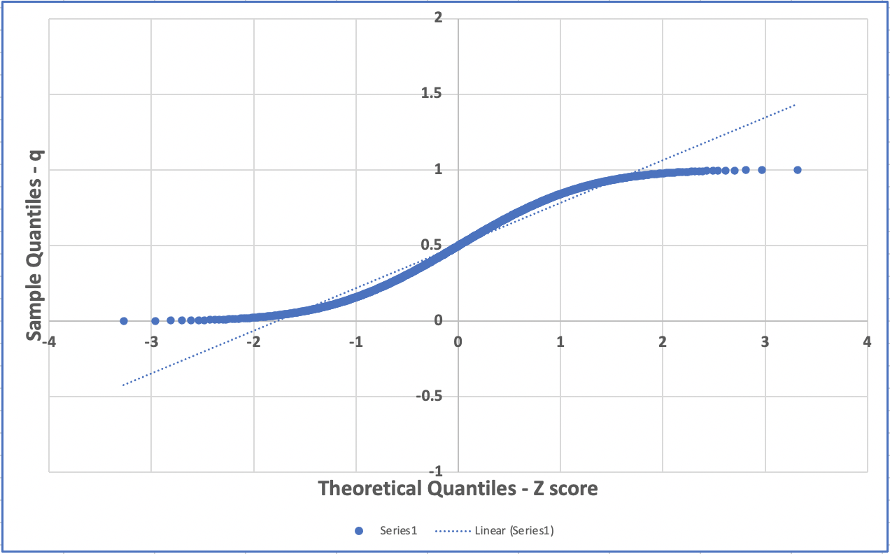

# Z-score and QQ-Plot

Say we have a `film` table, (`dvdrental` sample database):

```console
dvdrental=# \d film
                                              Table "public.film"
      Column      |            Type             | Collation | Nullable |                Default
------------------+-----------------------------+-----------+----------+---------------------------------------
 film_id          | integer                     |           | not null | nextval('film_film_id_seq'::regclass)
 title            | character varying(255)      |           | not null |
 description      | text                        |           |          |
 release_year     | year                        |           |          |
 language_id      | smallint                    |           | not null |
 rental_duration  | smallint                    |           | not null | 3
 rental_rate      | numeric(4,2)                |           | not null | 4.99
 length           | smallint                    |           |          |
 replacement_cost | numeric(5,2)                |           | not null | 19.99
 rating           | mpaa_rating                 |           |          | 'G'::mpaa_rating
 last_update      | timestamp without time zone |           | not null | now()
 special_features | text[]                      |           |          |
 fulltext         | tsvector                    |           | not null |
Indexes:
    "film_pkey" PRIMARY KEY, btree (film_id)
    "film_fulltext_idx" gist (fulltext)
    "idx_fk_language_id" btree (language_id)
    "idx_title" btree (title)
Foreign-key constraints:
    "film_language_id_fkey" FOREIGN KEY (language_id) REFERENCES language(language_id) ON UPDATE CASCADE ON DELETE RESTRICT
Referenced by:
    TABLE "film_actor" CONSTRAINT "film_actor_film_id_fkey" FOREIGN KEY (film_id) REFERENCES film(film_id) ON UPDATE CASCADE ON DELETE RESTRICT
    TABLE "film_category" CONSTRAINT "film_category_film_id_fkey" FOREIGN KEY (film_id) REFERENCES film(film_id) ON UPDATE CASCADE ON DELETE RESTRICT
    TABLE "inventory" CONSTRAINT "inventory_film_id_fkey" FOREIGN KEY (film_id) REFERENCES film(film_id) ON UPDATE CASCADE ON DELETE RESTRICT
Triggers:
    film_fulltext_trigger BEFORE INSERT OR UPDATE ON film FOR EACH ROW EXECUTE PROCEDURE tsvector_update_trigger('fulltext', 'pg_catalog.english', 'title', 'description')
    last_updated BEFORE UPDATE ON film FOR EACH ROW EXECUTE PROCEDURE last_updated()
```

where each row is a film with length in minutes:

```SQL
SELECT  film_id
      , title
      , length
  FROM film
 ORDER BY length DESC, film_id;
```

```console
film_id |            title            | length
--------+-----------------------------+--------
    141 | Chicago North               |    185
    182 | Control Anthem              |    185
    212 | Darn Forrester              |    185
    349 | Gangs Pride                 |    185
    426 | Home Pity                   |    185
    609 | Muscle Bright               |    185
    690 | Pond Seattle                |    185
    817 | Soldiers Evolution          |    185
    872 | Sweet Brotherhood           |    185
    991 | Worst Banger                |    185
    180 | Conspiracy Spirit           |    184
    198 | Crystal Breaking            |    184
    499 | King Evolution              |    184
    597 | Moonwalker Fool             |    184
    813 | Smoochy Control             |    184
    820 | Sons Interview              |    184
    821 | Sorority Queen              |    184
    886 | Theory Mermaid              |    184
    128 | Catch Amistad               |    183
    340 | Frontier Cabin              |    183
    767 | Scalawag Duck               |    183
    973 | Wife Turn                   |    183
    996 | Young Language              |    183
     50 | Baked Cleopatra             |    182
    591 | Monsoon Cause               |    182
    719 | Records Zorro               |    182
    721 | Reds Pocus                  |    182
    765 | Saturn Name                 |    182
    774 | Searchers Wait              |    182
     24 | Analyze Hoosiers            |    181
    406 | Haunting Pianist            |    181
    435 | Hotel Happiness             |    181
    467 | Intrigue Worst              |    181
    473 | Jacket Frisco               |    181
    510 | Lawless Vision              |    181
    535 | Love Suicides               |    181
    751 | Runaway Tenenbaums          |    181
    841 | Star Operation              |    181
    974 | Wild Apollo                 |    181
     16 | Alley Evolution             |    180
    174 | Confidential Interview      |    180
    454 | Impact Aladdin              |    180
    584 | Mixed Doors                 |    180
    612 | Mussolini Spoilers          |    180
    615 | Nash Chocolat               |    180
    818 | Something Duck              |    180
     27 | Anonymous Human             |    179
     88 | Born Spinal                 |    179
    126 | Casualties Encino           |    179
    ... | ....                        |    ...
```

In lesson [desc_stats](./00_desc_stats.md), we summarized the main descriptive statics to analyse the duration of movies in the `film` table of the `dvdrental` sample database.

```console
median |  mean  | sample_std | sample_skeweness | sample_kurt
-------+--------+------------+------------------+-------------
   114 | 115.27 |      40.43 |             0.03 |       -1.17
```

The findings of the median, mean and skeweness describe an approximately symmetric distribution, (the mean is closed to the median and the sample skeweness indicates a distribution a bit skewed to the right but almost symmetric). The excess of kurtosis indicates an almost flat distribution compared to the normal distribution.

## Problem

Calculate and plot the z-score of the length variable.

```console
zscore | cont | freq | sum  |                 freq_plot
--------+------+------+------+-------------------------------------------
  -1.7 |   23 |   23 |   23 | ***********************
  -1.6 |   28 |   28 |   51 | ****************************
  -1.5 |   22 |   22 |   73 | **********************
  -1.4 |   31 |   31 |  104 | *******************************
  -1.3 |   34 |   34 |  138 | **********************************
  -1.2 |   22 |   22 |  160 | **********************
  -1.1 |   24 |   24 |  184 | ************************
  -1.0 |   41 |   41 |  225 | *****************************************
  -0.9 |   28 |   28 |  253 | ****************************
  -0.8 |   29 |   29 |  282 | *****************************
  -0.7 |   32 |   32 |  314 | ********************************
  -0.6 |   36 |   36 |  350 | ************************************
  -0.5 |   12 |   12 |  362 | ************
  -0.4 |   35 |   35 |  397 | ***********************************
  -0.3 |   32 |   32 |  429 | ********************************
  -0.2 |   28 |   28 |  457 | ****************************
  -0.1 |   37 |   37 |  494 | *************************************
   0.0 |   26 |   26 |  520 | **************************
   0.1 |   31 |   31 |  551 | *******************************
   0.2 |   29 |   29 |  580 | *****************************
   0.3 |   28 |   28 |  608 | ****************************
   0.4 |   24 |   24 |  632 | ************************
   0.5 |   33 |   33 |  665 | *********************************
   0.6 |   29 |   29 |  694 | *****************************
   0.7 |   29 |   29 |  723 | *****************************
   0.8 |   27 |   27 |  750 | ***************************
   0.9 |   33 |   33 |  783 | *********************************
   1.0 |   23 |   23 |  806 | ***********************
   1.1 |   27 |   27 |  833 | ***************************
   1.2 |   21 |   21 |  854 | *********************
   1.3 |   22 |   22 |  876 | **********************
   1.4 |   27 |   27 |  903 | ***************************
   1.5 |   28 |   28 |  931 | ****************************
   1.6 |   40 |   40 |  971 | ****************************************
   1.7 |   29 |   29 | 1000 | *****************************
(35 rows)
```
Non-normal distributions can be transformed into sets of Z-scores. In this case the standard normal table cannot be consulted, since the shape of the distribution of Z-scores is the same as that for the original non-normal distribution.

Histogram of a sample from a uniform distribution – it looks multimodal and supposedly roughly symmetric.


## Problem 2

We want to generate a table to plot the normal probability plot or `Q-Q Plot`.

The normal probability plot is a plot used to assess the normal distribution of any numerical data.

If the data follow a normal distribution then a normal probability plot of the theoretical percentiles of the normal distribution on the x-axis versus the observed sample percentiles on the y-axis should be approximately linear.

The theoretical p% percentile of a normal distribution is the value such that p% of the values are lower than that value.

The sample p% percentile of any numerical data is the value such that p% of the measurements fall below that value.

For example, the 50% percentile or the median is the value so that 50% or half of your measurements fall below that value.

We want to generate the following table:

```console
q_plot |   z
-------+-------
0.0005 | -3.27
0.0015 | -2.96
0.0025 | -2.81
0.0035 | -2.70
0.0045 | -2.61
0.0055 | -2.54
0.0065 | -2.48
0.0075 | -2.43
0.0085 | -2.38
0.0095 | -2.34
0.0105 | -2.30
0.0115 | -2.27
0.0125 | -2.24
0.0135 | -2.21
0.0145 | -2.18
0.0155 | -2.15
0.0165 | -2.13
```

Where the first column `q_plot` is the sample quantile plot, and the second column is the normal z-score value corresponding to the `q_plot` value. In other words is the inverse function of the `pnorm` function. It's usually referred to `qnorm` function. The `qnorm` function takes as input the `CDF` value of the normal standard, usually referred as `quantile` or `q` and returns the corresponding `z-score` value. For example, the z-score value of `0.5` is `z=0`.

Plot the normal probability plot :



Normal probability plot of a sample from a uniform distribution – it has an S shape.

## Solution

Here’s the SQL for calculating z-scores for the length variable in the film table.

```SQL
WITH mean_std AS (
  SELECT ROUND(AVG(length),2) AS mu
       , ROUND(STDDEV(length),2) AS sigma
    FROM film
),
standardz AS (
  SELECT  length AS x
        , (length - mu)/sigma AS zscore
    FROM film f, mean_std m
),
freq AS (
  SELECT  ROUND(zscore::NUMERIC,1) AS zscore
        , COUNT(1) AS cont
    FROM standardz
   GROUP BY 1
),
histogram AS (
  SELECT  *
        , ROUND(1000.0*cont/SUM(cont) OVER(),1)::INTEGER AS freq
    FROM freq
)
SELECT  *
      , SUM(freq) OVER(ORDER BY zscore)
      , LPAD('*',freq::INTEGER,'*') AS freq_plot
  FROM histogram
 ORDER BY 1;
```

## Plot the Normal Probability Plot


Let's first compute the CDF of the Standard normal distribution in the z-score interval `[-4.0 +4.0]`.

```SQL
WITH RECURSIVE normal AS (
  SELECT  -4.0 AS z
        , pnorm(-4.0)::NUMERIC(5,4) AS q_Fz
        , pnorm(-4.0)::NUMERIC(5,4) AS q_prev
  UNION ALL
  SELECT  z + 0.01 AS z
        , pnorm(z + 0.01)::NUMERIC(5,4) AS q_Fz
        , pnorm(z)::NUMERIC(5,4) AS q_prev
    FROM normal
   WHERE z <= 4.0
)
SELECT q_Fz
     , MIN(z) AS min_z
     , MAX(z) AS max_z
     , MIN(q_prev) AS min_q_prev
     , CASE WHEN q_Fz = 0.0000
            THEN '[' || q_Fz::TEXT || ']'
            ELSE '(' || MIN(q_prev)::TEXT || ' '||  q_Fz::TEXT || ']'
       END AS q_class
     , MAX(z)::TEXT AS z
 FROM normal
GROUP BY q_Fz
ORDER BY q_Fz;
```

```console
q_fz   | min_z | max_z | min_q_prev |     q_class     |   z
-------+-------+-------+------------+-----------------+-------
0.0000 |  -4.0 | -3.90 |     0.0000 | [0.0000]        | -3.90
0.0001 | -3.89 | -3.62 |     0.0000 | (0.0000 0.0001] | -3.62
0.0002 | -3.61 | -3.49 |     0.0001 | (0.0001 0.0002] | -3.49
0.0003 | -3.48 | -3.39 |     0.0002 | (0.0002 0.0003] | -3.39
0.0004 | -3.38 | -3.33 |     0.0003 | (0.0003 0.0004] | -3.33
0.0005 | -3.32 | -3.27 |     0.0004 | (0.0004 0.0005] | -3.27
0.0006 | -3.26 | -3.22 |     0.0005 | (0.0005 0.0006] | -3.22
0.0007 | -3.21 | -3.18 |     0.0006 | (0.0006 0.0007] | -3.18
0.0008 | -3.17 | -3.14 |     0.0007 | (0.0007 0.0008] | -3.14
0.0009 | -3.13 | -3.11 |     0.0008 | (0.0008 0.0009] | -3.11
0.0010 | -3.10 | -3.08 |     0.0009 | (0.0009 0.0010] | -3.08
0.0011 | -3.07 | -3.05 |     0.0010 | (0.0010 0.0011] | -3.05
0.0012 | -3.04 | -3.03 |     0.0011 | (0.0011 0.0012] | -3.03
0.0013 | -3.02 | -3.00 |     0.0012 | (0.0012 0.0013] | -3.00
0.0014 | -2.99 | -2.98 |     0.0013 | (0.0013 0.0014] | -2.98
0.0015 | -2.97 | -2.96 |     0.0014 | (0.0014 0.0015] | -2.96
0.0016 | -2.95 | -2.94 |     0.0015 | (0.0015 0.0016] | -2.94
0.0017 | -2.93 | -2.93 |     0.0016 | (0.0016 0.0017] | -2.93
0.0018 | -2.92 | -2.91 |     0.0017 | (0.0017 0.0018] | -2.91
0.0019 | -2.90 | -2.89 |     0.0018 | (0.0018 0.0019] | -2.89
0.0020 | -2.88 | -2.88 |     0.0019 | (0.0019 0.0020] | -2.88
0.0021 | -2.87 | -2.86 |     0.0020 | (0.0020 0.0021] | -2.86
```

Compute the the q values of the normal probability plot in the `film` table for the length variable.


```SQL
WITH ranking AS (
  SELECT  length AS x
        , ROW_NUMBER() OVER (ORDER BY length) AS rnk
        , COUNT(length) OVER() AS n
    FROM film
),
plot_val AS (
  SELECT  x
        , ROUND((rnk - 0.5)/n,4) AS q_plot
    FROM ranking
)
SELECT  x
      , q_plot
  FROM plot_val
 ORDER BY x DESC;
```

1. Assign a rank to each value of your data.

- `ROW_NUMBER() OVER (ORDER BY length) AS rnk`

2. Calculate the cumulative probability (pi) associated with each rank (i) using the following formula:

```console
pi=(rnk-a)/(n+1-2a)

Where:

rnk = 1,2,3,…..n. n is the number of data points.

a = 3/8 for n ≤ 10, and = 0.5 for n > 10.
```

- `ROUND((rnk - 0.5)/n,4) AS q_plot`.

3. Finds the normal standard Z-score that is associated with each q_plot value.

```console
x   | q_plot
----+--------
46  | 0.0005
46  | 0.0015
46  | 0.0025
46  | 0.0035
46  | 0.0045
47  | 0.0055
47  | 0.0065
47  | 0.0075
47  | 0.0085
47  | 0.0095
47  | 0.0105
47  | 0.0115
48  | 0.0125
..  | ..
185 | 0.9905
```

Let's join the two tables to find out the corresponding z-values.

```SQL
WITH RECURSIVE normal AS (
  SELECT  -4.0 AS z
        , pnorm(-4.0)::NUMERIC(5,4) AS q_Fz
        , pnorm(-4.0)::NUMERIC(5,4) AS q_prev
  UNION ALL
  SELECT  z + 0.01 AS z
        , pnorm(z + 0.01)::NUMERIC(5,4) AS q_Fz
        , pnorm(z)::NUMERIC(5,4) AS q_prev
    FROM normal
   WHERE z <= 4.0
),
z_normal_score AS (
  SELECT q_Fz
       , MIN(z) AS min_z
       , MAX(z) AS max_z
       , MIN(q_prev) AS min_q_prev
       , CASE WHEN q_Fz = 0.0000
              THEN '[' || q_Fz::TEXT || ']'
              ELSE '(' || MIN(q_prev)::TEXT || ' '||  q_Fz::TEXT || ']'
         END AS q_class
       , MAX(z)::TEXT AS z
   FROM normal
  GROUP BY q_Fz
),
ranking AS (
  SELECT  length AS x
        , ROW_NUMBER() OVER (ORDER BY length) AS rnk
        , COUNT(length) OVER() AS n
    FROM film
),
plot_val AS (
  SELECT  x
        , ROUND((rnk - 0.5)/n,4) AS q_plot
    FROM ranking
)
SELECT  pv.q_plot AS q_plot
      , zns.z AS z
  FROM plot_val pv
  LEFT JOIN z_normal_score zns
    ON pv.q_plot > zns.min_q_prev AND pv.q_plot <= zns.q_Fz;  
```

```console
q_plot |   z
-------+-------
0.0005 | -3.27
0.0015 | -2.96
0.0025 | -2.81
0.0035 | -2.70
0.0045 | -2.61
0.0055 | -2.54
0.0065 | -2.48
0.0075 | -2.43
0.0085 | -2.38
0.0095 | -2.34
0.0105 | -2.30
0.0115 | -2.27
0.0125 | -2.24
0.0135 | -2.21
0.0145 | -2.18
0.0155 | -2.15
0.0165 | -2.13
```

Now, let's export the result as a csv file.

```SQL
CREATE VIEW film_normal_prob_plot AS (
WITH RECURSIVE normal AS (
  SELECT  -4.0 AS z
        , pnorm(-4.0)::NUMERIC(5,4) AS q_Fz
        , pnorm(-4.0)::NUMERIC(5,4) AS q_prev
  UNION ALL
  SELECT  z + 0.01 AS z
        , pnorm(z + 0.01)::NUMERIC(5,4) AS q_Fz
        , pnorm(z)::NUMERIC(5,4) AS q_prev
    FROM normal
   WHERE z <= 4.0
),
z_normal_score AS (
  SELECT q_Fz
       , MIN(z) AS min_z
       , MAX(z) AS max_z
       , MIN(q_prev) AS min_q_prev
       , CASE WHEN q_Fz = 0.0000
              THEN '[' || q_Fz::TEXT || ']'
              ELSE '(' || MIN(q_prev)::TEXT || ' '||  q_Fz::TEXT || ']'
         END AS q_class
       , MAX(z)::TEXT AS z
   FROM normal
  GROUP BY q_Fz
),
ranking AS (
  SELECT  length AS x
        , ROW_NUMBER() OVER (ORDER BY length) AS rnk
        , COUNT(length) OVER() AS n
    FROM film
),
plot_val AS (
  SELECT  x
        , ROUND((rnk - 0.5)/n,4) AS q_plot
    FROM ranking
)
SELECT  pv.q_plot AS q_plot
      , zns.z AS z
  FROM plot_val pv
  LEFT JOIN z_normal_score zns
    ON pv.q_plot > zns.min_q_prev AND pv.q_plot <= zns.q_Fz
);
```

Let's export the query as csv file:

```console
dvdrental=# COPY (SELECT * FROM film_normal_prob_plot ORDER BY q_plot) TO 'your_path/film_length_normal_plot.csv' DELIMITER ',' QUOTE ' ' CSV;
COPY 1000
```

Plotting the `qq-plot`:


